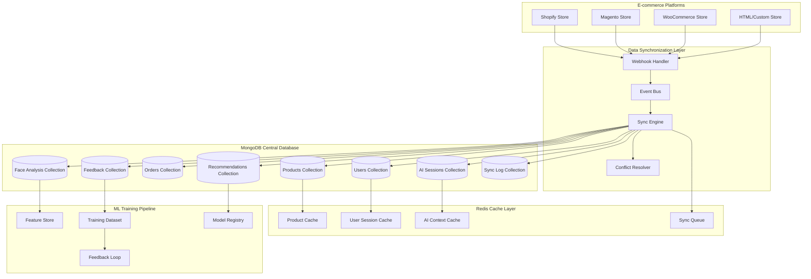

# Data Synchronization Specifications
## AI Discovery E-commerce Integration

## Document Information
- **Document Type**: Data Synchronization Specification
- **System**: EyewearML Varai AI Discovery
- **Version**: 1.0
- **Date**: January 2025
- **Author**: Agent 2 - Data Architecture Specification Agent

## Executive Summary

This document defines comprehensive data synchronization patterns, ML training data collection, privacy-compliant processing flows, and performance optimization strategies for the AI discovery e-commerce integration. The specifications build upon the existing MongoDB-based architecture while introducing enhanced data flows for cross-platform synchronization and ML training pipelines.

## Current Data Architecture Analysis

### Existing MongoDB Schema (Source of Truth)

Based on analysis of [`data-management/mongodb/init/01-init.js`](data-management/mongodb/init/01-init.js:1) and [`config/mongodb/init/01-init-db.js`](config/mongodb/init/01-init-db.js:1):

**Primary Database**: `varai` (legacy) + `eyewear_ml` (unified)

**Core Collections**:
- [`products`](data-management/mongodb/init/01-init.js:23) - Product catalog with AI-enhanced metadata
- [`users`](data-management/mongodb/init/01-init.js:24) - Customer profiles with face analysis data
- [`orders`](data-management/mongodb/init/01-init.js:25) - Purchase history and conversion tracking
- [`brands`](data-management/mongodb/init/01-init.js:26) - Brand information and manufacturer data
- [`categories`](data-management/mongodb/init/01-init.js:27) - Product categorization hierarchy
- [`recommendations`](config/mongodb/init/01-init-db.js:8) - AI-generated recommendations
- [`feedback`](config/mongodb/init/01-init-db.js:9) - User feedback and ML training signals
- [`opticians_stores`](config/mongodb/init/01-init-db.js:12) - Multi-tenant store management
- [`opticians_products`](config/mongodb/init/01-init-db.js:13) - Store-specific product catalog

### Enhanced Data Architecture for AI Discovery



## Data Synchronization Patterns

### 1. Real-time Synchronization

**Event-Driven Architecture**:
```typescript
interface SynchronizationEvent {
  eventId: string;
  timestamp: Date;
  source: 'shopify' | 'magento' | 'woocommerce' | 'html' | 'varai';
  eventType: 'create' | 'update' | 'delete' | 'ai_interaction';
  entityType: 'product' | 'user' | 'order' | 'recommendation' | 'feedback';
  entityId: string;
  data: any;
  metadata: {
    storeId: string;
    userId?: string;
    sessionId?: string;
    region: 'EU' | 'NA';
    priority: 'high' | 'medium' | 'low';
  };
}

interface SyncPattern {
  // Immediate sync for critical data
  realTimeSync: {
    triggers: ['order_created', 'user_registered', 'ai_session_started'];
    latency: '<100ms';
    reliability: '99.9%';
    conflictResolution: 'last_write_wins' | 'merge' | 'manual_review';
  };
  
  // Near real-time for user interactions
  nearRealTimeSync: {
    triggers: ['product_viewed', 'recommendation_clicked', 'face_analysis_completed'];
    latency: '<1s';
    batchSize: 100;
    flushInterval: '5s';
  };
  
  // Batch sync for bulk operations
  batchSync: {
    triggers: ['product_catalog_update', 'inventory_sync', 'analytics_aggregation'];
    schedule: 'every_15_minutes';
    batchSize: 1000;
    retryPolicy: 'exponential_backoff';
  };
}
```

### 2. Platform-Specific Synchronization

**Shopify Integration**:
```typescript
interface ShopifySyncConfig {
  webhooks: {
    'orders/create': {
      endpoint: '/api/sync/shopify/orders';
      priority: 'high';
      transformation: 'shopify_to_varai_order';
    };
    'customers/create': {
      endpoint: '/api/sync/shopify/customers';
      priority: 'medium';
      transformation: 'shopify_to_varai_user';
    };
    'products/update': {
      endpoint: '/api/sync/shopify/products';
      priority: 'low';
      transformation: 'shopify_to_varai_product';
      batchable: true;
    };
  };
  
  polling: {
    'ai_recommendations': {
      interval: '5_minutes';
      endpoint: '/api/sync/varai/recommendations';
      transformation: 'varai_to_shopify_metafields';
    };
  };
}
```

**WooCommerce Integration**:
```typescript
interface WooCommerceSyncConfig {
  actionHooks: {
    'woocommerce_order_status_completed': {
      handler: 'sync_completed_order';
      priority: 'high';
      async: true;
    };
    'woocommerce_add_to_cart': {
      handler: 'sync_cart_event';
      priority: 'medium';
      debounce: '2s';
    };
    'varai_face_analysis_complete': {
      handler: 'sync_face_analysis_data';
      priority: 'high';
      privacy_compliant: true;
    };
  };
}
```

### 3. Conflict Resolution Strategies

```typescript
interface ConflictResolutionStrategy {
  // Product data conflicts
  productConflicts: {
    strategy: 'source_priority';
    priority: ['varai', 'shopify', 'magento', 'woocommerce', 'html'];
    fields: {
      'ai_enhanced': 'varai_wins';
      'inventory': 'platform_wins';
      'pricing': 'platform_wins';
      'metadata': 'merge_with_timestamp';
    };
  };
  
  // User data conflicts
  userConflicts: {
    strategy: 'merge_with_validation';
    rules: {
      'face_analysis_data': 'latest_with_consent';
      'preferences': 'merge_arrays';
      'purchase_history': 'append_only';
      'privacy_settings': 'most_restrictive';
    };
  };
  
  // AI session conflicts
  aiSessionConflicts: {
    strategy: 'session_based';
    rules: {
      'active_session': 'continue_existing';
      'completed_session': 'create_new';
      'abandoned_session': 'cleanup_after_timeout';
    };
  };
}
```

## ML Training Data Collection

### 1. Training Data Schema

```typescript
interface MLTrainingDataSchema {
  // Face analysis training data
  faceAnalysisTraining: {
    collection: 'ml_face_analysis_training';
    schema: {
      sessionId: string;
      userId?: string; // Optional for privacy
      timestamp: Date;
      region: 'EU' | 'NA';
      
      // Anonymized face measurements (not raw landmarks)
      measurements: {
        pupillaryDistance: number;
        faceWidth: number;
        bridgeWidth: number;
        frameHeight: number;
        faceShape: 'oval' | 'round' | 'square' | 'heart' | 'diamond' | 'oblong';
        confidence: number;
      };
      
      // Recommendation outcomes
      recommendedFrames: string[];
      userFeedback: {
        liked: string[];
        disliked: string[];
        purchased?: string;
        virtualTryOnUsed: boolean;
      };
      
      // Privacy metadata
      consentLevel: 'basic' | 'enhanced' | 'research';
      dataRetentionDays: number;
      anonymized: boolean;
    };
    
    indexes: [
      { timestamp: -1 },
      { region: 1 },
      { faceShape: 1 },
      { consentLevel: 1 }
    ];
  };
  
  // Recommendation training data
  recommendationTraining: {
    collection: 'ml_recommendation_training';
    schema: {
      sessionId: string;
      userId?: string;
      timestamp: Date;
      
      // Input features
      userProfile: {
        faceShape?: string;
        stylePreferences: string[];
        priceRange: { min: number; max: number };
        brandPreferences: string[];
        previousPurchases: string[];
      };
      
      // Context features
      sessionContext: {
        platform: 'shopify' | 'magento' | 'woocommerce' | 'html';
        deviceType: 'mobile' | 'desktop' | 'tablet';
        timeOfDay: 'morning' | 'afternoon' | 'evening';
        dayOfWeek: string;
      };
      
      // Recommendation results
      recommendations: {
        frameId: string;
        score: number;
        reasoning: string[];
        position: number;
      }[];
      
      // Outcome metrics
      outcomes: {
        clicked: string[];
        virtualTryOn: string[];
        addedToCart: string[];
        purchased: string[];
        sessionDuration: number;
        conversionRate: number;
      };
    };
  };
  
  // Conversation training data
  conversationTraining: {
    collection: 'ml_conversation_training';
    schema: {
      sessionId: string;
      timestamp: Date;
      
      // Conversation flow
      conversationFlow: {
        userInput: string;
        intent: string;
        entities: Record<string, any>;
        aiResponse: string;
        userSatisfaction?: number; // 1-5 rating
        followUpAction?: string;
      }[];
      
      // Session outcomes
      sessionOutcome: {
        completed: boolean;
        goalAchieved: boolean;
        recommendationsGenerated: number;
        userEngagement: 'high' | 'medium' | 'low';
        conversionResult: 'purchased' | 'saved' | 'abandoned';
      };
    };
  };
}
```

### 2. Data Collection Pipeline

```typescript
interface MLDataCollectionPipeline {
  // Real-time data collection
  realtimeCollection: {
    sources: ['widget_interactions', 'face_analysis_results', 'recommendation_clicks'];
    processing: 'stream_processing';
    storage: 'mongodb_change_streams';
    privacy: 'immediate_anonymization';
  };
  
  // Batch data aggregation
  batchAggregation: {
    schedule: 'hourly';
    sources: ['user_sessions', 'conversion_events', 'feedback_data'];
    processing: 'spark_jobs';
    output: 'training_datasets';
  };
  
  // Feature engineering
  featureEngineering: {
    pipeline: [
      'data_validation',
      'missing_value_imputation',
      'feature_scaling',
      'categorical_encoding',
      'privacy_filtering'
    ];
    output: 'feature_store';
  };
}
```

### 3. Privacy-Compliant Data Processing

```typescript
interface PrivacyCompliantProcessing {
  // Data minimization
  dataMinimization: {
    faceAnalysis: {
      retain: ['pupillary_distance', 'face_width', 'face_shape'];
      discard: ['raw_landmarks', 'facial_features', 'biometric_identifiers'];
      anonymize: ['session_id', 'user_id'];
    };
    
    userBehavior: {
      retain: ['interaction_patterns', 'preference_signals', 'conversion_events'];
      discard: ['ip_addresses', 'device_fingerprints', 'personal_identifiers'];
      aggregate: ['demographic_segments', 'behavioral_clusters'];
    };
  };
  
  // Consent management
  consentManagement: {
    levels: {
      'basic': {
        dataTypes: ['face_shape', 'product_preferences'];
        retention: '30_days';
        sharing: 'none';
      };
      'enhanced': {
        dataTypes: ['detailed_measurements', 'interaction_history'];
        retention: '90_days';
        sharing: 'anonymized_research';
      };
      'research': {
        dataTypes: ['full_dataset'];
        retention: '2_years';
        sharing: 'anonymized_ml_training';
      };
    };
    
    enforcement: {
      'data_collection': 'consent_required';
      'data_processing': 'purpose_limitation';
      'data_retention': 'automatic_deletion';
      'data_sharing': 'explicit_consent';
    };
  };
  
  // Regional compliance
  regionalCompliance: {
    'EU': {
      regulation: 'GDPR';
      dataResidency: 'EU_only';
      consentRequired: true;
      rightToForgotten: true;
      dataPortability: true;
    };
    'NA': {
      regulation: 'CCPA';
      dataResidency: 'NA_preferred';
      consentRequired: 'opt_out';
      rightToForgotten: true;
      dataPortability: true;
    };
  };
}
```

## Performance Optimization Strategies

### 1. Caching Architecture

Based on [`data-management/redis/config/redis.conf`](data-management/redis/config/redis.conf:1):

```typescript
interface CachingStrategy {
  // Redis configuration optimization
  redisOptimization: {
    memory: '256mb'; // Current setting
    policy: 'allkeys-lru'; // Current setting
    persistence: 'aof_enabled'; // Current setting
    
    // AI-specific cache patterns
    aiCachePatterns: {
      'face_analysis_results': {
        ttl: '1_hour';
        pattern: 'face_analysis:{session_id}';
        compression: true;
      };
      'product_recommendations': {
        ttl: '15_minutes';
        pattern: 'recommendations:{user_id}:{face_shape}';
        invalidation: 'on_product_update';
      };
      'conversation_context': {
        ttl: '30_minutes';
        pattern: 'conversation:{session_id}';
        sliding_expiration: true;
      };
    };
  };
  
  // Multi-level caching
  multiLevelCaching: {
    l1_browser: {
      storage: 'localStorage';
      data: ['user_preferences', 'session_state'];
      ttl: '24_hours';
    };
    l2_cdn: {
      storage: 'cloudflare';
      data: ['product_images', 'static_assets', 'widget_code'];
      ttl: '7_days';
    };
    l3_redis: {
      storage: 'redis_cluster';
      data: ['dynamic_content', 'api_responses', 'ml_results'];
      ttl: 'variable';
    };
    l4_mongodb: {
      storage: 'mongodb_with_indexes';
      data: ['persistent_data', 'historical_records'];
      ttl: 'permanent';
    };
  };
}
```

### 2. Database Optimization

Based on existing MongoDB configuration:

```typescript
interface DatabaseOptimization {
  // Index optimization
  indexStrategy: {
    // Existing indexes enhanced for AI discovery
    products: [
      { 'ai_enhanced.style_keywords': 1 }, // Existing
      { 'ai_enhanced.face_shape_compatibility': 1 }, // New
      { 'metadata.updated_at': -1, 'brand': 1 }, // Compound
      { 'categories': 1, 'price': 1 } // Compound for filtering
    ];
    
    users: [
      { 'profile.face_shape': 1 }, // New for AI matching
      { 'profile.preferences.brands': 1 }, // Array index
      { 'metadata.last_login': -1 }, // Existing
      { 'privacyConsent.faceAnalysisConsent.granted': 1 } // Privacy
    ];
    
    ai_sessions: [
      { 'sessionId': 1, 'timestamp': -1 }, // Primary lookup
      { 'userId': 1, 'completed': 1 }, // User history
      { 'region': 1, 'timestamp': -1 }, // Regional queries
      { 'faceShape': 1, 'conversionOutcome': 1 } // ML training
    ];
  };
  
  // Query optimization
  queryOptimization: {
    // Aggregation pipelines for complex queries
    recommendationPipeline: [
      { $match: { 'ai_enhanced.face_shape_compatibility.{faceShape}': { $gte: 0.7 } } },
      { $addFields: { compatibility_score: '$ai_enhanced.face_shape_compatibility.{faceShape}' } },
      { $sort: { compatibility_score: -1, price: 1 } },
      { $limit: 20 },
      { $lookup: { from: 'brands', localField: 'brand', foreignField: 'name', as: 'brand_info' } }
    ];
    
    // Read preferences for performance
    readPreferences: {
      'real_time_queries': 'primary';
      'analytics_queries': 'secondary';
      'ml_training_queries': 'secondary_preferred';
    };
  };
  
  // Sharding strategy
  shardingStrategy: {
    shardKey: { 'region': 1, 'timestamp': 1 };
    chunks: {
      'EU_data': 'shard_eu';
      'NA_data': 'shard_na';
    };
    balancing: 'automatic';
  };
}
```

### 3. Data Synchronization Performance

```typescript
interface SyncPerformanceOptimization {
  // Batch processing optimization
  batchOptimization: {
    batchSizes: {
      'product_updates': 1000;
      'user_interactions': 5000;
      'ai_sessions': 500;
      'feedback_data': 2000;
    };
    
    parallelProcessing: {
      'concurrent_batches': 5;
      'thread_pool_size': 10;
      'queue_depth': 1000;
    };
  };
  
  // Network optimization
  networkOptimization: {
    compression: 'gzip';
    connectionPooling: {
      'min_connections': 5;
      'max_connections': 50;
      'idle_timeout': '30s';
    };
    retryPolicy: {
      'max_retries': 3;
      'backoff_strategy': 'exponential';
      'circuit_breaker': true;
    };
  };
  
  // Monitoring and alerting
  monitoring: {
    metrics: [
      'sync_latency',
      'batch_processing_time',
      'error_rates',
      'queue_depth',
      'throughput'
    ];
    alerts: {
      'high_latency': '>5s';
      'high_error_rate': '>5%';
      'queue_backup': '>1000_items';
    };
  };
}
```

## Analytics and Monitoring Data Structures

### 1. Analytics Schema

```typescript
interface AnalyticsDataStructure {
  // AI discovery analytics
  aiDiscoveryAnalytics: {
    collection: 'analytics_ai_discovery';
    schema: {
      timestamp: Date;
      sessionId: string;
      userId?: string;
      storeId: string;
      platform: string;
      region: string;
      
      // Discovery journey metrics
      journeyMetrics: {
        stage: 'greeting' | 'consent' | 'face_analysis' | 'recommendations' | 'vto' | 'purchase';
        duration: number;
        interactions: number;
        completionRate: number;
      };
      
      // AI performance metrics
      aiMetrics: {
        faceAnalysisAccuracy: number;
        recommendationRelevance: number;
        conversationQuality: number;
        responseTime: number;
      };
      
      // Business metrics
      businessMetrics: {
        conversionRate: number;
        averageOrderValue: number;
        customerSatisfaction: number;
        returnVisitRate: number;
      };
    };
  };
  
  // Performance monitoring
  performanceMonitoring: {
    collection: 'analytics_performance';
    schema: {
      timestamp: Date;
      service: string;
      endpoint: string;
      
      // Response time metrics
      responseTime: {
        p50: number;
        p95: number;
        p99: number;
        max: number;
      };
      
      // Throughput metrics
      throughput: {
        requestsPerSecond: number;
        concurrentUsers: number;
        errorRate: number;
      };
      
      // Resource utilization
      resources: {
        cpuUsage: number;
        memoryUsage: number;
        diskUsage: number;
        networkIO: number;
      };
    };
  };
}
```

### 2. Real-time Monitoring

```typescript
interface RealTimeMonitoring {
  // Dashboard metrics
  dashboardMetrics: {
    updateInterval: '5s';
    metrics: [
      'active_ai_sessions',
      'recommendations_generated',
      'face_analyses_completed',
      'conversion_events',
      'system_health'
    ];
  };
  
  // Alerting system
  alertingSystem: {
    channels: ['slack', 'email', 'pagerduty'];
    rules: {
      'high_error_rate': {
        condition: 'error_rate > 5%';
        severity: 'critical';
        cooldown: '5m';
      };
      'slow_response_time': {
        condition: 'p95_response_time > 2s';
        severity: 'warning';
        cooldown: '10m';
      };
      'low_conversion_rate': {
        condition: 'conversion_rate < baseline * 0.8';
        severity: 'info';
        cooldown: '1h';
      };
    };
  };
}
```

## Implementation Roadmap

### Phase 1: Foundation (Weeks 1-2)
1. **Enhanced MongoDB Schema**: Extend existing collections with AI discovery fields
2. **Redis Cache Optimization**: Configure AI-specific caching patterns
3. **Basic Sync Infrastructure**: Implement webhook handlers and event bus
4. **Privacy Framework**: Establish consent management and data minimization

### Phase 2: Core Synchronization (Weeks 3-4)
1. **Platform Integrations**: Implement sync for Shopify, Magento, WooCommerce
2. **Conflict Resolution**: Deploy conflict resolution strategies
3. **ML Data Pipeline**: Establish training data collection
4. **Performance Monitoring**: Deploy monitoring and alerting

### Phase 3: Advanced Features (Weeks 5-6)
1. **Real-time Sync**: Implement low-latency synchronization
2. **Advanced Analytics**: Deploy comprehensive analytics
3. **ML Training Pipeline**: Full ML training data pipeline
4. **Regional Compliance**: Complete GDPR/CCPA implementation

### Phase 4: Optimization (Weeks 7-8)
1. **Performance Tuning**: Optimize queries and caching
2. **Scalability Testing**: Load testing and optimization
3. **Advanced Monitoring**: Comprehensive observability
4. **Documentation**: Complete technical documentation

## Success Metrics

### Technical Metrics
- **Sync Latency**: <100ms for real-time, <1s for near real-time
- **Data Consistency**: >99.9% across all platforms
- **System Availability**: >99.95% uptime
- **Query Performance**: <200ms for product recommendations

### Business Metrics
- **Data Quality**: >95% accuracy in synchronized data
- **ML Training Efficiency**: 50% improvement in model training time
- **Privacy Compliance**: 100% GDPR/CCPA compliance
- **Customer Satisfaction**: >4.5/5 rating for AI discovery experience

This comprehensive data architecture specification provides the foundation for implementing robust, scalable, and privacy-compliant data synchronization for the AI discovery e-commerce integration.