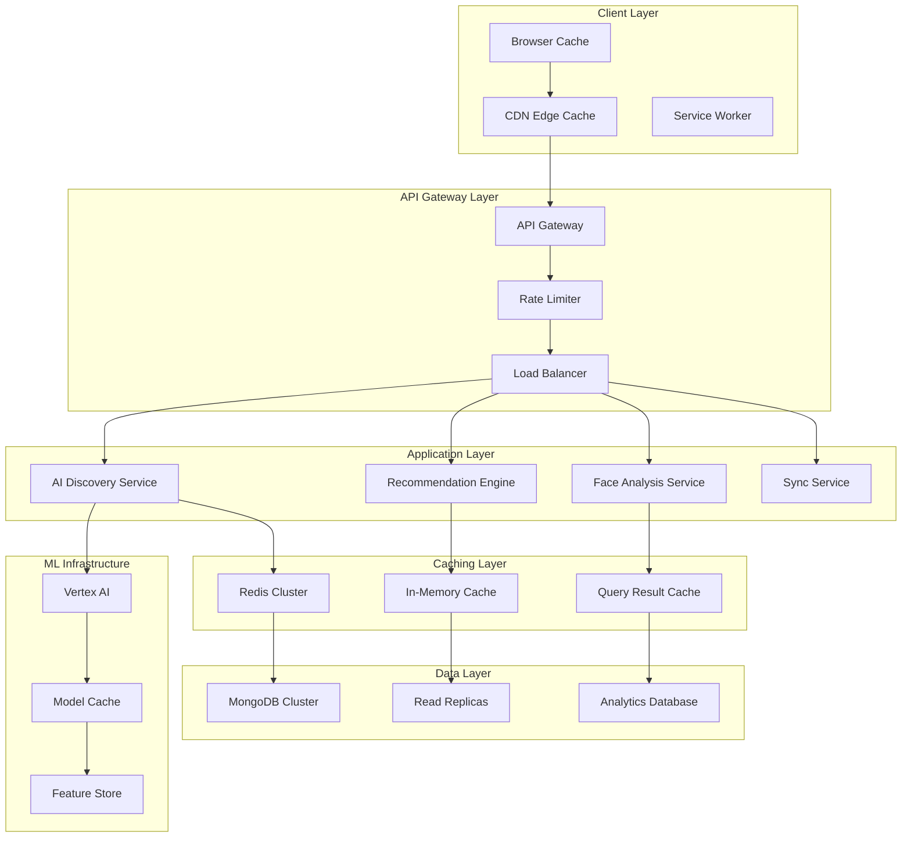

# Performance Optimization Specification
## AI Discovery E-commerce Integration

## Document Information
- **Document Type**: Performance Optimization Specification
- **System**: EyewearML Varai AI Discovery
- **Version**: 1.0
- **Date**: January 2025
- **Author**: Agent 2 - Data Architecture Specification Agent

## Executive Summary

This document defines comprehensive performance optimization strategies for the AI discovery e-commerce integration, focusing on caching, database optimization, network performance, and scalability. The specifications build upon the existing Redis and MongoDB infrastructure while introducing AI-specific optimizations for real-time face analysis, recommendation generation, and cross-platform synchronization.

## Performance Architecture Overview



## Caching Strategy and Implementation

### 1. Multi-Level Caching Architecture

Based on [`data-management/redis/config/redis.conf`](data-management/redis/config/redis.conf:1):

```typescript
interface MultiLevelCachingStrategy {
  // L1: Browser/Client-side caching
  clientSideCache: {
    localStorage: {
      data: ['user_preferences', 'face_shape_result', 'recent_recommendations'];
      ttl: '24_hours';
      maxSize: '10MB';
      compression: 'lz4';
    };
    
    sessionStorage: {
      data: ['current_session_state', 'conversation_context', 'temp_measurements'];
      ttl: 'session_duration';
      maxSize: '5MB';
      encryption: 'aes_256_gcm';
    };
    
    serviceWorker: {
      data: ['widget_assets', 'ml_models', 'static_resources'];
      ttl: '7_days';
      strategy: 'cache_first_with_network_fallback';
      updateStrategy: 'background_sync';
    };
  };
  
  // L2: CDN Edge caching
  cdnCache: {
    cloudflare: {
      staticAssets: {
        data: ['widget_js', 'css_files', 'images', 'fonts'];
        ttl: '30_days';
        compression: 'brotli';
        minification: true;
      };
      
      dynamicContent: {
        data: ['product_images', 'brand_logos', 'recommendation_thumbnails'];
        ttl: '24_hours';
        purgeStrategy: 'tag_based_purging';
        geoDistribution: 'global_edge_locations';
      };
      
      apiResponses: {
        data: ['product_catalog', 'brand_information', 'category_data'];
        ttl: '1_hour';
        varyHeaders: ['Accept-Language', 'User-Agent'];
        compressionLevel: 'maximum';
      };
    };
  };
  
  // L3: Application-level caching (Redis)
  applicationCache: {
    redisCluster: {
      // Current Redis config optimization
      memory: '256mb'; // From existing config
      evictionPolicy: 'allkeys-lru'; // From existing config
      persistence: 'aof_enabled'; // From existing config
      
      // AI-specific cache patterns
      faceAnalysisCache: {
        pattern: 'face_analysis:{session_id}:{hash}';
        ttl: '1_hour';
        compression: 'snappy';
        serialization: 'msgpack';
        pipeline: true;
      };
      
      recommendationCache: {
        pattern: 'recommendations:{user_id}:{face_shape}:{preferences_hash}';
        ttl: '15_minutes';
        invalidationTriggers: ['product_update', 'inventory_change'];
        precomputation: 'background_refresh';
      };
      
      conversationCache: {
        pattern: 'conversation:{session_id}';
        ttl: '30_minutes';
        slidingExpiration: true;
        contextCompression: 'zstd';
      };
      
      productCache: {
        pattern: 'product:{product_id}:{version}';
        ttl: '6_hours';
        warmupStrategy: 'popular_products_preload';
        distributedLocking: 'redlock_algorithm';
      };
    };
  };
  
  // L4: Database query caching
  databaseCache: {
    mongodbQueryCache: {
      aggregationPipelines: {
        recommendationQueries: {
          ttl: '5_minutes';
          keyStrategy: 'query_hash_with_parameters';
          invalidation: 'write_through';
        };
        
        analyticsQueries: {
          ttl: '1_hour';
          keyStrategy: 'time_bucketed_cache_keys';
          refreshStrategy: 'background_refresh';
        };
      };
      
      indexOptimization: {
        coveringIndexes: 'minimize_document_retrieval';
        partialIndexes: 'index_only_relevant_documents';
        compoundIndexes: 'optimize_for_query_patterns';
      };
    };
  };
}
```

### 2. Cache Warming and Precomputation

```typescript
interface CacheWarmingStrategy {
  // Predictive cache warming
  predictiveCaching: {
    userBehaviorPrediction: {
      algorithm: 'collaborative_filtering_with_time_decay';
      triggers: ['user_login', 'session_start', 'product_view'];
      preloadData: ['likely_recommendations', 'related_products', 'user_preferences'];
    };
    
    popularContentCaching: {
      algorithm: 'trending_products_with_decay';
      updateFrequency: 'every_15_minutes';
      metrics: ['view_count', 'conversion_rate', 'user_engagement'];
      preloadStrategy: 'background_batch_processing';
    };
  };
  
  // Scheduled cache warming
  scheduledWarming: {
    dailyWarmup: {
      schedule: '02:00_UTC_daily';
      scope: 'popular_products_and_recommendations';
      parallelism: '10_concurrent_workers';
      monitoring: 'warmup_completion_metrics';
    };
    
    realTimeWarmup: {
      triggers: ['product_catalog_update', 'inventory_change', 'price_update'];
      strategy: 'incremental_cache_refresh';
      batchSize: '100_items_per_batch';
      throttling: 'rate_limited_to_prevent_overload';
    };
  };
  
  // Geographic cache distribution
  geographicCaching: {
    regionSpecificCaching: {
      EU: {
        dataCenter: 'eu_west_1';
        cacheStrategy: 'regional_product_preferences';
        complianceRequirements: 'gdpr_compliant_caching';
      };
      
      NA: {
        dataCenter: 'us_east_1';
        cacheStrategy: 'regional_product_preferences';
        complianceRequirements: 'ccpa_compliant_caching';
      };
    };
    
    edgeComputing: {
      faceAnalysisEdge: {
        deployment: 'cloudflare_workers';
        models: 'lightweight_mediapipe_models';
        fallback: 'central_processing_on_failure';
      };
    };
  };
}
```

## Database Performance Optimization

### 1. MongoDB Optimization Strategy

Based on [`data-management/mongodb/config/mongod.conf`](data-management/mongodb/config/mongod.conf:1):

```typescript
interface MongoDBOptimization {
  // Index optimization for AI discovery
  indexStrategy: {
    // Enhanced existing indexes
    products: {
      // Existing indexes from init script
      existingIndexes: [
        { name: 1 },
        { brand: 1 },
        { categories: 1 },
        { 'inventory.sku': 1 },
        { 'ai_enhanced.style_keywords': 1 },
        { 'metadata.created_at': -1 },
        { price: 1 }
      ];
      
      // New AI-specific indexes
      aiDiscoveryIndexes: [
        // Face shape compatibility compound index
        { 
          'ai_enhanced.face_shape_compatibility.oval': 1,
          'ai_enhanced.face_shape_compatibility.round': 1,
          'ai_enhanced.face_shape_compatibility.square': 1,
          price: 1
        },
        
        // Multi-dimensional recommendation index
        {
          brand: 1,
          categories: 1,
          'ai_enhanced.style_keywords': 1,
          'inventory.isInStock': 1
        },
        
        // Performance optimization index
        {
          'metadata.updated_at': -1,
          'ai_enhanced.feature_summary': 'text'
        }
      ];
      
      // Partial indexes for active products
      partialIndexes: [
        {
          index: { 'inventory.isInStock': 1, price: 1 },
          partialFilterExpression: { 'inventory.isInStock': true }
        }
      ];
    };
    
    // AI sessions collection optimization
    aiSessions: {
      primaryIndexes: [
        { sessionId: 1, timestamp: -1 },
        { userId: 1, completed: 1 },
        { 'faceAnalysis.faceShape': 1, timestamp: -1 }
      ];
      
      ttlIndexes: [
        { 
          index: { createdAt: 1 },
          expireAfterSeconds: 86400 // 24 hours
        }
      ];
    };
    
    // Recommendations collection optimization
    recommendations: {
      compoundIndexes: [
        { userId: 1, timestamp: -1, relevanceScore: -1 },
        { sessionId: 1, productId: 1 },
        { 'context.faceShape': 1, 'context.stylePreferences': 1 }
      ];
      
      sparseIndexes: [
        { 
          index: { userId: 1 },
          sparse: true // For anonymous sessions
        }
      ];
    };
  };
  
  // Query optimization patterns
  queryOptimization: {
    // Aggregation pipeline optimization
    recommendationPipeline: {
      // Optimized pipeline for face shape matching
      pipeline: [
        // Stage 1: Early filtering with index
        {
          $match: {
            'inventory.isInStock': true,
            $expr: {
              $gte: [
                { $getField: { field: faceShape, input: '$ai_enhanced.face_shape_compatibility' } },
                0.7
              ]
            }
          }
        },
        
        // Stage 2: Add computed fields
        {
          $addFields: {
            compatibilityScore: { $getField: { field: faceShape, input: '$ai_enhanced.face_shape_compatibility' } },
            priceScore: { $divide: [1, { $add: ['$price', 1] }] }
          }
        },
        
        // Stage 3: Sort by relevance
        {
          $sort: {
            compatibilityScore: -1,
            priceScore: -1,
            'metadata.updated_at': -1
          }
        },
        
        // Stage 4: Limit results
        { $limit: 20 },
        
        // Stage 5: Lookup brand information (if needed)
        {
          $lookup: {
            from: 'brands',
            localField: 'brand',
            foreignField: 'name',
            as: 'brandInfo',
            pipeline: [{ $project: { name: 1, logo_url: 1 } }]
          }
        }
      ];
      
      optimization: {
        allowDiskUse: false; // Keep in memory for performance
        maxTimeMS: 1000; // 1 second timeout
        hint: { 'inventory.isInStock': 1, price: 1 }; // Force index usage
      };
    };
    
    // Read preference optimization
    readPreferences: {
      realTimeQueries: {
        preference: 'primary';
        maxStalenessSeconds: 0;
        tags: [{ region: 'primary' }];
      };
      
      analyticsQueries: {
        preference: 'secondaryPreferred';
        maxStalenessSeconds: 300;
        tags: [{ workload: 'analytics' }];
      };
      
      recommendationQueries: {
        preference: 'secondary';
        maxStalenessSeconds: 60;
        tags: [{ workload: 'ml' }];
      };
    };
  };
  
  // Connection optimization
  connectionOptimization: {
    connectionPooling: {
      minPoolSize: 5;
      maxPoolSize: 50;
      maxIdleTimeMS: 30000;
      waitQueueTimeoutMS: 5000;
    };
    
    writeOptimization: {
      writeConcern: {
        w: 'majority';
        j: true;
        wtimeout: 5000;
      };
      
      batchWriteOperations: {
        batchSize: 1000;
        ordered: false;
        bypassDocumentValidation: false;
      };
    };
  };
}
```

### 2. Sharding and Replication Strategy

```typescript
interface ShardingStrategy {
  // Horizontal scaling strategy
  shardingConfiguration: {
    shardKey: {
      primary: { region: 1, timestamp: 1 };
      rationale: 'geographic_distribution_with_time_locality';
    };
    
    shardDistribution: {
      euShard: {
        region: 'EU';
        dataTypes: ['eu_user_data', 'eu_ai_sessions', 'eu_recommendations'];
        hardware: 'high_memory_optimized_instances';
      };
      
      naShard: {
        region: 'NA';
        dataTypes: ['na_user_data', 'na_ai_sessions', 'na_recommendations'];
        hardware: 'high_memory_optimized_instances';
      };
      
      globalShard: {
        region: 'GLOBAL';
        dataTypes: ['product_catalog', 'brand_data', 'anonymized_analytics'];
        hardware: 'balanced_compute_storage_instances';
      };
    };
    
    balancerConfiguration: {
      activeWindow: {
        start: '02:00';
        stop: '06:00';
        timezone: 'UTC';
      };
      
      chunkSize: '64MB';
      autoSplit: true;
      enableBalancing: true;
    };
  };
  
  // Replication optimization
  replicationStrategy: {
    replicaSetConfiguration: {
      primary: {
        priority: 10;
        votes: 1;
        hardware: 'high_performance_ssd';
      };
      
      secondaries: [
        {
          priority: 5;
          votes: 1;
          hardware: 'high_performance_ssd';
          tags: { workload: 'realtime' };
        },
        {
          priority: 1;
          votes: 1;
          hardware: 'high_capacity_storage';
          tags: { workload: 'analytics' };
        }
      ];
      
      arbiter: {
        priority: 0;
        votes: 1;
        hardware: 'minimal_compute';
      };
    };
    
    oplogOptimization: {
      oplogSize: '10GB';
      oplogRetentionHours: 48;
      compressionAlgorithm: 'zstd';
    };
  };
}
```

## Network and API Performance

### 1. API Gateway Optimization

```typescript
interface APIGatewayOptimization {
  // Request routing optimization
  routingOptimization: {
    loadBalancing: {
      algorithm: 'weighted_round_robin';
      healthChecks: {
        interval: '10s';
        timeout: '5s';
        unhealthyThreshold: 3;
        healthyThreshold: 2;
      };
      
      stickySession: {
        enabled: true;
        cookieName: 'ai_session_affinity';
        duration: '30_minutes';
      };
    };
    
    rateLimiting: {
      globalLimits: {
        requestsPerSecond: 1000;
        burstCapacity: 2000;
        windowSize: '1_minute';
      };
      
      userLimits: {
        authenticatedUsers: {
          requestsPerMinute: 100;
          faceAnalysisPerHour: 10;
          recommendationsPerMinute: 20;
        };
        
        anonymousUsers: {
          requestsPerMinute: 20;
          faceAnalysisPerHour: 3;
          recommendationsPerMinute: 5;
        };
      };
      
      endpointLimits: {
        '/api/face-analysis': {
          requestsPerMinute: 50;
          concurrentRequests: 10;
        };
        
        '/api/recommendations': {
          requestsPerMinute: 200;
          concurrentRequests: 50;
        };
      };
    };
  };
  
  // Response optimization
  responseOptimization: {
    compression: {
      algorithm: 'gzip';
      level: 6;
      minSize: '1KB';
      types: ['application/json', 'text/html', 'text/css', 'application/javascript'];
    };
    
    caching: {
      staticContent: {
        maxAge: '31536000'; // 1 year
        immutable: true;
        etag: true;
      };
      
      dynamicContent: {
        maxAge: '300'; // 5 minutes
        staleWhileRevalidate: '60';
        etag: true;
      };
    };
    
    contentOptimization: {
      jsonMinification: true;
      imageOptimization: {
        webpConversion: true;
        qualityReduction: '85%';
        progressiveJpeg: true;
      };
    };
  };
  
  // Connection optimization
  connectionOptimization: {
    http2: {
      enabled: true;
      serverPush: ['critical_css', 'essential_js'];
      multiplexing: true;
    };
    
    keepAlive: {
      enabled: true;
      timeout: '60s';
      maxRequests: 100;
    };
    
    ssl: {
      protocol: 'TLSv1.3';
      cipherSuites: 'modern_secure_ciphers';
      sessionResumption: true;
      ocspStapling: true;
    };
  };
}
```

### 2. CDN and Edge Computing

```typescript
interface CDNOptimization {
  // Global CDN strategy
  globalDistribution: {
    cloudflare: {
      edgeLocations: 'global_coverage_200_plus_cities';
      cachingStrategy: 'intelligent_tiered_caching';
      
      performanceFeatures: {
        argo: 'smart_routing_for_30_percent_faster_performance';
        railgun: 'wan_optimization_for_dynamic_content';
        mirage: 'automatic_image_optimization';
        polish: 'image_compression_and_format_conversion';
      };
      
      securityFeatures: {
        ddosProtection: 'automatic_ddos_mitigation';
        waf: 'web_application_firewall';
        botManagement: 'intelligent_bot_detection';
      };
    };
    
    regionalOptimization: {
      EU: {
        primaryPop: 'frankfurt_germany';
        secondaryPops: ['london_uk', 'paris_france', 'amsterdam_netherlands'];
        dataResidency: 'eu_only_processing';
      };
      
      NA: {
        primaryPop: 'ashburn_virginia';
        secondaryPops: ['los_angeles_california', 'toronto_canada', 'dallas_texas'];
        dataResidency: 'na_preferred_processing';
      };
    };
  };
  
  // Edge computing for AI processing
  edgeComputing: {
    faceAnalysisEdge: {
      deployment: 'cloudflare_workers';
      runtime: 'v8_isolates';
      
      capabilities: {
        mediapipeProcessing: 'lightweight_face_detection';
        measurementExtraction: 'basic_facial_measurements';
        privacyProcessing: 'client_side_anonymization';
      };
      
      fallbackStrategy: {
        edgeFailure: 'fallback_to_regional_processing';
        modelUnavailable: 'fallback_to_basic_measurements';
        performanceDegradation: 'adaptive_quality_reduction';
      };
    };
    
    recommendationEdge: {
      deployment: 'edge_side_includes';
      caching: 'personalized_fragment_caching';
      
      capabilities: {
        basicRecommendations: 'rule_based_recommendations';
        popularProducts: 'trending_product_suggestions';
        categoryFiltering: 'basic_product_filtering';
      };
    };
  };
}
```

## Real-time Performance Optimization

### 1. AI Processing Performance

```typescript
interface AIProcessingOptimization {
  // Face analysis optimization
  faceAnalysisOptimization: {
    clientSideProcessing: {
      mediapipeOptimization: {
        modelSize: 'lightweight_2mb_model';
        processingTime: 'target_under_500ms';
        memoryUsage: 'under_50mb_peak';
        cpuUsage: 'single_thread_optimized';
      };
      
      webAssembly: {
        compilation: 'ahead_of_time_compilation';
        threading: 'web_workers_for_parallel_processing';
        memory: 'shared_array_buffer_optimization';
      };
      
      progressiveProcessing: {
        initialEstimate: 'quick_face_detection_100ms';
        refinedMeasurements: 'detailed_analysis_500ms';
        qualityAssessment: 'accuracy_validation_200ms';
      };
    };
    
    serverSideProcessing: {
      vertexAIOptimization: {
        modelDeployment: 'dedicated_prediction_endpoints';
        batchProcessing: 'micro_batch_processing_for_latency';
        autoScaling: 'predictive_scaling_based_on_usage';
      };
      
      gpuAcceleration: {
        hardware: 'nvidia_t4_gpus';
        framework: 'tensorflow_serving_with_gpu';
        optimization: 'tensorrt_model_optimization';
      };
    };
  };
  
  // Recommendation engine optimization
  recommendationOptimization: {
    algorithmOptimization: {
      collaborativeFiltering: {
        algorithm: 'matrix_factorization_with_implicit_feedback';
        dimensions: '50_latent_factors';
        regularization: 'l2_regularization_0_01';
        iterations: 'early_stopping_at_convergence';
      };
      
      contentBasedFiltering: {
        featureExtraction: 'tfidf_with_ngrams';
        similarity: 'cosine_similarity_with_normalization';
        dimensionalityReduction: 'pca_to_100_dimensions';
      };
      
      hybridApproach: {
        weightingStrategy: 'dynamic_weighting_based_on_data_availability';
        ensembleMethod: 'weighted_average_with_confidence_scores';
        fallbackStrategy: 'popularity_based_recommendations';
      };
    };
    
    realTimeOptimization: {
      precomputation: {
        userEmbeddings: 'precompute_user_vectors_daily';
        itemEmbeddings: 'precompute_item_vectors_on_update';
        similarityMatrices: 'precompute_top_k_similarities';
      };
      
      incrementalUpdates: {
        userPreferences: 'online_learning_with_decay';
        itemFeatures: 'incremental_feature_updates';
        modelRefresh: 'partial_model_retraining_hourly';
      };
    };
  };
  
  // Conversation AI optimization
  conversationOptimization: {
    nlpOptimization: {
      intentRecognition: {
        model: 'distilbert_optimized_for_inference';
        caching: 'intent_classification_result_caching';
        preprocessing: 'text_normalization_and_tokenization';
      };
      
      responseGeneration: {
        model: 'gpt_3_5_turbo_with_fine_tuning';
        contextWindow: '4k_tokens_with_compression';
        streaming: 'server_sent_events_for_real_time_responses';
      };
    };
    
    contextManagement: {
      sessionState: {
        storage: 'redis_with_json_serialization';
        compression: 'gzip_compression_for_large_contexts';
        expiration: 'sliding_expiration_30_minutes';
      };
      
      contextOptimization: {
        summarization: 'automatic_context_summarization';
        relevanceFiltering: 'keep_only_relevant_conversation_history';
        memoryManagement: 'lru_eviction_for_old_contexts';
      };
    };
  };
}
```

### 2. Synchronization Performance

```typescript
interface SynchronizationOptimization {
  // Real-time sync optimization
  realTimeSyncOptimization: {
    eventStreaming: {
      technology: 'apache_kafka_with_schema_registry';
      partitioning: 'partition_by_store_id_for_parallelism';
      replication: '3_replicas_for_fault_tolerance';
      
      performance: {
        batchSize: '100_events_per_batch';
        lingerMs: '10ms_for_low_latency';
        compressionType: 'snappy_for_speed';
        acks: 'all_for_durability';
      };
    };
    
    changeDataCapture: {
      mongodb: 'change_streams_with_resume_tokens';
      filtering: 'filter_relevant_changes_only';
      transformation: 'lightweight_transformation_at_source';
      
      performance: {
        batchSize: '1000_changes_per_batch';
        maxAwaitTime: '1000ms';
        fullDocument: 'updateLookup_for_complete_documents';
      };
    };
  };
  
  // Batch sync optimization
  batchSyncOptimization: {
    bulkOperations: {
      mongodb: {
        bulkWrite: {
          batchSize: 1000;
          ordered: false;
          bypassDocumentValidation: true;
        };
        
        aggregationPipeline: {
          allowDiskUse: false;
          cursor: { batchSize: 1000 };
          maxTimeMS: 30000;
        };
      };
      
      redis: {
        pipeline: {
          batchSize: 100;
          autoFlush: true;
          timeout: '5s';
        };
        
        luaScripts: {
          atomicOperations: 'use_lua_for_complex_atomic_operations';
          bulkUpdates: 'batch_multiple_operations_in_single_script';
        };
      };
    };
    
    parallelProcessing: {
      workerPools: {
        syncWorkers: {
          poolSize: 10;
          queueSize: 1000;
          taskTimeout: '30s';
        };
        
        transformationWorkers: {
          poolSize: 5;
          queueSize: 500;
          taskTimeout: '10s';
        };
      };
      
      loadBalancing: {
        strategy: 'round_robin_with_health_checks';
        failover: 'automatic_failover_to_healthy_workers';
        monitoring: 'worker_performance_monitoring';
      };
    };
  };
}
```

## Monitoring and Performance Analytics

### 1. Real-time Performance Monitoring

```typescript
interface PerformanceMonitoring {
  // Application performance monitoring
  applicationMonitoring: {
    responseTimeMetrics: {
      p50: 'median_response_time';
      p95: '95th_percentile_response_time';
      p99: '99th_percentile_response_time';
      max: 'maximum_response_time';
    };
    
    throughputMetrics: {
      requestsPerSecond: 'total_requests_per_second';
      concurrentUsers: 'active_concurrent_users';
      errorRate: 'percentage_of_failed_requests';
    };
    
    resourceMetrics: {
      cpuUtilization: 'cpu_usage_percentage';
      memoryUtilization: 'memory_usage_percentage';
      diskIO: 'disk_read_write_operations';
      networkIO: 'network_bandwidth_utilization';
    };
  };
  
  // AI-specific performance monitoring
  aiPerformanceMonitoring: {
    faceAnalysisMetrics: {
      processingTime: 'time_from_image_to_measurements';
      accuracy: 'measurement_accuracy_validation';
      successRate: 'percentage_of_successful_analyses';
      clientVsServerProcessing: 'performance_comparison';
    };
    
    recommendationMetrics: {
      generationTime: 'time_to_generate_recommendations';
      relevanceScore: 'recommendation_quality_metrics';
      clickThroughRate: 'user_engagement_with_recommendations';
      conversionRate: 'recommendation_to_purchase_rate';
    };
    
    conversationMetrics: {
      responseTime: 'ai_response_generation_time';
      contextAccuracy: 'conversation_context_maintenance';
      userSatisfaction: 'conversation_quality_ratings';
      };
    };
    
    conversationMetrics: {
      responseTime: 'ai_response_generation_time';
      contextAccuracy: 'conversation_context_maintenance';
      userSatisfaction: 'conversation_quality_ratings';
      sessionCompletionRate: 'percentage_of_completed_conversations';
    };
  };
  
  // Database performance monitoring
  databaseMonitoring: {
    mongodbMetrics: {
      queryPerformance: {
        slowQueries: 'queries_exceeding_100ms_threshold';
        indexUsage: 'index_hit_ratio_and_efficiency';
        connectionPool: 'connection_pool_utilization';
        replicationLag: 'secondary_replication_delay';
      };
      
      resourceUtilization: {
        diskUsage: 'storage_utilization_and_growth';
        memoryUsage: 'wiredtiger_cache_utilization';
        cpuUsage: 'database_cpu_consumption';
        networkIO: 'database_network_traffic';
      };
    };
    
    redisMetrics: {
      cachePerformance: {
        hitRate: 'cache_hit_ratio_percentage';
        evictionRate: 'key_eviction_frequency';
        memoryUsage: 'memory_utilization_percentage';
        connectionCount: 'active_client_connections';
      };
      
      operationMetrics: {
        commandsPerSecond: 'redis_operations_per_second';
        latency: 'command_execution_latency';
        keyspaceHits: 'successful_key_lookups';
        keyspaceMisses: 'failed_key_lookups';
      };
    };
  };
}
```

### 2. Performance Alerting and SLA Management

```typescript
interface PerformanceAlertingSystem {
  // SLA definitions
  serviceLevelAgreements: {
    apiResponseTime: {
      target: 'p95_under_500ms';
      warning: 'p95_over_300ms';
      critical: 'p95_over_1000ms';
      measurement: '5_minute_rolling_window';
    };
    
    faceAnalysisPerformance: {
      target: 'processing_under_2_seconds';
      warning: 'processing_over_1_5_seconds';
      critical: 'processing_over_5_seconds';
      measurement: '1_minute_rolling_window';
    };
    
    recommendationLatency: {
      target: 'generation_under_1_second';
      warning: 'generation_over_800ms';
      critical: 'generation_over_2_seconds';
      measurement: '1_minute_rolling_window';
    };
    
    systemAvailability: {
      target: '99_95_percent_uptime';
      warning: '99_9_percent_uptime';
      critical: '99_5_percent_uptime';
      measurement: '24_hour_rolling_window';
    };
  };
  
  // Alerting configuration
  alertingRules: {
    performanceAlerts: {
      highLatency: {
        condition: 'p95_response_time > 500ms for 5 minutes';
        severity: 'warning';
        channels: ['slack', 'email'];
        escalation: 'page_on_call_after_15_minutes';
      };
      
      lowThroughput: {
        condition: 'requests_per_second < baseline * 0.5 for 10 minutes';
        severity: 'warning';
        channels: ['slack'];
        escalation: 'investigate_capacity_issues';
      };
      
      highErrorRate: {
        condition: 'error_rate > 5% for 2 minutes';
        severity: 'critical';
        channels: ['slack', 'email', 'pagerduty'];
        escalation: 'immediate_investigation';
      };
    };
    
    resourceAlerts: {
      highCpuUsage: {
        condition: 'cpu_utilization > 80% for 10 minutes';
        severity: 'warning';
        action: 'trigger_auto_scaling';
      };
      
      highMemoryUsage: {
        condition: 'memory_utilization > 85% for 5 minutes';
        severity: 'critical';
        action: 'investigate_memory_leaks';
      };
      
      diskSpaceWarning: {
        condition: 'disk_usage > 80%';
        severity: 'warning';
        action: 'cleanup_old_data_and_logs';
      };
    };
  };
  
  // Automated remediation
  automatedRemediation: {
    autoScaling: {
      triggers: ['high_cpu', 'high_memory', 'high_request_rate'];
      scaleUpPolicy: {
        metric: 'cpu_utilization > 70%';
        cooldown: '5_minutes';
        scaleUpBy: '2_instances';
        maxInstances: 20;
      };
      
      scaleDownPolicy: {
        metric: 'cpu_utilization < 30%';
        cooldown: '10_minutes';
        scaleDownBy: '1_instance';
        minInstances: 2;
      };
    };
    
    cacheWarming: {
      triggers: ['cache_hit_rate < 80%', 'high_cache_miss_rate'];
      actions: ['preload_popular_products', 'refresh_stale_cache_entries'];
      scheduling: 'background_cache_warming_jobs';
    };
    
    circuitBreaker: {
      triggers: ['high_error_rate', 'slow_response_times'];
      actions: ['fallback_to_cached_responses', 'graceful_degradation'];
      recovery: 'gradual_traffic_restoration';
    };
  };
}
```

## Scalability and Capacity Planning

### 1. Horizontal Scaling Strategy

```typescript
interface HorizontalScalingStrategy {
  // Microservices scaling
  microservicesScaling: {
    aiDiscoveryService: {
      scalingMetric: 'requests_per_second';
      targetUtilization: '70%';
      minReplicas: 3;
      maxReplicas: 20;
      scaleUpThreshold: '80%_cpu_or_memory';
      scaleDownThreshold: '30%_cpu_and_memory';
    };
    
    recommendationEngine: {
      scalingMetric: 'queue_depth';
      targetQueueDepth: 100;
      minReplicas: 2;
      maxReplicas: 15;
      scaleUpThreshold: 'queue_depth > 200';
      scaleDownThreshold: 'queue_depth < 50';
    };
    
    faceAnalysisService: {
      scalingMetric: 'processing_time';
      targetProcessingTime: '1_second';
      minReplicas: 2;
      maxReplicas: 10;
      scaleUpThreshold: 'p95_processing_time > 2_seconds';
      scaleDownThreshold: 'p95_processing_time < 500ms';
    };
  };
  
  // Database scaling
  databaseScaling: {
    mongodbSharding: {
      shardingStrategy: 'range_based_on_region_and_time';
      chunkSize: '64MB';
      balancerWindow: '02:00-06:00_UTC';
      
      shardAddition: {
        trigger: 'shard_utilization > 80%';
        process: 'automated_shard_provisioning';
        rebalancing: 'gradual_chunk_migration';
      };
    };
    
    readReplicas: {
      analyticsReplicas: {
        count: 2;
        hardware: 'storage_optimized';
        lag: 'max_5_minutes';
      };
      
      mlTrainingReplicas: {
        count: 1;
        hardware: 'compute_optimized';
        lag: 'max_1_hour';
      };
    };
  };
  
  // Cache scaling
  cacheScaling: {
    redisCluster: {
      nodes: {
        minimum: 3;
        maximum: 12;
        scalingFactor: 'memory_utilization';
      };
      
      sharding: {
        strategy: 'consistent_hashing';
        replication: '1_replica_per_shard';
        failover: 'automatic_failover_with_sentinel';
      };
    };
  };
}
```

### 2. Capacity Planning and Forecasting

```typescript
interface CapacityPlanning {
  // Traffic forecasting
  trafficForecasting: {
    historicalAnalysis: {
      dataPoints: '12_months_historical_data';
      seasonality: 'detect_seasonal_patterns';
      trends: 'identify_growth_trends';
      anomalies: 'filter_out_anomalous_events';
    };
    
    predictiveModeling: {
      algorithm: 'arima_with_seasonal_decomposition';
      forecastHorizon: '3_months_ahead';
      confidenceInterval: '95_percent';
      updateFrequency: 'weekly_model_retraining';
    };
    
    scenarioPlanning: {
      baselineGrowth: '20_percent_annual_growth';
      optimisticGrowth: '50_percent_annual_growth';
      pessimisticGrowth: '5_percent_annual_growth';
      blackFridayScenario: '10x_traffic_spike';
    };
  };
  
  // Resource planning
  resourcePlanning: {
    computeResources: {
      cpuPlanning: {
        baselineUtilization: '40_percent_average';
        peakUtilization: '80_percent_maximum';
        growthBuffer: '25_percent_headroom';
      };
      
      memoryPlanning: {
        baselineUtilization: '60_percent_average';
        peakUtilization: '85_percent_maximum';
        growthBuffer: '20_percent_headroom';
      };
    };
    
    storageResources: {
      databaseGrowth: {
        currentSize: '500GB';
        monthlyGrowth: '10_percent';
        retentionPolicy: '2_years_active_data';
        archivalStrategy: 'cold_storage_after_1_year';
      };
      
      cacheStorage: {
        currentSize: '50GB';
        growthRate: '5_percent_monthly';
        evictionPolicy: 'lru_with_ttl';
      };
    };
    
    networkResources: {
      bandwidthPlanning: {
        currentUsage: '1Gbps_average';
        peakUsage: '5Gbps_maximum';
        growthProjection: '30_percent_annual';
        cdnOffloading: '80_percent_static_content';
      };
    };
  };
  
  // Cost optimization
  costOptimization: {
    rightSizing: {
      instanceOptimization: 'continuous_right_sizing_recommendations';
      reservedInstances: 'purchase_reserved_capacity_for_baseline';
      spotInstances: 'use_spot_instances_for_batch_processing';
    };
    
    storageOptimization: {
      tieredStorage: 'automatic_data_tiering_based_on_access_patterns';
      compression: 'enable_compression_for_cold_data';
      deduplication: 'eliminate_duplicate_data_storage';
    };
    
    networkOptimization: {
      cdnUsage: 'maximize_cdn_cache_hit_ratio';
      dataTransfer: 'minimize_cross_region_data_transfer';
      compression: 'enable_compression_for_all_api_responses';
    };
  };
}
```

## Implementation Roadmap

### Phase 1: Foundation Optimization (Weeks 1-2)
1. **Cache Infrastructure**: Deploy Redis cluster with AI-specific caching patterns
2. **Database Indexing**: Implement optimized indexes for AI discovery queries
3. **Basic Monitoring**: Deploy performance monitoring and alerting
4. **CDN Configuration**: Configure global CDN with edge caching

### Phase 2: Core Performance Features (Weeks 3-4)
1. **API Gateway Optimization**: Implement rate limiting and load balancing
2. **Database Sharding**: Deploy MongoDB sharding for regional data
3. **Cache Warming**: Implement predictive cache warming strategies
4. **Edge Computing**: Deploy lightweight AI processing at edge

### Phase 3: Advanced Optimization (Weeks 5-6)
1. **Auto-scaling**: Implement intelligent auto-scaling policies
2. **ML Performance**: Optimize AI model inference performance
3. **Advanced Caching**: Deploy multi-level caching with precomputation
4. **Network Optimization**: Implement HTTP/2, compression, and keep-alive

### Phase 4: Scalability and Monitoring (Weeks 7-8)
1. **Capacity Planning**: Implement automated capacity planning
2. **Advanced Monitoring**: Deploy comprehensive performance analytics
3. **Cost Optimization**: Implement cost optimization strategies
4. **Performance Testing**: Conduct load testing and optimization

## Success Metrics

### Performance Targets
- **API Response Time**: P95 < 500ms, P99 < 1s
- **Face Analysis**: < 2s end-to-end processing
- **Recommendations**: < 1s generation time
- **Cache Hit Rate**: > 90% for product data, > 80% for recommendations

### Scalability Targets
- **Concurrent Users**: Support 10,000+ concurrent users
- **Request Throughput**: Handle 1,000+ requests per second
- **Auto-scaling**: Scale from 2 to 20 instances in < 5 minutes
- **Database Performance**: Maintain < 100ms query response times

### Availability Targets
- **System Uptime**: 99.95% availability
- **Error Rate**: < 0.1% for critical operations
- **Recovery Time**: < 5 minutes for service restoration
- **Data Consistency**: 99.99% data synchronization accuracy

This comprehensive performance optimization specification provides the foundation for building a high-performance, scalable AI discovery e-commerce integration that can handle enterprise-scale traffic while maintaining optimal user experience.