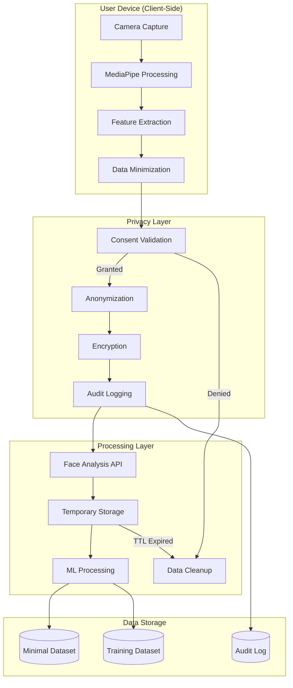

# Privacy-Compliant Data Flow Specification
## AI Discovery E-commerce Integration

## Document Information
- **Document Type**: Privacy Data Flow Specification
- **System**: EyewearML Varai AI Discovery
- **Version**: 1.0
- **Date**: January 2025
- **Author**: Agent 2 - Data Architecture Specification Agent

## Executive Summary

This document defines privacy-compliant data processing flows for the AI discovery e-commerce integration, ensuring GDPR and CCPA compliance while maintaining optimal user experience and ML training capabilities. The specification builds upon the existing privacy architecture and extends it with AI-specific privacy controls.

## Privacy Compliance Framework

### 1. Regulatory Compliance Matrix

```typescript
interface RegulatoryComplianceMatrix {
  GDPR: {
    applicability: 'EU_residents_and_EU_processing';
    keyPrinciples: [
      'lawfulness_fairness_transparency',
      'purpose_limitation',
      'data_minimization',
      'accuracy',
      'storage_limitation',
      'integrity_confidentiality',
      'accountability'
    ];
    
    userRights: {
      rightToInformation: 'transparent_privacy_notices';
      rightOfAccess: 'data_export_api';
      rightToRectification: 'data_correction_interface';
      rightToErasure: 'automated_deletion_system';
      rightToRestriction: 'processing_limitation_controls';
      rightToPortability: 'structured_data_export';
      rightToObject: 'opt_out_mechanisms';
    };
  };
  
  CCPA: {
    applicability: 'california_residents';
    keyRequirements: [
      'notice_at_collection',
      'right_to_know',
      'right_to_delete',
      'right_to_opt_out',
      'non_discrimination'
    ];
    
    userRights: {
      rightToKnow: 'data_disclosure_reports';
      rightToDelete: 'deletion_request_processing';
      rightToOptOut: 'sale_opt_out_mechanism';
      rightToNonDiscrimination: 'equal_service_guarantee';
    };
  };
  
  regionalDataResidency: {
    EU: {
      dataStorage: 'EU_only';
      dataProcessing: 'EU_preferred';
      dataTransfer: 'adequacy_decision_or_safeguards';
      retention: 'purpose_limited';
    };
    
    NA: {
      dataStorage: 'NA_preferred';
      dataProcessing: 'NA_allowed';
      dataTransfer: 'privacy_shield_or_sccs';
      retention: 'business_purpose_limited';
    };
  };
}
```

### 2. Data Classification and Sensitivity Levels

```typescript
interface DataClassification {
  // Biometric data (highest sensitivity)
  biometricData: {
    classification: 'special_category_personal_data';
    examples: ['facial_landmarks', 'biometric_templates', 'face_geometry'];
    processing: 'explicit_consent_required';
    retention: 'minimal_necessary';
    encryption: 'end_to_end_with_key_rotation';
    access: 'need_to_know_basis';
  };
  
  // Personal identifiers (high sensitivity)
  personalIdentifiers: {
    classification: 'personal_data';
    examples: ['email', 'user_id', 'session_id', 'ip_address'];
    processing: 'lawful_basis_required';
    retention: 'purpose_limited';
    encryption: 'at_rest_and_in_transit';
    access: 'role_based_access_control';
  };
  
  // Behavioral data (medium sensitivity)
  behavioralData: {
    classification: 'personal_data';
    examples: ['product_preferences', 'interaction_patterns', 'purchase_history'];
    processing: 'legitimate_interest_or_consent';
    retention: 'business_purpose_limited';
    encryption: 'standard_encryption';
    access: 'business_need_basis';
  };
  
  // Aggregated data (low sensitivity)
  aggregatedData: {
    classification: 'anonymized_data';
    examples: ['usage_statistics', 'performance_metrics', 'trend_analysis'];
    processing: 'no_restrictions';
    retention: 'business_determined';
    encryption: 'standard_protection';
    access: 'business_users';
  };
}
```

## Privacy-by-Design Data Flows

### 1. Face Analysis Privacy Flow



**Face Analysis Privacy Implementation**:
```typescript
interface FaceAnalysisPrivacyFlow {
  // Client-side processing (privacy-first)
  clientSideProcessing: {
    mediaCapture: {
      permissions: 'explicit_user_consent';
      storage: 'memory_only_no_persistence';
      processing: 'local_mediapipe_processing';
      dataMinimization: 'extract_essential_measurements_only';
    };
    
    featureExtraction: {
      landmarks: 'discard_after_measurement_extraction';
      measurements: {
        pupillaryDistance: 'retain_for_recommendations';
        faceWidth: 'retain_for_frame_sizing';
        faceShape: 'retain_for_style_matching';
        bridgeWidth: 'retain_for_fit_analysis';
      };
      rawImage: 'never_transmitted_or_stored';
    };
  };
  
  // Server-side processing (minimal data)
  serverSideProcessing: {
    dataReceived: {
      measurements: 'anonymized_numerical_values';
      sessionId: 'temporary_anonymous_identifier';
      timestamp: 'processing_time_only';
      region: 'data_residency_compliance';
    };
    
    processing: {
      validation: 'measurement_range_validation';
      analysis: 'face_shape_classification';
      recommendations: 'product_matching_algorithm';
      storage: 'temporary_session_storage_only';
    };
    
    dataRetention: {
      sessionData: 'delete_after_session_completion';
      measurements: 'delete_after_24_hours_unless_consented';
      aggregatedStats: 'anonymized_retention_for_improvement';
    };
  };
}
```

### 2. User Data Privacy Flow

```typescript
interface UserDataPrivacyFlow {
  // Data collection with consent
  dataCollection: {
    consentManagement: {
      granularConsent: {
        faceAnalysis: 'separate_consent_checkbox';
        dataRetention: 'retention_period_selection';
        mlTraining: 'optional_research_participation';
        marketing: 'separate_marketing_consent';
      };
      
      consentCapture: {
        timestamp: 'iso_8601_utc';
        ipAddress: 'hashed_for_verification';
        userAgent: 'browser_fingerprint_hash';
        consentVersion: 'privacy_policy_version';
        method: 'explicit_opt_in';
      };
      
      consentValidation: {
        activeConsent: 'check_before_each_processing';
        consentExpiry: 'reconfirm_annually';
        withdrawalProcessing: 'immediate_processing_stop';
      };
    };
    
    dataMinimization: {
      collectionPrinciple: 'collect_only_necessary_data';
      purposeLimitation: 'use_only_for_stated_purpose';
      retentionLimitation: 'delete_when_purpose_fulfilled';
      
      minimizationRules: {
        faceAnalysis: 'measurements_only_no_images';
        userProfile: 'preferences_only_no_demographics';
        interactions: 'aggregated_patterns_no_individual_tracking';
        purchases: 'product_ids_only_no_personal_details';
      };
    };
  };
  
  // Data processing with privacy controls
  dataProcessing: {
    purposeLimitation: {
      primaryPurpose: 'eyewear_recommendation_service';
      secondaryPurposes: [
        'service_improvement_with_consent',
        'ml_model_training_with_consent',
        'anonymized_analytics_legitimate_interest'
      ];
      prohibitedUses: [
        'facial_recognition_identification',
        'demographic_profiling',
        'third_party_advertising',
        'surveillance_or_monitoring'
      ];
    };
    
    processingControls: {
      accessControl: 'role_based_access_with_audit';
      dataEncryption: 'aes_256_at_rest_tls_1_3_in_transit';
      processingLogs: 'comprehensive_audit_trail';
      dataIntegrity: 'checksums_and_validation';
    };
  };
  
  // Data sharing and transfer
  dataSharing: {
    internalSharing: {
      withinEU: 'unrestricted_for_same_purpose';
      euToNa: 'adequacy_decision_or_sccs';
      naToEu: 'gdpr_compliance_required';
    };
    
    externalSharing: {
      thirdPartyProcessors: 'data_processing_agreements';
      cloudProviders: 'privacy_certified_providers';
      analyticsServices: 'anonymized_data_only';
      prohibitedSharing: [
        'raw_biometric_data',
        'personal_identifiers',
        'individual_behavior_profiles'
      ];
    };
  };
}
```

### 3. ML Training Privacy Flow

```typescript
interface MLTrainingPrivacyFlow {
  // Privacy-preserving ML training
  privacyPreservingML: {
    dataPreparation: {
      anonymization: {
        identifierRemoval: 'remove_all_direct_identifiers';
        quasiIdentifierHandling: 'k_anonymity_l_diversity';
        sensitiveAttributeProtection: 'differential_privacy';
      };
      
      dataAggregation: {
        individualLevel: 'never_use_individual_records';
        cohortLevel: 'minimum_cohort_size_100';
        statisticalLevel: 'aggregated_statistics_only';
      };
    };
    
    trainingProcess: {
      differentialPrivacy: {
        epsilon: '1.0'; // Privacy budget
        delta: '1e-5'; // Failure probability
        mechanism: 'gaussian_mechanism';
        composition: 'advanced_composition_theorem';
      };
      
      federatedLearning: {
        localTraining: 'train_on_device_when_possible';
        modelAggregation: 'secure_aggregation_protocol';
        gradientClipping: 'prevent_gradient_leakage';
      };
    };
    
    modelDeployment: {
      modelPrivacy: {
        membershipInference: 'protection_against_attacks';
        modelInversion: 'protection_against_reconstruction';
        propertyInference: 'protection_against_attribute_inference';
      };
      
      outputPrivacy: {
        noiseInjection: 'add_calibrated_noise_to_outputs';
        outputValidation: 'prevent_sensitive_data_leakage';
        responseFiltering: 'filter_potentially_identifying_responses';
      };
    };
  };
}
```

## Regional Data Processing Architecture

### 1. EU Data Processing (GDPR Compliant)

```typescript
interface EUDataProcessing {
  dataResidency: {
    storage: 'eu_only_data_centers';
    processing: 'eu_based_compute_resources';
    backup: 'eu_region_replication';
    disaster_recovery: 'eu_region_failover';
  };
  
  legalBasis: {
    consent: {
      standard: 'freely_given_specific_informed_unambiguous';
      withdrawal: 'as_easy_as_giving_consent';
      children: 'parental_consent_under_16';
    };
    
    legitimateInterest: {
      assessment: 'legitimate_interest_assessment_documented';
      balancing: 'individual_rights_vs_business_interests';
      objection: 'right_to_object_mechanism';
    };
  };
  
  dataSubjectRights: {
    rightOfAccess: {
      response_time: '1_month_maximum';
      format: 'structured_commonly_used_machine_readable';
      scope: 'all_personal_data_being_processed';
    };
    
    rightToRectification: {
      correction_mechanism: 'user_self_service_portal';
      verification: 'identity_verification_required';
      propagation: 'corrections_to_all_systems';
    };
    
    rightToErasure: {
      automated_deletion: 'immediate_for_consent_withdrawal';
      manual_review: 'complex_cases_human_review';
      exceptions: 'legal_obligations_freedom_of_expression';
    };
  };
}
```

### 2. North America Data Processing (CCPA Compliant)

```typescript
interface NADataProcessing {
  dataResidency: {
    storage: 'na_preferred_eu_acceptable';
    processing: 'na_based_compute_preferred';
    backup: 'cross_region_replication_allowed';
    disaster_recovery: 'global_failover_acceptable';
  };
  
  ccpaCompliance: {
    noticeAtCollection: {
      categories: 'specific_categories_of_personal_information';
      purposes: 'business_or_commercial_purposes';
      sources: 'categories_of_sources';
      sharing: 'categories_of_third_parties';
    };
    
    consumerRights: {
      rightToKnow: {
        categories: 'categories_of_personal_information_collected';
        sources: 'categories_of_sources';
        purposes: 'business_purposes_for_collection';
        sharing: 'categories_shared_and_recipients';
      };
      
      rightToDelete: {
        scope: 'personal_information_collected_from_consumer';
        exceptions: 'transaction_completion_security_legal_compliance';
        verification: 'reasonable_verification_methods';
      };
      
      rightToOptOut: {
        mechanism: 'do_not_sell_my_personal_information_link';
        scope: 'sale_of_personal_information_to_third_parties';
        verification: 'no_verification_required_for_opt_out';
      };
    };
  };
}
```

## Privacy Controls Implementation

### 1. Consent Management System

```typescript
interface ConsentManagementSystem {
  consentCapture: {
    interface: {
      granularControls: 'separate_toggles_for_each_purpose';
      clearLanguage: 'plain_english_explanations';
      visualDesign: 'prominent_easy_to_understand';
      accessibility: 'wcag_2_1_aa_compliant';
    };
    
    consentTypes: {
      essential: {
        required: true;
        description: 'necessary_for_service_provision';
        examples: ['session_management', 'security', 'basic_functionality'];
      };
      
      functional: {
        required: false;
        description: 'enhanced_user_experience';
        examples: ['face_analysis', 'personalized_recommendations', 'preference_storage'];
      };
      
      analytics: {
        required: false;
        description: 'service_improvement_and_optimization';
        examples: ['usage_analytics', 'performance_monitoring', 'error_tracking'];
      };
      
      research: {
        required: false;
        description: 'ml_model_improvement_and_research';
        examples: ['anonymized_training_data', 'algorithm_improvement', 'academic_research'];
      };
    };
  };
  
  consentStorage: {
    dataStructure: {
      userId: 'unique_user_identifier';
      consentId: 'unique_consent_record_identifier';
      timestamp: 'iso_8601_utc_timestamp';
      consentVersion: 'privacy_policy_version_number';
      ipAddress: 'hashed_ip_for_verification';
      userAgent: 'hashed_user_agent_string';
      
      consents: {
        essential: { granted: boolean; timestamp: Date };
        functional: { granted: boolean; timestamp: Date };
        analytics: { granted: boolean; timestamp: Date };
        research: { granted: boolean; timestamp: Date };
      };
      
      withdrawals: {
        withdrawalDate?: Date;
        withdrawalReason?: string;
        partialWithdrawal?: string[];
      };
    };
    
    storage: {
      location: 'same_region_as_user_data';
      encryption: 'field_level_encryption';
      backup: 'encrypted_backup_with_key_rotation';
      retention: 'permanent_for_legal_compliance';
    };
  };
  
  consentEnforcement: {
    realTimeValidation: {
      beforeProcessing: 'check_active_consent_before_each_operation';
      consentExpiry: 'revalidate_consent_annually';
      withdrawalProcessing: 'immediate_processing_cessation';
    };
    
    automatedControls: {
      dataCollection: 'only_collect_consented_data_types';
      dataProcessing: 'only_process_for_consented_purposes';
      dataSharing: 'only_share_with_consented_parties';
      dataRetention: 'delete_data_when_consent_withdrawn';
    };
  };
}
```

### 2. Data Anonymization and Pseudonymization

```typescript
interface DataAnonymizationSystem {
  pseudonymization: {
    techniques: {
      tokenization: 'replace_identifiers_with_tokens';
      hashing: 'one_way_hash_with_salt';
      encryption: 'reversible_encryption_with_key_management';
    };
    
    implementation: {
      userIds: 'sha256_hash_with_user_specific_salt';
      sessionIds: 'uuid_v4_temporary_identifiers';
      ipAddresses: 'hash_with_daily_rotating_salt';
      deviceFingerprints: 'hash_with_weekly_rotating_salt';
    };
  };
  
  anonymization: {
    techniques: {
      dataGeneralization: 'reduce_precision_of_quasi_identifiers';
      dataSuppression: 'remove_highly_identifying_attributes';
      dataSwapping: 'exchange_values_between_records';
      syntheticData: 'generate_statistically_similar_fake_data';
    };
    
    privacyMetrics: {
      kAnonymity: 'minimum_k_value_5';
      lDiversity: 'minimum_l_value_3';
      tCloseness: 'maximum_t_value_0_2';
      differentialPrivacy: 'epsilon_1_0_delta_1e_5';
    };
  };
  
  dataUtility: {
    utilityMetrics: {
      statisticalAccuracy: 'maintain_statistical_properties';
      mlModelAccuracy: 'preserve_ml_training_effectiveness';
      businessIntelligence: 'retain_business_insights';
    };
    
    utilityTesting: {
      beforeDeployment: 'validate_utility_preservation';
      continuousMonitoring: 'monitor_utility_degradation';
      feedbackLoop: 'adjust_anonymization_based_on_utility';
    };
  };
}
```

### 3. Data Retention and Deletion

```typescript
interface DataRetentionSystem {
  retentionPolicies: {
    biometricData: {
      defaultRetention: '24_hours';
      consentedRetention: '90_days_maximum';
      researchRetention: '2_years_with_explicit_consent';
      deletionTriggers: ['consent_withdrawal', 'purpose_fulfillment', 'retention_expiry'];
    };
    
    personalData: {
      activeUsers: '3_years_from_last_activity';
      inactiveUsers: '1_year_from_last_activity';
      deletedAccounts: 'immediate_deletion_30_day_grace_period';
      minorData: 'delete_when_reaching_majority_plus_1_year';
    };
    
    analyticsData: {
      individualLevel: 'anonymize_after_90_days';
      aggregatedLevel: '7_years_for_business_intelligence';
      mlTrainingData: 'anonymized_indefinite_retention';
    };
  };
  
  automatedDeletion: {
    scheduledDeletion: {
      frequency: 'daily_automated_cleanup';
      batchSize: '1000_records_per_batch';
      verification: 'verify_deletion_completion';
      logging: 'log_all_deletion_activities';
    };
    
    triggerBasedDeletion: {
      consentWithdrawal: 'immediate_deletion_within_24_hours';
      accountDeletion: 'cascade_delete_all_related_data';
      dataSubjectRequest: 'manual_review_and_deletion';
    };
  };
  
  deletionVerification: {
    completenessCheck: 'verify_all_copies_deleted';
    backupHandling: 'mark_for_deletion_in_backups';
    thirdPartyNotification: 'notify_processors_of_deletion_requirement';
    auditTrail: 'maintain_deletion_audit_log';
  };
}
```

## Privacy Monitoring and Compliance

### 1. Privacy Monitoring Dashboard

```typescript
interface PrivacyMonitoringDashboard {
  realTimeMetrics: {
    consentRates: {
      optInRate: 'percentage_of_users_consenting';
      optOutRate: 'percentage_of_users_withdrawing_consent';
      granularConsent: 'breakdown_by_consent_type';
    };
    
    dataProcessingMetrics: {
      dataMinimizationCompliance: 'percentage_of_minimal_data_collection';
      purposeLimitationCompliance: 'processing_within_stated_purposes';
      retentionCompliance: 'data_deleted_within_retention_periods';
    };
    
    userRightsMetrics: {
      accessRequests: 'number_and_response_time';
      deletionRequests: 'number_and_completion_time';
      rectificationRequests: 'number_and_resolution_time';
    };
  };
  
  complianceReporting: {
    gdprCompliance: {
      dataProtectionImpactAssessments: 'completed_dpias';
      lawfulBasisDocumentation: 'documented_legal_basis';
      dataSubjectRightsFulfillment: 'response_time_compliance';
    };
    
    ccpaCompliance: {
      consumerRightsFulfillment: 'response_time_compliance';
      doNotSellCompliance: 'opt_out_mechanism_effectiveness';
      noticeRequirements: 'privacy_notice_completeness';
    };
  };
  
  alertingSystem: {
    privacyViolationAlerts: {
      unauthorizedAccess: 'immediate_security_team_notification';
      dataRetentionViolation: 'automated_deletion_trigger';
      consentViolation: 'processing_cessation_alert';
    };
    
    complianceAlerts: {
      regulatoryDeadlines: 'upcoming_compliance_requirements';
      auditPreparation: 'audit_readiness_checklist';
      policyUpdates: 'privacy_policy_update_notifications';
    };
  };
}
```

### 2. Privacy Audit and Assessment

```typescript
interface PrivacyAuditSystem {
  continuousAssessment: {
    automatedChecks: {
      dataFlowValidation: 'verify_data_flows_match_privacy_notices';
      consentValidation: 'verify_processing_matches_consent';
      retentionValidation: 'verify_data_deleted_per_schedule';
    };
    
    riskAssessment: {
      privacyRiskScoring: 'quantitative_privacy_risk_assessment';
      impactAssessment: 'data_protection_impact_assessment';
      mitigationTracking: 'privacy_risk_mitigation_progress';
    };
  };
  
  externalAudits: {
    regulatoryAudits: {
      preparation: 'audit_readiness_documentation';
      response: 'regulator_inquiry_response_process';
      remediation: 'audit_finding_remediation_tracking';
    };
    
    thirdPartyAudits: {
      privacyCertification: 'iso_27001_privacy_certification';
      penetrationTesting: 'privacy_focused_security_testing';
      complianceValidation: 'third_party_compliance_verification';
    };
  };
}
```

## Implementation Roadmap

### Phase 1: Foundation (Weeks 1-2)
1. **Consent Management System**: Deploy granular consent capture and storage
2. **Data Classification**: Implement data sensitivity classification
3. **Basic Anonymization**: Deploy pseudonymization for user identifiers
4. **Regional Architecture**: Establish EU/NA data residency

### Phase 2: Core Privacy Controls (Weeks 3-4)
1. **Advanced Anonymization**: Implement differential privacy for ML training
2. **Automated Deletion**: Deploy retention policy enforcement
3. **User Rights Portal**: Implement data subject rights fulfillment
4. **Privacy Monitoring**: Deploy real-time privacy compliance monitoring

### Phase 3: Advanced Privacy Features (Weeks 5-6)
1. **Privacy-Preserving ML**: Implement federated learning and differential privacy
2. **Cross-Border Data Transfer**: Deploy adequacy decision compliance
3. **Advanced Audit**: Implement continuous privacy assessment
4. **Incident Response**: Deploy privacy breach response procedures

### Phase 4: Optimization and Compliance (Weeks 7-8)
1. **Performance Optimization**: Optimize privacy controls for performance
2. **Compliance Validation**: Complete GDPR/CCPA compliance validation
3. **Documentation**: Complete privacy documentation and training
4. **Certification**: Pursue privacy certifications and third-party validation

## Success Metrics

### Privacy Compliance Metrics
- **Consent Opt-in Rate**: >70% for functional features
- **Data Subject Rights Response Time**: <30 days (GDPR), <45 days (CCPA)
- **Data Retention Compliance**: 100% automated deletion compliance
- **Privacy Incident Rate**: Zero privacy violations

### Technical Privacy Metrics
- **Data Minimization**: >90% reduction in stored biometric data
- **Anonymization Effectiveness**: k≥5, l≥3, t≤0.2
- **Differential Privacy**: ε=1.0, δ=1e-5 for ML training
- **Cross-Border Transfer Compliance**: 100% adequacy decision compliance

This comprehensive privacy-compliant data flow specification ensures that the AI discovery e-commerce integration meets the highest standards of privacy protection while maintaining functionality and user experience.