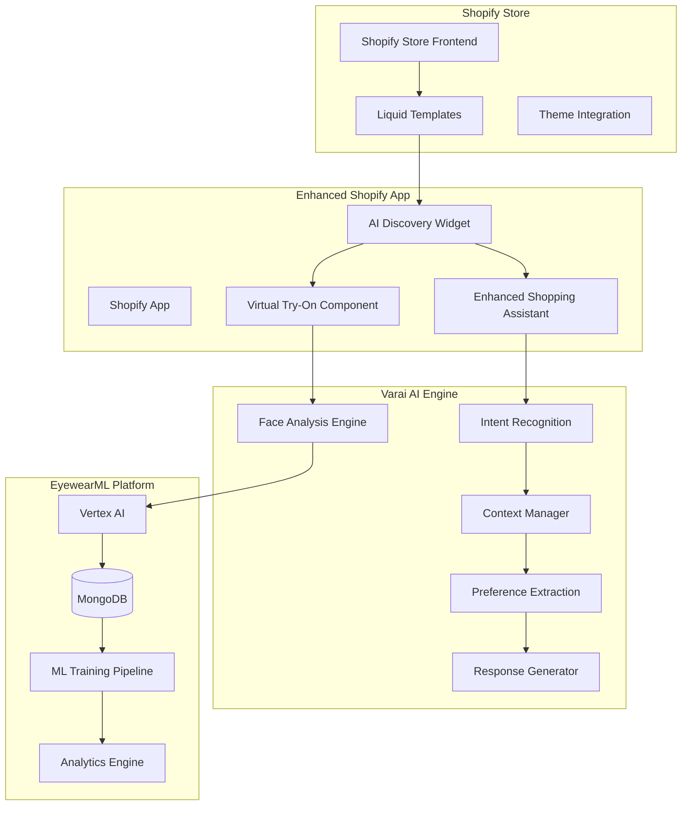

# Shopify AI Discovery Integration Requirements Specification

## Document Information
- **Document Type**: Requirements Specification
- **Platform**: Shopify
- **System**: EyewearML Varai AI Discovery
- **Version**: 1.0
- **Date**: January 2025
- **Author**: Agent 1 - Requirements Analysis Agent

## Executive Summary

This document defines comprehensive requirements for integrating EyewearML's Varai AI-powered eyewear discovery system into Shopify stores. The integration transforms traditional product search into an AI-guided discovery experience, leveraging existing MongoDB data structures, Vertex AI capabilities, and the established Shopify app architecture.

## 1. System Context and Architecture Alignment

### 1.1 Existing Platform Foundation
- **MongoDB Database**: Central source of truth with established product, user, and analytics schemas
- **Shopify App Structure**: Existing `apps/shopify/` with React components and TypeScript configuration
- **Vertex AI Integration**: Established connector at `apps/shopify/connectors/vertex-ai-connector.ts`
- **Shopping Assistant**: Current implementation at `apps/shopify/frontend/components/ShoppingAssistant.tsx`

### 1.2 Integration Architecture

## 2. Functional Requirements

### 2.1 AI Discovery Widget Integration

#### FR-001: Widget Deployment
- **Requirement**: Deploy AI Discovery widget as Shopify app extension
- **Description**: Create embeddable widget that integrates seamlessly with Shopify themes
- **Acceptance Criteria**:
  - Widget installs via Shopify App Store
  - Supports all major Shopify themes (Dawn, Debut, Brooklyn, etc.)
  - Configurable placement (product page, collection page, custom)
  - Mobile-responsive design with 90+ Lighthouse score
  - Loads in <2 seconds on 3G connection

#### FR-002: No-Search Philosophy Implementation
- **Requirement**: Replace traditional search with AI-guided discovery
- **Description**: Eliminate keyword search in favor of conversational AI discovery
- **Acceptance Criteria**:
  - Chatbot initiates conversation on page load
  - Face analysis guides product selection
  - Maximum 8 curated frame recommendations per session
  - Zero traditional search interface elements
  - 85%+ discovery completion rate

#### FR-003: Enhanced Shopping Assistant
- **Requirement**: Extend existing `ShoppingAssistant.tsx` with AI discovery
- **Description**: Enhance current shopping assistant with face analysis and personalized recommendations
- **Acceptance Criteria**:
  - Integrates with existing conversation flow
  - Adds face analysis capability
  - Provides personalized frame recommendations
  - Maintains conversation context across sessions
  - Supports multi-language conversations (EN, ES, FR)

### 2.2 Face Analysis and Personalization

#### FR-004: Computer Vision Integration
- **Requirement**: Implement face analysis using MediaPipe and Vertex AI
- **Description**: Analyze customer face shape, features, and measurements for personalization
- **Acceptance Criteria**:
  - Face shape detection (oval, round, square, heart, diamond, oblong)
  - Gender recognition for style preferences
  - Pupillary distance measurement (±2mm accuracy)
  - Feature analysis (eye size, nose shape, jawline)
  - 95%+ analysis accuracy rate
  - Privacy-compliant image processing (no storage)

#### FR-005: Personalized Recommendations
- **Requirement**: Generate curated frame selections based on face analysis
- **Description**: Use ML models to recommend optimal frames for individual customers
- **Acceptance Criteria**:
  - Maximum 8 frame recommendations per session
  - Recommendations ranked by compatibility score
  - Reasoning provided for each recommendation
  - Real-time updates based on user interactions
  - 80%+ recommendation relevance score

#### FR-006: Virtual Try-On Integration
- **Requirement**: Seamless VTO experience within discovery flow
- **Description**: Enable customers to virtually try on recommended frames
- **Acceptance Criteria**:
  - One-click VTO activation from recommendations
  - Real-time frame overlay on customer's face
  - Multiple frame comparison capability
  - High-quality rendering (1080p minimum)
  - 60%+ VTO engagement rate

### 2.3 Data Integration and Synchronization

#### FR-007: MongoDB Integration
- **Requirement**: Leverage existing MongoDB schema for product data
- **Description**: Integrate with established product catalog and user data structures
- **Acceptance Criteria**:
  - Uses existing product schema from `data-management/mongodb/init/01-init.js`
  - Supports AI-enhanced product attributes
  - Real-time inventory synchronization
  - Customer preference storage and retrieval
  - 99.9% data consistency across platforms

#### FR-008: Shopify Data Synchronization
- **Requirement**: Bi-directional sync between Shopify and EyewearML platform
- **Description**: Maintain data consistency between Shopify store and MongoDB
- **Acceptance Criteria**:
  - Product data sync (inventory, pricing, variants)
  - Customer data sync (profiles, preferences, orders)
  - Order data sync (purchases, returns, exchanges)
  - Real-time webhook processing
  - <5 minute sync latency for critical updates

#### FR-009: Analytics Data Collection
- **Requirement**: Comprehensive interaction tracking for ML improvement
- **Description**: Capture all user interactions for recommendation optimization
- **Acceptance Criteria**:
  - Frame view tracking with duration and position
  - VTO session recording with quality metrics
  - Conversion path analysis from discovery to purchase
  - A/B testing data collection
  - GDPR/CCPA compliant data handling

### 2.4 Conversational AI Features

#### FR-010: Intent Recognition
- **Requirement**: Understand customer intent through natural language
- **Description**: Process customer queries to determine shopping intent and preferences
- **Acceptance Criteria**:
  - Recognizes 20+ eyewear-specific intents
  - Handles multi-intent queries
  - Context-aware response generation
  - Sentiment analysis for customer satisfaction
  - 90%+ intent classification accuracy

#### FR-011: Context Management
- **Requirement**: Maintain conversation context across interactions
- **Description**: Remember customer preferences and conversation history
- **Acceptance Criteria**:
  - Session-based context retention
  - Cross-session preference memory
  - Context-aware recommendations
  - Conversation history for customer service
  - 30-day context retention period

#### FR-012: Response Generation
- **Requirement**: Generate natural, helpful responses using NLG
- **Description**: Create personalized responses that guide customers through discovery
- **Acceptance Criteria**:
  - Natural language response generation
  - Personalized messaging based on analysis
  - Educational content about frame suitability
  - Proactive suggestions and guidance
  - 4.5/5 average conversation quality rating

## 3. Technical Requirements

### 3.1 Platform Integration

#### TR-001: Shopify App Architecture
- **Requirement**: Build on existing Shopify app structure
- **Description**: Extend current app with AI discovery capabilities
- **Technical Specifications**:
  - TypeScript/React frontend components
  - Node.js backend with Express framework
  - Shopify API integration using latest SDK
  - OAuth 2.0 authentication flow
  - Webhook handling for real-time updates

#### TR-002: Theme Compatibility
- **Requirement**: Support all major Shopify themes
- **Description**: Ensure widget works across different theme architectures
- **Technical Specifications**:
  - Liquid template integration
  - CSS framework compatibility
  - JavaScript module loading
  - Responsive design breakpoints
  - Theme customization API support

#### TR-003: Performance Optimization
- **Requirement**: Maintain fast loading times and smooth interactions
- **Description**: Optimize for mobile and desktop performance
- **Technical Specifications**:
  - <2 second initial load time
  - <500ms API response times
  - Lazy loading for non-critical components
  - CDN distribution for static assets
  - Progressive Web App capabilities

### 3.2 AI and ML Integration

#### TR-004: Vertex AI Integration
- **Requirement**: Leverage existing Vertex AI connector
- **Description**: Extend current AI capabilities for discovery features
- **Technical Specifications**:
  - Enhance `vertex-ai-connector.ts`
  - Face analysis model deployment
  - Recommendation model serving
  - Real-time inference capabilities
  - Model versioning and rollback

#### TR-005: MediaPipe Integration
- **Requirement**: Client-side face analysis using MediaPipe
- **Description**: Implement privacy-first face analysis in browser
- **Technical Specifications**:
  - MediaPipe Face Landmarker integration
  - WebAssembly optimization
  - Camera access and image processing
  - Real-time face tracking
  - Privacy-compliant processing (no data storage)

#### TR-006: Machine Learning Pipeline
- **Requirement**: Continuous learning from user interactions
- **Description**: Implement ML pipeline for recommendation improvement
- **Technical Specifications**:
  - Feature extraction from user interactions
  - Model training pipeline automation
  - A/B testing framework for model comparison
  - Performance monitoring and alerting
  - Automated model deployment

### 3.3 Data Architecture

#### TR-007: Database Schema Extension
- **Requirement**: Extend MongoDB schema for AI discovery data
- **Description**: Add collections and indexes for discovery features
- **Technical Specifications**:
  - User interaction tracking collections
  - Face analysis result storage (temporary)
  - Recommendation history and performance
  - A/B testing experiment data
  - Analytics aggregation collections

#### TR-008: API Architecture
- **Requirement**: RESTful API design for discovery features
- **Description**: Create scalable API endpoints for AI discovery
- **Technical Specifications**:
  - RESTful endpoint design
  - GraphQL support for complex queries
  - Rate limiting and authentication
  - Request/response validation
  - API versioning strategy

#### TR-009: Caching Strategy
- **Requirement**: Implement multi-layer caching for performance
- **Description**: Cache frequently accessed data and computations
- **Technical Specifications**:
  - Redis caching for session data
  - CDN caching for static assets
  - Application-level caching for recommendations
  - Cache invalidation strategies
  - Performance monitoring

## 4. User Experience Requirements

### 4.1 Customer Journey

#### UX-001: Discovery Initiation
- **Requirement**: Seamless entry into AI discovery experience
- **Description**: Guide customers naturally into face analysis and discovery
- **UX Specifications**:
  - Friendly chatbot greeting with clear value proposition
  - Progressive disclosure of features and benefits
  - Clear camera permission request with privacy explanation
  - Fallback options for users who decline camera access
  - Accessibility compliance (WCAG 2.1 AA)

#### UX-002: Face Analysis Experience
- **Requirement**: User-friendly face capture and analysis
- **Description**: Make face analysis feel natural and valuable
- **UX Specifications**:
  - Real-time feedback during face capture
  - Clear instructions and positioning guides
  - Progress indicators during analysis
  - Explanation of analysis results
  - Option to retake photo if unsatisfied

#### UX-003: Frame Presentation
- **Requirement**: Compelling presentation of recommended frames
- **Description**: Present curated frames in an engaging, informative way
- **UX Specifications**:
  - Maximum 8 frames per recommendation set
  - Clear reasoning for each recommendation
  - High-quality product images and details
  - One-click virtual try-on activation
  - Comparison tools for multiple frames

#### UX-004: Virtual Try-On Experience
- **Requirement**: Seamless and realistic virtual try-on
- **Description**: Provide high-quality VTO experience within discovery flow
- **UX Specifications**:
  - Real-time frame overlay with accurate positioning
  - Multiple viewing angles and lighting conditions
  - Frame adjustment controls (size, position)
  - Comparison mode for multiple frames
  - Social sharing capabilities

### 4.2 Merchant Experience

#### UX-005: Installation and Setup
- **Requirement**: Simple app installation and configuration
- **Description**: Enable merchants to easily install and configure AI discovery
- **UX Specifications**:
  - One-click installation from Shopify App Store
  - Guided setup wizard with best practices
  - Theme integration assistance
  - Configuration preview and testing
  - Documentation and video tutorials

#### UX-006: Analytics Dashboard
- **Requirement**: Comprehensive analytics for merchant insights
- **Description**: Provide actionable insights into AI discovery performance
- **UX Specifications**:
  - Real-time performance metrics
  - Customer journey visualization
  - Recommendation effectiveness analysis
  - Revenue attribution reporting
  - Customizable dashboard widgets

#### UX-007: Customization Options
- **Requirement**: Brand customization and configuration flexibility
- **Description**: Allow merchants to customize AI discovery to match their brand
- **UX Specifications**:
  - Brand color and logo customization
  - Custom messaging and conversation flows
  - Widget placement and sizing options
  - Feature enable/disable toggles
  - A/B testing configuration

## 5. Integration Requirements

### 5.1 Shopify Platform Integration

#### INT-001: App Store Compliance
- **Requirement**: Meet all Shopify App Store requirements
- **Description**: Ensure app complies with Shopify's technical and policy requirements
- **Compliance Specifications**:
  - Shopify Partner requirements compliance
  - App review process preparation
  - Privacy policy and terms of service
  - GDPR and CCPA compliance documentation
  - Security audit and penetration testing

#### INT-002: Theme Integration
- **Requirement**: Seamless integration with Shopify themes
- **Description**: Ensure widget works across all major Shopify themes
- **Integration Specifications**:
  - Liquid template integration patterns
  - CSS framework compatibility testing
  - JavaScript conflict resolution
  - Mobile responsiveness across themes
  - Theme update compatibility

#### INT-003: Shopify API Integration
- **Requirement**: Full utilization of Shopify APIs
- **Description**: Leverage Shopify's APIs for complete integration
- **API Specifications**:
  - Admin API for product and customer data
  - Storefront API for frontend interactions
  - Webhook API for real-time updates
  - GraphQL API for efficient data fetching
  - Partner API for app management

### 5.2 Third-Party Integrations

#### INT-004: Google Cloud Integration
- **Requirement**: Leverage Google Cloud services for AI capabilities
- **Description**: Integrate with Google Cloud for ML and AI services
- **Cloud Specifications**:
  - Vertex AI for machine learning models
  - Cloud Vision API for image analysis
  - Cloud Run for scalable deployment
  - Cloud Storage for temporary data
  - Cloud Monitoring for observability

#### INT-005: Analytics Integration
- **Requirement**: Integration with analytics platforms
- **Description**: Support integration with popular analytics tools
- **Analytics Specifications**:
  - Google Analytics 4 integration
  - Shopify Analytics compatibility
  - Custom event tracking
  - Conversion funnel analysis
  - Attribution modeling support

## 6. Performance Requirements

### 6.1 Response Time Requirements

#### PERF-001: Widget Loading Performance
- **Requirement**: Fast widget initialization and loading
- **Performance Targets**:
  - Initial widget load: <2 seconds
  - Face analysis completion: <5 seconds
  - Recommendation generation: <3 seconds
  - VTO activation: <1 second
  - API response times: <500ms (95th percentile)

#### PERF-002: Scalability Requirements
- **Requirement**: Handle high traffic and concurrent users
- **Scalability Targets**:
  - Support 10,000+ concurrent users
  - Handle 1M+ API requests per day
  - Auto-scaling based on demand
  - 99.9% uptime SLA
  - <1% error rate under normal load

#### PERF-003: Mobile Performance
- **Requirement**: Optimized performance on mobile devices
- **Mobile Targets**:
  - Lighthouse Performance Score: 90+
  - First Contentful Paint: <2 seconds
  - Largest Contentful Paint: <3 seconds
  - Cumulative Layout Shift: <0.1
  - First Input Delay: <100ms

### 6.2 Resource Utilization

#### PERF-004: Memory and CPU Usage
- **Requirement**: Efficient resource utilization
- **Resource Targets**:
  - Client-side memory usage: <100MB
  - CPU usage during face analysis: <80%
  - Battery impact on mobile: Minimal
  - Network bandwidth optimization
  - Offline capability for core features

## 7. Security and Privacy Requirements

### 7.1 Data Privacy

#### SEC-001: Privacy-First Face Analysis
- **Requirement**: Process face images without storing personal data
- **Privacy Specifications**:
  - Client-side face analysis using MediaPipe
  - No face image storage on servers
  - Temporary processing data deletion
  - User consent management
  - Privacy policy compliance

#### SEC-002: GDPR/CCPA Compliance
- **Requirement**: Full compliance with privacy regulations
- **Compliance Specifications**:
  - Data processing consent mechanisms
  - Right to deletion implementation
  - Data portability features
  - Privacy impact assessment
  - Regular compliance audits

#### SEC-003: Data Encryption
- **Requirement**: Encrypt all sensitive data in transit and at rest
- **Encryption Specifications**:
  - TLS 1.3 for data in transit
  - AES-256 encryption for data at rest
  - Key management using Google Cloud KMS
  - Certificate management and rotation
  - End-to-end encryption for sensitive operations

### 7.2 Application Security

#### SEC-004: Authentication and Authorization
- **Requirement**: Secure authentication and access control
- **Security Specifications**:
  - OAuth 2.0 with Shopify
  - JWT token management
  - Role-based access control
  - Session management and timeout
  - Multi-factor authentication support

#### SEC-005: API Security
- **Requirement**: Secure API endpoints and data access
- **API Security Specifications**:
  - Rate limiting and throttling
  - Input validation and sanitization
  - SQL injection prevention
  - Cross-site scripting (XSS) protection
  - CORS policy implementation

## 8. Monitoring and Analytics Requirements

### 8.1 System Monitoring

#### MON-001: Application Performance Monitoring
- **Requirement**: Comprehensive monitoring of application performance
- **Monitoring Specifications**:
  - Real-time performance metrics
  - Error tracking and alerting
  - User experience monitoring
  - Infrastructure monitoring
  - Custom dashboard creation

#### MON-002: Business Metrics Tracking
- **Requirement**: Track key business metrics and KPIs
- **Business Metrics**:
  - Discovery completion rate
  - Recommendation click-through rate
  - VTO engagement rate
  - Conversion rate improvement
  - Customer satisfaction scores

#### MON-003: ML Model Monitoring
- **Requirement**: Monitor ML model performance and accuracy
- **ML Monitoring Specifications**:
  - Model accuracy tracking
  - Prediction confidence monitoring
  - Data drift detection
  - Model performance degradation alerts
  - A/B testing result tracking

### 8.2 Analytics and Reporting

#### MON-004: Customer Journey Analytics
- **Requirement**: Detailed analytics of customer discovery journeys
- **Analytics Specifications**:
  - Funnel analysis from discovery to purchase
  - Drop-off point identification
  - User behavior pattern analysis
  - Cohort analysis and retention
  - Personalization effectiveness measurement

#### MON-005: Merchant Reporting
- **Requirement**: Comprehensive reporting for merchant insights
- **Reporting Specifications**:
  - Revenue attribution to AI discovery
  - Product performance by face type
  - Customer satisfaction metrics
  - Operational efficiency improvements
  - ROI calculation and reporting

## 9. Success Metrics and KPIs

### 9.1 Customer Experience Metrics

#### KPI-001: Discovery Experience
- **Discovery Completion Rate**: >85%
- **Face Analysis Success Rate**: >95%
- **Recommendation Satisfaction**: >4.5/5 stars
- **Time to Find Perfect Frame**: <3 minutes
- **Customer Effort Score**: <2.0

#### KPI-002: Engagement Metrics
- **VTO Engagement Rate**: >60%
- **Recommendation Click-Through Rate**: >40%
- **Session Duration**: >5 minutes average
- **Return Visit Rate**: >30%
- **Social Sharing Rate**: >10%

### 9.2 Business Impact Metrics

#### KPI-003: Conversion and Revenue
- **Conversion Rate Improvement**: +40% vs. traditional search
- **Average Order Value Increase**: +25%
- **Revenue per Visitor**: +35%
- **Cart Abandonment Reduction**: -20%
- **Customer Lifetime Value**: +30%

#### KPI-004: Operational Efficiency
- **Support Ticket Reduction**: -50%
- **Return Rate Reduction**: -25%
- **Inventory Turnover Improvement**: +20%
- **Customer Acquisition Cost**: -15%
- **Time to Market for New Products**: -30%

### 9.3 Technical Performance Metrics

#### KPI-005: System Performance
- **System Uptime**: >99.9%
- **API Response Time**: <500ms (95th percentile)
- **Error Rate**: <1%
- **Mobile Performance Score**: >90
- **Security Incident Rate**: 0

## 10. Acceptance Criteria

### 10.1 Functional Acceptance

#### AC-001: Core Functionality
- [ ] AI Discovery widget successfully installs via Shopify App Store
- [ ] Face analysis completes with >95% accuracy
- [ ] Personalized recommendations generate within 3 seconds
- [ ] Virtual try-on activates within 1 second
- [ ] Conversation flow maintains context across interactions

#### AC-002: Integration Acceptance
- [ ] Widget integrates with top 10 Shopify themes
- [ ] Data synchronizes between Shopify and MongoDB
- [ ] Analytics data captures all user interactions
- [ ] Mobile experience achieves 90+ Lighthouse score
- [ ] API endpoints respond within SLA requirements

#### AC-003: User Experience Acceptance
- [ ] Customer journey completes in <5 minutes
- [ ] Recommendation satisfaction scores >4.5/5
- [ ] VTO engagement rate exceeds 60%
- [ ] Accessibility compliance verified (WCAG 2.1 AA)
- [ ] Multi-language support functions correctly

### 10.2 Technical Acceptance

#### AC-004: Performance Acceptance
- [ ] Widget loads in <2 seconds on 3G connection
- [ ] System handles 10,000+ concurrent users
- [ ] 99.9% uptime maintained over 30-day period
- [ ] Memory usage stays below 100MB on mobile
- [ ] CPU usage remains under 80% during peak load

#### AC-005: Security Acceptance
- [ ] Privacy compliance audit passes
- [ ] Security penetration testing passes
- [ ] Data encryption verified for all sensitive data
- [ ] Authentication and authorization function correctly
- [ ] No face images stored on servers

### 10.3 Business Acceptance

#### AC-006: Business Impact Acceptance
- [ ] Conversion rate improves by >40%
- [ ] Average order value increases by >25%
- [ ] Customer satisfaction scores improve
- [ ] Support ticket volume decreases by >50%
- [ ] ROI calculation shows positive return within 6 months

## 11. Dependencies and Constraints

### 11.1 Technical Dependencies

#### DEP-001: Platform Dependencies
- Shopify API availability and stability
- Google Cloud services (Vertex AI, Cloud Run)
- MongoDB database performance and availability
- MediaPipe library updates and compatibility
- React and TypeScript framework updates

#### DEP-002: Integration Dependencies
- Shopify App Store approval process
- Theme compatibility across updates
- Third-party analytics platform APIs
- Payment gateway integrations
- Customer data synchronization services

### 11.2 Business Constraints

#### CON-001: Regulatory Constraints
- GDPR compliance requirements
- CCPA privacy regulations
- Shopify App Store policies
- Industry-specific regulations
- International data transfer restrictions

#### CON-002: Technical Constraints
- Shopify platform limitations
- Browser compatibility requirements
- Mobile device performance limitations
- Network bandwidth constraints
- Real-time processing requirements

### 11.3 Resource Constraints

#### CON-003: Development Constraints
- Development team availability
- Testing environment limitations
- Budget constraints for cloud services
- Timeline constraints for market launch
- Quality assurance resource allocation

## 12. Risk Assessment and Mitigation

### 12.1 Technical Risks

#### RISK-001: Face Analysis Accuracy
- **Risk**: Face analysis accuracy below requirements
- **Impact**: Poor recommendation quality, customer dissatisfaction
- **Probability**: Medium
- **Mitigation**: Extensive testing, fallback algorithms, continuous model improvement

#### RISK-002: Performance Degradation
- **Risk**: System performance degrades under high load
- **Impact**: Poor user experience, customer abandonment
- **Probability**: Medium
- **Mitigation**: Load testing, auto-scaling, performance monitoring

#### RISK-003: Integration Complexity
- **Risk**: Complex integration with diverse Shopify themes
- **Impact**: Limited theme compatibility, reduced market reach
- **Probability**: High
- **Mitigation**: Comprehensive theme testing, flexible integration patterns

### 12.2 Business Risks

#### RISK-004: Market Acceptance
- **Risk**: Customers resist AI-guided shopping experience
- **Impact**: Low adoption rates, poor business outcomes
- **Probability**: Low
- **Mitigation**: User education, gradual rollout, feedback incorporation

#### RISK-005: Competitive Response
- **Risk**: Competitors develop similar solutions
- **Impact**: Reduced competitive advantage, market share loss
- **Probability**: High
- **Mitigation**: Continuous innovation, patent protection, first-mover advantage

### 12.3 Regulatory Risks

#### RISK-006: Privacy Compliance
- **Risk**: Privacy regulations change or enforcement increases
- **Impact**: Legal liability, operational disruption
- **Probability**: Medium
- **Mitigation**: Privacy-by-design, legal consultation, compliance monitoring

## 13. Implementation Roadmap

### 13.1 Phase 1: Foundation (Weeks 1-2)
- Enhance existing Shopify app structure
- Implement basic AI discovery widget
- Integrate face analysis capabilities
- Set up analytics infrastructure

### 13.2 Phase 2: Core Features (Weeks 3-4)
- Develop recommendation engine
- Implement virtual try-on integration
- Create merchant dashboard
- Build data synchronization services

### 13.3 Phase 3: Optimization (Weeks 5-6)
- Optimize performance and scalability
- Implement advanced analytics
- Add A/B testing framework
- Enhance mobile experience

### 13.4 Phase 4: Launch (Weeks 7-8)
- Shopify App Store submission
- Merchant onboarding process
- Customer support documentation
- Marketing and launch activities

## 14. Conclusion

This requirements specification provides a comprehensive foundation for implementing Shopify AI Discovery integration within the EyewearML platform. The requirements align with existing architecture while introducing innovative AI-powered discovery capabilities that transform the eyewear shopping experience.

The specification balances technical feasibility with business objectives, ensuring that the implementation delivers measurable value to both merchants and customers while maintaining the highest standards of privacy, security, and performance.

Success will be measured through improved customer experience metrics, increased business outcomes, and technical performance achievements that establish EyewearML as the leader in AI-powered eyewear discovery.