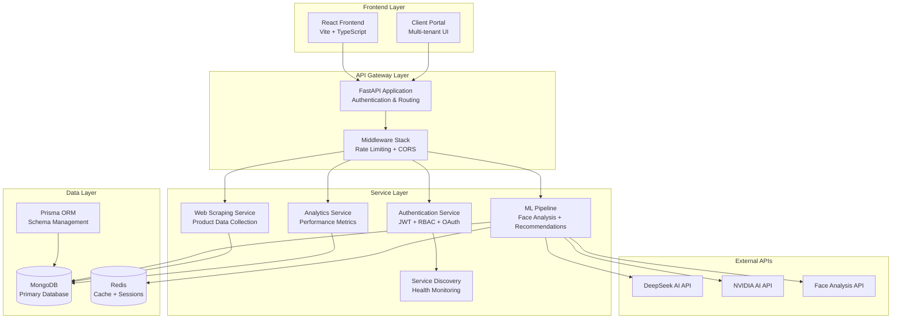
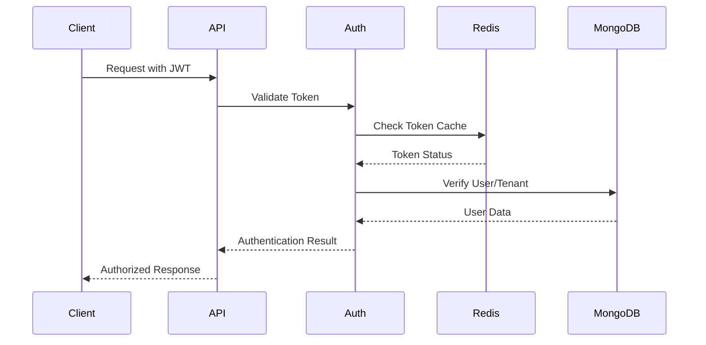
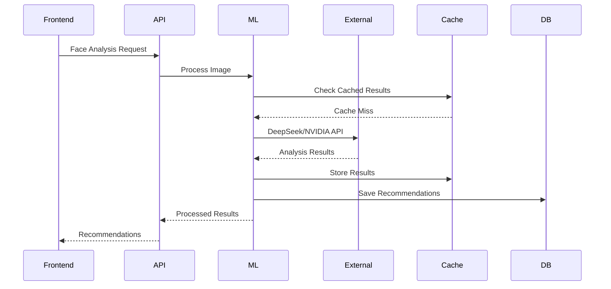

# EyewearML Platform - System Architecture Design
## SPARC Phase 1.1: Comprehensive Architecture Review

### Executive Summary

The EyewearML platform implements a sophisticated multi-service architecture with comprehensive authentication, service discovery, and graceful degradation patterns. While the core application logic is well-designed, critical configuration and dependency issues prevent full operability.

### System Overview



### Architecture Layers

#### 1. Frontend Layer
- **React Application**: Modern Vite-based build system with TypeScript
- **Material-UI Components**: Comprehensive UI component library
- **Multi-tenant Support**: Client portal for opticians stores
- **Testing Infrastructure**: Jest + Testing Library setup

#### 2. API Gateway Layer
- **FastAPI Framework**: High-performance async Python web framework
- **Authentication Stack**: Multi-layered security with JWT, API keys, RBAC
- **Middleware Pipeline**: Rate limiting, CORS, error handling, logging
- **Service Discovery**: Automatic service registration and health monitoring

#### 3. Service Layer
- **Authentication Service**: Comprehensive auth with multi-tenant support
- **ML Pipeline**: Face shape analysis and eyewear recommendations
- **Web Scraping**: Product data collection and processing
- **Analytics**: Performance metrics and reporting
- **Health Monitoring**: Service discovery and health checks

#### 4. Data Layer
- **MongoDB**: Primary document database for flexible data storage
- **Redis**: Caching layer and session management
- **Prisma ORM**: Type-safe database access with schema management
- **Multi-database Support**: PostgreSQL compatibility maintained

### Critical Issues Resolution Plan

#### Phase 1: Dependency Resolution (Priority: CRITICAL)

**1.1 Fix Frontend Circular Dependency**
```json
// Remove from frontend/package.json
- "eyewear-ml": "file:.."

// Add proper workspace configuration to root package.json
{
  "workspaces": ["frontend", "client-portal"],
  "scripts": {
    "dev": "concurrently \"npm run dev:api\" \"npm run dev:frontend\"",
    "dev:api": "cd src/api && uvicorn main:app --reload --host 0.0.0.0 --port 8080",
    "dev:frontend": "cd frontend && npm run dev"
  }
}
```

**1.2 Configure Root Package Management**
```json
{
  "name": "eyewear-ml-platform",
  "version": "1.0.0",
  "type": "module",
  "scripts": {
    "start": "docker-compose up",
    "dev": "docker-compose -f docker-compose.dev.yml up",
    "test": "npm run test:api && npm run test:frontend",
    "build": "npm run build:frontend && docker build -t eyewear-ml-api ."
  }
}
```

#### Phase 2: Environment Configuration (Priority: HIGH)

**2.1 Complete Environment Variables**
```bash
# Core Infrastructure
DATABASE_URL=mongodb://mongodb:27017/eyewear_ml
MONGODB_URL=mongodb://mongodb:27017
REDIS_URL=redis://redis:6379/0

# Security
SECRET_KEY=your_secure_secret_key_here
JWT_SECRET_KEY=your_jwt_secret_key_here

# External APIs
DEEPSEEK_DIRECT_API_KEY=your_deepseek_api_key
NVIDIA_API_KEY=your_nvidia_api_key
FACE_ANALYSIS_API_KEY=your_face_analysis_api_key
```

**2.2 Fix Configuration Corruption**
```python
# src/api/core/config.py line 117
if os.getenv("ENVIRONMENT") == "test":
    settings.MONGODB_DATABASE = "eyewear_ml_test"
    settings.DATABASE_URL = f"mongodb://mongodb:27017/{settings.MONGODB_DATABASE}"
    settings.USE_REDIS_CACHE = False
    settings.RATE_LIMIT_REQUESTS_PER_MINUTE = 1000
```

#### Phase 3: Container Orchestration (Priority: MEDIUM)

**3.1 Fix Migration Service**
```yaml
# docker-compose.yml
migration-service:
  build: .
  command: ["python", "-m", "prisma", "db", "push"]
  environment:
    - DATABASE_URL=${DATABASE_URL}
  depends_on:
    - mongodb
```

**3.2 Multi-stage Docker Build**
```dockerfile
# Add Node.js for Prisma generation
FROM python:3.9-slim as base
RUN apt-get update && apt-get install -y nodejs npm
COPY requirements.txt .
RUN pip install -r requirements.txt
RUN npx prisma generate

FROM base as production
COPY . .
EXPOSE 8080
CMD ["uvicorn", "src.api.main:app", "--host", "0.0.0.0", "--port", "8080"]
```

#### Phase 4: Database Schema Completion (Priority: MEDIUM)

**4.1 Complete Model Definitions**
```prisma
model Report {
  id          String   @id @default(auto()) @map("_id") @db.ObjectId
  title       String
  description String?
  type        String
  data        Json
  createdAt   DateTime @default(now())
  updatedAt   DateTime @updatedAt
  storeId     String   @db.ObjectId
  store       OpticiansStore @relation(fields: [storeId], references: [id])
}

model ScheduledReport {
  id          String   @id @default(auto()) @map("_id") @db.ObjectId
  reportId    String   @db.ObjectId
  schedule    String   // Cron expression
  isActive    Boolean  @default(true)
  lastRun     DateTime?
  nextRun     DateTime
  createdAt   DateTime @default(now())
  report      Report   @relation(fields: [reportId], references: [id])
}
```

### Service Integration Patterns

#### 1. Authentication Flow


#### 2. ML Pipeline Integration


### Performance & Scalability Considerations

#### 1. Caching Strategy
- **Redis**: Session management, rate limiting, ML results caching
- **Application-level**: Recommendation caching with TTL
- **Database**: MongoDB indexing for optimal query performance

#### 2. Rate Limiting
- **Per-endpoint**: Configurable limits with Redis backend
- **Graceful Degradation**: Fallback policies when Redis unavailable
- **Multi-tenant**: Separate limits per optician store

#### 3. Service Discovery
- **Health Checks**: Automated service monitoring
- **Load Balancing**: Service registration for horizontal scaling
- **Fault Tolerance**: Circuit breaker patterns implemented

### Security Architecture

#### 1. Multi-layered Authentication
- **JWT Tokens**: Stateless authentication with refresh tokens
- **API Keys**: Service-to-service authentication
- **RBAC**: Role-based access control with tenant isolation
- **OAuth**: Third-party authentication integration

#### 2. Data Protection
- **Tenant Isolation**: Multi-tenant data segregation
- **Input Validation**: Pydantic models for request validation
- **CORS Configuration**: Restricted cross-origin access
- **Rate Limiting**: DDoS protection and abuse prevention

### Deployment Strategy

#### 1. Container Orchestration
```yaml
# Production docker-compose.yml
version: '3.8'
services:
  api:
    build: .
    ports:
      - "8080:8080"
    environment:
      - ENVIRONMENT=production
    depends_on:
      - mongodb
      - redis
    healthcheck:
      test: ["CMD", "curl", "-f", "http://localhost:8080/health"]
      interval: 30s
      timeout: 10s
      retries: 3
```

#### 2. Cloud Deployment
- **Google Cloud Run**: Serverless container deployment
- **Health Checks**: Integrated monitoring and auto-scaling
- **Environment Management**: Secure secret management
- **CI/CD Pipeline**: Automated testing and deployment

### Monitoring & Observability

#### 1. Health Monitoring
- **Service Discovery**: Automatic health check registration
- **Endpoint Monitoring**: `/health` endpoint with dependency checks
- **Performance Metrics**: Response time and error rate tracking

#### 2. Logging Strategy
- **Structured Logging**: JSON format for log aggregation
- **Error Tracking**: Comprehensive exception handling
- **Audit Trails**: Authentication and authorization logging

### Next Steps & Implementation Roadmap

#### Immediate Actions (Week 1)
1. **Fix Circular Dependency**: Remove `"eyewear-ml": "file:.."` from frontend/package.json
2. **Configure Root Package**: Add workspace management and startup scripts
3. **Complete Environment**: Set all required environment variables
4. **Fix Config Corruption**: Repair test environment DATABASE_URL

#### Short-term Goals (Weeks 2-4)
1. **Complete Database Schema**: Finish incomplete model definitions
2. **Fix Docker Migration**: Resolve Python/Node.js container mismatch
3. **Implement Testing**: Add comprehensive test coverage
4. **Documentation**: Complete API documentation and deployment guides

#### Medium-term Objectives (Months 2-3)
1. **Performance Optimization**: Implement advanced caching strategies
2. **Security Hardening**: Complete security audit and penetration testing
3. **Monitoring Enhancement**: Add comprehensive observability stack
4. **Scalability Testing**: Load testing and performance benchmarking

### Conclusion

The EyewearML platform demonstrates sophisticated architectural patterns with comprehensive authentication, service discovery, and graceful degradation. The core application logic is well-designed and production-ready. However, critical configuration issues prevent full operability.

**Key Strengths:**
- Comprehensive authentication and authorization system
- Service discovery and health monitoring
- Graceful error handling and fallback mechanisms
- Multi-database support with proper abstraction
- Modern frontend architecture with TypeScript

**Critical Blockers:**
- Frontend circular dependency preventing builds
- Incomplete environment configuration blocking service connections
- Docker configuration mismatches preventing deployments
- Database schema inconsistencies affecting data operations

**Recommendation:** Address the critical blockers in priority order, starting with dependency resolution and environment configuration. The platform's sophisticated architecture provides a solid foundation for scaling once these configuration issues are resolved.