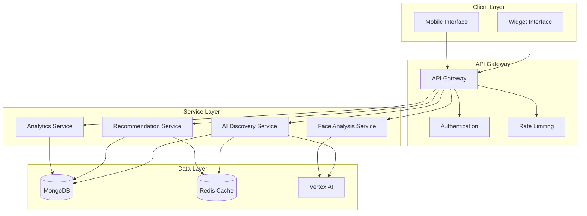

# AI Discovery E-commerce Integration - Developer Technical Guide

## Document Information
- **Document Type**: Technical Developer Guide
- **Target Audience**: Developers, System Administrators, DevOps Engineers
- **Version**: 1.0
- **Date**: January 2025
- **Maintenance**: Updated with each major release

## Table of Contents

1. [Development Environment Setup](#development-environment-setup)
2. [Architecture Deep Dive](#architecture-deep-dive)
3. [Platform-Specific Development](#platform-specific-development)
4. [API Reference](#api-reference)
5. [Database Schema](#database-schema)
6. [Testing Framework](#testing-framework)
7. [Deployment Procedures](#deployment-procedures)
8. [Monitoring & Debugging](#monitoring--debugging)
9. [Security Implementation](#security-implementation)
10. [Performance Optimization](#performance-optimization)

## Development Environment Setup

### Prerequisites
```bash
# Required Software
Node.js >= 18.0.0
Python >= 3.9
PHP >= 8.1 (for WooCommerce/Magento)
Docker >= 20.10
Docker Compose >= 2.0
MongoDB >= 4.4
Redis >= 6.0
Google Cloud SDK >= 400.0
```

### Environment Configuration
```bash
# Clone the repository
git clone https://github.com/your-org/commerce-studio.git
cd commerce-studio

# Install dependencies
npm install
pip install -r requirements.txt
composer install

# Environment variables
cp .env.example .env
```

### Required Environment Variables
```bash
# Database Configuration
MONGODB_URI=mongodb://localhost:27017/commerce-studio
REDIS_URL=redis://localhost:6379

# Google Cloud Configuration
GCP_PROJECT_ID=ml-datadriven-recos
VERTEX_AI_PROJECT=ml-datadriven-recos
VERTEX_AI_LOCATION=us-central1
GOOGLE_APPLICATION_CREDENTIALS=/path/to/service-account.json

# API Configuration
API_BASE_URL=http://localhost:3000
WIDGET_CDN_URL=http://localhost:8080
JWT_SECRET=your-secure-jwt-secret

# Platform Credentials (Development)
SHOPIFY_API_KEY=your-dev-api-key
SHOPIFY_API_SECRET=your-dev-api-secret
WORDPRESS_API_URL=http://localhost:8000/wp-json
MAGENTO_API_URL=http://localhost:9000/rest/V1
```

### Local Development Setup
```bash
# Start development services
docker-compose -f docker-compose.dev.yml up -d

# Start the main API server
npm run dev

# Start widget development server
cd apps/html-store && npm run dev

# Start platform-specific development
cd apps/shopify && npm run dev
cd apps/woocommerce && composer install && npm run dev
cd apps/magento && composer install && npm run dev
```

## Architecture Deep Dive

### System Components

#### 1. Core Services Architecture
```typescript
// Service Registry Pattern
interface ServiceRegistry {
  aiDiscovery: AIDiscoveryService;
  faceAnalysis: FaceAnalysisService;
  recommendations: RecommendationService;
  analytics: AnalyticsService;
  qualityManagement: QualityManagementService;
}

// Microservices Communication
class ServiceMesh {
  private services: Map<string, Service>;
  
  async callService(serviceName: string, method: string, data: any): Promise<any> {
    const service = this.services.get(serviceName);
    return await service.invoke(method, data);
  }
}
```

#### 2. Data Flow Architecture


#### 3. Widget Architecture
```typescript
// Widget Base Class
abstract class BaseWidget {
  protected config: WidgetConfig;
  protected apiClient: APIClient;
  protected eventEmitter: EventEmitter;
  
  abstract render(): void;
  abstract initialize(config: WidgetConfig): void;
  abstract destroy(): void;
  
  protected async loadAIServices(): Promise<void> {
    // Load AI services asynchronously
  }
}

// Platform-Specific Implementations
class ShopifyWidget extends BaseWidget {
  initialize(config: ShopifyWidgetConfig): void {
    // Shopify-specific initialization
    this.setupLiquidIntegration();
    this.configureShopifyAPI();
  }
}

class WooCommerceWidget extends BaseWidget {
  initialize(config: WooCommerceWidgetConfig): void {
    // WooCommerce-specific initialization
    this.setupWordPressHooks();
    this.configureWooCommerceAPI();
  }
}
```

### Database Design

#### MongoDB Collections Schema
```javascript
// Users Collection
{
  _id: ObjectId,
  email: String,
  role: "super_admin" | "client",
  clients: [ObjectId], // For super_admin
  clientId: ObjectId, // For client users
  profile: {
    name: String,
    avatar: String,
    preferences: Object
  },
  createdAt: Date,
  updatedAt: Date
}

// Clients Collection
{
  _id: ObjectId,
  name: String,
  domain: String,
  platform: "shopify" | "woocommerce" | "magento" | "html",
  configuration: {
    apiKeys: Object,
    features: {
      faceAnalysis: Boolean,
      virtualTryOn: Boolean,
      aiRecommendations: Boolean
    },
    branding: {
      primaryColor: String,
      logoUrl: String,
      customCSS: String
    }
  },
  status: "active" | "inactive" | "suspended",
  createdAt: Date,
  updatedAt: Date
}

// AI Sessions Collection
{
  _id: ObjectId,
  clientId: ObjectId,
  sessionId: String,
  userId: String, // Platform-specific user ID
  platform: String,
  conversation: [{
    timestamp: Date,
    type: "user" | "ai",
    message: String,
    metadata: Object
  }],
  faceAnalysis: {
    faceShape: String,
    confidence: Number,
    landmarks: Object,
    processedAt: Date
  },
  recommendations: [{
    productId: String,
    score: Number,
    reason: String,
    timestamp: Date
  }],
  qualityScore: {
    coherence: Number,
    helpfulness: Number,
    naturalness: Number,
    overall: Number,
    scoredAt: Date
  },
  outcome: {
    type: "purchase" | "abandoned" | "ongoing",
    productIds: [String],
    value: Number
  },
  createdAt: Date,
  updatedAt: Date
}

// Products Collection
{
  _id: ObjectId,
  clientId: ObjectId,
  platformProductId: String,
  name: String,
  description: String,
  category: String,
  brand: String,
  price: Number,
  currency: String,
  images: [String],
  attributes: {
    frameShape: String,
    material: String,
    color: String,
    size: String,
    gender: String,
    style: String
  },
  aiMetadata: {
    faceShapeCompatibility: [String],
    styleVector: [Number],
    popularityScore: Number
  },
  syncedAt: Date,
  createdAt: Date,
  updatedAt: Date
}
```

## Platform-Specific Development

### Shopify Development

#### App Structure
```
apps/shopify/
├── api/
│   ├── ai-discovery/
│   │   ├── chat.js
│   │   ├── recommendations.js
│   │   └── face-analysis.js
│   └── webhooks/
├── frontend/
│   ├── components/
│   │   ├── AIDiscoveryWidget.tsx
│   │   └── ShoppingAssistant.tsx
│   └── services/
├── extensions/
│   └── theme/
│       └── blocks/
└── middleware/
```

#### Shopify API Integration
```typescript
// Shopify API Client
class ShopifyAPIClient {
  private shop: string;
  private accessToken: string;
  
  constructor(shop: string, accessToken: string) {
    this.shop = shop;
    this.accessToken = accessToken;
  }
  
  async getProducts(params: ProductQueryParams): Promise<Product[]> {
    const response = await fetch(`https://${this.shop}.myshopify.com/admin/api/2023-10/products.json`, {
      headers: {
        'X-Shopify-Access-Token': this.accessToken,
        'Content-Type': 'application/json'
      }
    });
    return response.json();
  }
  
  async createWebhook(webhook: WebhookConfig): Promise<Webhook> {
    // Webhook creation logic
  }
}

// Liquid Template Integration
const liquidTemplate = `
 VARAi AI Discovery Widget 
<div id="varai-ai-discovery" 
     data-shop="{{ shop.permanent_domain }}"
     data-product-id="{{ product.id }}"
     data-customer-id="{{ customer.id }}">
  <div class="varai-loading">
    {{ 'Loading AI-powered frame finder...' | t }}
  </div>
</div>

<script>
  window.varaiConfig = {
    shopDomain: "{{ shop.permanent_domain }}",
    productId: {{ product.id | json }},
    customerId: {{ customer.id | json }},
    product: {{ product | json }}
  };
</script>
`;
```

### WooCommerce Development

#### Plugin Structure
```
apps/woocommerce/
├── includes/
│   ├── class-varai-ai-discovery.php
│   ├── class-varai-api.php
│   └── class-varai-analytics.php
├── assets/
│   ├── js/
│   │   ├── ai-discovery.js
│   │   └── face-analysis.js
│   └── css/
├── templates/
│   └── shortcodes/
└── tests/
```

#### WordPress Integration
```php
<?php
/**
 * VARAi AI Discovery WooCommerce Integration
 */
class VARAi_AI_Discovery {
    
    public function __construct() {
        add_action('init', array($this, 'init'));
        add_action('wp_enqueue_scripts', array($this, 'enqueue_scripts'));
        add_action('woocommerce_single_product_summary', array($this, 'add_ai_widget'), 15);
        add_shortcode('varai_ai_discovery', array($this, 'ai_discovery_shortcode'));
    }
    
    public function init() {
        // Initialize plugin
        $this->load_dependencies();
        $this->setup_hooks();
    }
    
    public function enqueue_scripts() {
        if (is_product()) {
            wp_enqueue_script(
                'varai-ai-discovery',
                VARAI_PLUGIN_URL . 'assets/js/ai-discovery.js',
                array('jquery'),
                VARAI_VERSION,
                true
            );
            
            wp_localize_script('varai-ai-discovery', 'varaiAI', array(
                'ajax_url' => admin_url('admin-ajax.php'),
                'nonce' => wp_create_nonce('varai-ai-discovery'),
                'product_id' => get_the_ID(),
                'api_endpoint' => 'https://api.varai.ai/v1'
            ));
        }
    }
    
    public function add_ai_widget() {
        echo $this->render_ai_widget();
    }
    
    private function render_ai_widget() {
        ob_start();
        include VARAI_PLUGIN_PATH . 'templates/ai-discovery-widget.php';
        return ob_get_clean();
    }
}

// AJAX Handlers
add_action('wp_ajax_varai_ai_chat', 'varai_handle_ai_chat');
add_action('wp_ajax_nopriv_varai_ai_chat', 'varai_handle_ai_chat');

function varai_handle_ai_chat() {
    check_ajax_referer('varai-ai-discovery', 'nonce');
    
    $message = sanitize_text_field($_POST['message']);
    $session_id = sanitize_text_field($_POST['session_id']);
    
    // Process AI chat request
    $response = VARAi_API::process_chat($message, $session_id);
    
    wp_send_json_success($response);
}
?>
```

### Magento Development

#### Extension Structure
```
apps/magento/
├── Controller/
│   ├── Analytics/
│   ├── Recommendations/
│   └── VirtualTryOn/
├── Model/
│   └── Product/
├── Helper/
├── etc/
│   ├── adminhtml/
│   └── frontend/
├── view/
│   ├── frontend/
│   │   ├── layout/
│   │   ├── templates/
│   │   └── web/js/
│   └── adminhtml/
└── Test/
```

#### Magento Integration
```php
<?php
namespace VARAi\AIDiscovery\Controller\Analytics;

use Magento\Framework\App\Action\Action;
use Magento\Framework\App\Action\Context;
use Magento\Framework\Controller\Result\JsonFactory;

class Track extends Action
{
    private $jsonFactory;
    private $analyticsHelper;
    
    public function __construct(
        Context $context,
        JsonFactory $jsonFactory,
        \VARAi\AIDiscovery\Helper\Analytics $analyticsHelper
    ) {
        parent::__construct($context);
        $this->jsonFactory = $jsonFactory;
        $this->analyticsHelper = $analyticsHelper;
    }
    
    public function execute()
    {
        $result = $this->jsonFactory->create();
        
        try {
            $eventData = $this->getRequest()->getPostValue();
            $this->analyticsHelper->trackEvent($eventData);
            
            return $result->setData([
                'success' => true,
                'message' => 'Event tracked successfully'
            ]);
        } catch (\Exception $e) {
            return $result->setData([
                'success' => false,
                'message' => $e->getMessage()
            ]);
        }
    }
}

// Block Class for Widget Rendering
namespace VARAi\AIDiscovery\Block;

use Magento\Framework\View\Element\Template;

class AIDiscoveryWidget extends Template
{
    public function getWidgetConfig()
    {
        $product = $this->registry->registry('current_product');
        $customer = $this->customerSession->getCustomer();
        
        return [
            'store_id' => $this->storeManager->getStore()->getId(),
            'product_id' => $product ? $product->getId() : null,
            'customer_id' => $customer->getId(),
            'api_endpoint' => $this->getApiEndpoint(),
            'features' => $this->getEnabledFeatures()
        ];
    }
}
?>
```

### HTML Widget Development

#### Widget Architecture
```typescript
// HTML Widget Implementation
class VaraiAIDiscoveryWidget {
    private config: WidgetConfig;
    private container: HTMLElement;
    private apiClient: APIClient;
    private faceAnalysis: FaceAnalysisService;
    private chatInterface: ChatInterface;
    
    constructor(config: WidgetConfig) {
        this.config = config;
        this.container = document.getElementById(config.containerId);
        this.apiClient = new APIClient(config.apiEndpoint, config.apiKey);
        this.initialize();
    }
    
    private async initialize(): Promise<void> {
        await this.loadDependencies();
        this.setupEventListeners();
        this.render();
    }
    
    private async loadDependencies(): Promise<void> {
        // Load MediaPipe for face analysis
        await this.loadScript('https://cdn.jsdelivr.net/npm/@mediapipe/face_mesh');
        
        // Initialize services
        this.faceAnalysis = new FaceAnalysisService();
        this.chatInterface = new ChatInterface(this.apiClient);
    }
    
    private render(): void {
        this.container.innerHTML = `
            <div class="varai-widget">
                <div class="varai-chat-interface" id="varai-chat"></div>
                <div class="varai-face-analysis" id="varai-face"></div>
                <div class="varai-recommendations" id="varai-recommendations"></div>
            </div>
        `;
        
        this.chatInterface.render(document.getElementById('varai-chat'));
        this.faceAnalysis.render(document.getElementById('varai-face'));
    }
    
    public async startFaceAnalysis(): Promise<FaceAnalysisResult> {
        return await this.faceAnalysis.analyze();
    }
    
    public async sendMessage(message: string): Promise<ChatResponse> {
        return await this.chatInterface.sendMessage(message);
    }
}

// Usage
window.VaraiAI = {
    init: (config: WidgetConfig) => {
        return new VaraiAIDiscoveryWidget(config);
    }
};
```

## API Reference

### Core API Endpoints

#### Authentication
```typescript
// POST /api/auth/login
interface LoginRequest {
  email: string;
  password: string;
}

interface LoginResponse {
  token: string;
  user: {
    id: string;
    email: string;
    role: 'super_admin' | 'client';
    clients?: string[];
  };
}

// GET /api/auth/verify
interface VerifyResponse {
  valid: boolean;
  user?: User;
}
```

#### AI Discovery
```typescript
// POST /api/ai/chat
interface ChatRequest {
  message: string;
  sessionId: string;
  clientId: string;
  context?: {
    productId?: string;
    faceAnalysis?: FaceAnalysisResult;
  };
}

interface ChatResponse {
  response: string;
  recommendations?: Product[];
  actions?: Action[];
  sessionId: string;
}

// POST /api/ai/face-analysis
interface FaceAnalysisRequest {
  imageData: string; // Base64 encoded
  sessionId: string;
  clientId: string;
}

interface FaceAnalysisResult {
  faceShape: 'oval' | 'round' | 'square' | 'heart' | 'diamond';
  confidence: number;
  landmarks: FaceLandmark[];
  recommendations: string[];
}
```

#### Recommendations
```typescript
// GET /api/recommendations
interface RecommendationRequest {
  clientId: string;
  userId?: string;
  faceShape?: string;
  preferences?: UserPreferences;
  limit?: number;
}

interface RecommendationResponse {
  products: Product[];
  algorithm: string;
  confidence: number;
  reasons: string[];
}
```

#### Analytics
```typescript
// POST /api/analytics/track
interface AnalyticsEvent {
  type: 'widget_load' | 'face_analysis' | 'chat_message' | 'recommendation_click' | 'purchase';
  clientId: string;
  sessionId: string;
  data: Record<string, any>;
  timestamp: Date;
}

// GET /api/analytics/dashboard
interface DashboardRequest {
  clientId?: string; // Optional for super admin
  dateRange: {
    start: Date;
    end: Date;
  };
  metrics: string[];
}
```

### Error Handling
```typescript
interface APIError {
  code: string;
  message: string;
  details?: Record<string, any>;
  timestamp: Date;
}

// Standard Error Codes
enum ErrorCodes {
  UNAUTHORIZED = 'UNAUTHORIZED',
  FORBIDDEN = 'FORBIDDEN',
  NOT_FOUND = 'NOT_FOUND',
  VALIDATION_ERROR = 'VALIDATION_ERROR',
  RATE_LIMIT_EXCEEDED = 'RATE_LIMIT_EXCEEDED',
  INTERNAL_ERROR = 'INTERNAL_ERROR',
  SERVICE_UNAVAILABLE = 'SERVICE_UNAVAILABLE'
}
```

## Testing Framework

### Unit Testing
```typescript
// Jest Configuration
module.exports = {
  preset: 'ts-jest',
  testEnvironment: 'node',
  roots: ['<rootDir>/src', '<rootDir>/tests'],
  testMatch: ['**/__tests__/**/*.ts', '**/?(*.)+(spec|test).ts'],
  collectCoverageFrom: [
    'src/**/*.ts',
    '!src/**/*.d.ts',
    '!src/types/**/*'
  ],
  coverageThreshold: {
    global: {
      branches: 80,
      functions: 80,
      lines: 80,
      statements: 80
    }
  }
};

// Example Unit Test
describe('FaceAnalysisService', () => {
  let service: FaceAnalysisService;
  
  beforeEach(() => {
    service = new FaceAnalysisService();
  });
  
  it('should analyze face shape correctly', async () => {
    const mockImageData = 'data:image/jpeg;base64,/9j/4AAQSkZJRgABAQAAAQ...';
    const result = await service.analyzeFaceShape(mockImageData);
    
    expect(result.faceShape).toBeDefined();
    expect(result.confidence).toBeGreaterThan(0.7);
    expect(result.landmarks).toHaveLength(468);
  });
  
  it('should handle invalid image data', async () => {
    const invalidImageData = 'invalid-data';
    
    await expect(service.analyzeFaceShape(invalidImageData))
      .rejects.toThrow('Invalid image data format');
  });
});
```

### Integration Testing
```typescript
// Integration Test Example
describe('AI Discovery Integration', () => {
  let app: Application;
  let testClient: TestClient;
  
  beforeAll(async () => {
    app = await createTestApp();
    testClient = new TestClient(app);
  });
  
  afterAll(async () => {
    await app.close();
  });
  
  it('should complete full AI discovery flow', async () => {
    // 1. Start session
    const sessionResponse = await testClient.post('/api/ai/session/start', {
      clientId: 'test-client',
      userId: 'test-user'
    });
    
    expect(sessionResponse.status).toBe(200);
    const { sessionId } = sessionResponse.body;
    
    // 2. Perform face analysis
    const faceAnalysisResponse = await testClient.post('/api/ai/face-analysis', {
      sessionId,
      imageData: mockImageData
    });
    
    expect(faceAnalysisResponse.status).toBe(200);
    expect(faceAnalysisResponse.body.faceShape).toBeDefined();
    
    // 3. Get recommendations
    const recommendationsResponse = await testClient.get('/api/recommendations', {
      params: { sessionId }
    });
    
    expect(recommendationsResponse.status).toBe(200);
    expect(recommendationsResponse.body.products).toHaveLength(5);
  });
});
```

### End-to-End Testing
```typescript
// Playwright E2E Test
import { test, expect } from '@playwright/test';

test.describe('AI Discovery Widget', () => {
  test('should load and interact with widget', async ({ page }) => {
    await page.goto('http://localhost:3000/test-store');
    
    // Wait for widget to load
    await page.waitForSelector('#varai-ai-discovery');
    
    // Start face analysis
    await page.click('[data-testid="start-face-analysis"]');
    
    // Mock camera permission
    await page.evaluate(() => {
      navigator.mediaDevices.getUserMedia = () => 
        Promise.resolve(new MediaStream());
    });
    
    // Wait for face analysis to complete
    await page.waitForSelector('[data-testid="face-analysis-result"]');
    
    // Verify face shape is detected
    const faceShape = await page.textContent('[data-testid="detected-face-shape"]');
    expect(faceShape).toBeTruthy();
    
    // Start chat
    await page.fill('[data-testid="chat-input"]', 'I need sunglasses for summer');
    await page.click('[data-testid="send-message"]');
    
    // Wait for AI response
    await page.waitForSelector('[data-testid="ai-response"]');
    
    // Verify recommendations are shown
    const recommendations = await page.locator('[data-testid="recommendation-item"]');
    expect(await recommendations.count()).toBeGreaterThan(0);
  });
});
```

## Deployment Procedures

### Development Deployment
```bash
# Build and test
npm run build
npm run test
npm run lint

# Deploy to development environment
docker build -t ai-discovery:dev .
docker-compose -f docker-compose.dev.yml up -d

# Run smoke tests
npm run test:smoke
```

### Staging Deployment
```bash
# Deploy to staging
./deploy/scripts/deploy-staging.sh

# Run integration tests
npm run test:integration

# Performance testing
npm run test:performance
```

### Production Deployment
```bash
# Tag release
git tag v1.0.0
git push origin v1.0.0

# Deploy via CI/CD (GitHub Actions)
# Manual deployment alternative:
./deploy/scripts/deploy-all-platforms.sh v1.0.0 true

# Verify deployment
./deploy/scripts/verify-deployment.sh production
```

## Monitoring & Debugging

### Logging Configuration
```typescript
// Winston Logger Configuration
import winston from 'winston';

const logger = winston.createLogger({
  level: process.env.LOG_LEVEL || 'info',
  format: winston.format.combine(
    winston.format.timestamp(),
    winston.format.errors({ stack: true }),
    winston.format.json()
  ),
  defaultMeta: { service: 'ai-discovery' },
  transports: [
    new winston.transports.File({ filename: 'logs/error.log', level: 'error' }),
    new winston.transports.File({ filename: 'logs/combined.log' }),
    new winston.transports.Console({
      format: winston.format.simple()
    })
  ]
});

// Structured Logging
logger.info('AI chat request processed', {
  sessionId: 'session-123',
  clientId: 'client-456',
  responseTime: 1250,
  faceAnalysis: true,
  recommendationCount: 5
});
```

### Performance Monitoring
```typescript
// Performance Metrics Collection
class PerformanceMonitor {
  private metrics: Map<string, number[]> = new Map();
  
  startTimer(operation: string): () => void {
    const start = Date.now();
    return () => {
      const duration = Date.now() - start;
      this.recordMetric(operation, duration);
    };
  }
  
  recordMetric(name: string, value: number): void {
    if (!this.metrics.has(name)) {
      this.metrics.set(name, []);
    }
    this.metrics.get(name)!.push(value);
  }
  
  getMetrics(): Record<string, MetricSummary> {
    const summary: Record<string, MetricSummary> = {};
    
    for (const [name, values] of this.metrics) {
      summary[name] = {
        count: values.length,
        avg: values.reduce((a, b) => a + b, 0) / values.length,
        min: Math.min(...values),
        max: Math.max(...values),
        p95: this.percentile(values, 0.95)
      };
    }
    
    return summary;
  }
}

// Usage
const monitor = new PerformanceMonitor();

async function processFaceAnalysis(imageData: string): Promise<FaceAnalysisResult> {
  const endTimer = monitor.startTimer('face_analysis');
  
  try {
    const result = await faceAnalysisService.analyze(imageData);
    return result;
  } finally {
    endTimer();
  }
}
```

### Debug Utilities
```typescript
// Debug Middleware
export function debugMiddleware(req: Request, res: Response, next: NextFunction) {
  const start = Date.now();
  
  // Log request
  logger.debug('Request received', {
    method: req.method,
    url: req.url,
    headers: req.headers,
    body: req.body
  });
  
  // Override res.json to log response
  const originalJson = res.json;
  res.json = function(body: any) {
    logger.debug('Response sent', {
      statusCode: res.statusCode,
      duration: Date.now() - start,
      body: body
    });
    return originalJson.call(this, body);
  };
  
  next();
}

// Health Check Endpoint
app.get('/health', (req, res) => {
  const health = {
    status: 'healthy',
    timestamp: new Date().toISOString(),
    uptime: process.uptime(),
    memory: process.memoryUsage(),
    services: {
      mongodb: checkMongoDBHealth(),
      redis: checkRedisHealth(),
      vertexAI: checkVertexAIHealth()
    }
  };
  
  res.json(health);
});
```

## Security Implementation

### Authentication & Authorization
```typescript
// JWT Authentication Middleware
export function authenticateToken(req: Request, res: Response, next: NextFunction) {
  const authHeader = req.headers['authorization'];
  const token = authHeader && authHeader.split(' ')[1];
  
  if (!token) {
    return res.status(401).json({ error: 'Access token required' });
  }
  
  jwt.verify(token, process.env.JWT_SECRET!, (err: any, user: any) => {
    if (err) {
      return res.status(403).json({ error: 'Invalid or expired token' });
    }
    
    req.user = user;
    next();
  });
}

// Role-Based Authorization
export function requireRole(roles: string[]) {
  return (req: Request, res: Response, next: NextFunction) => {
    if (!req.user || !roles.includes(req.user.role)) {
      return res.status(403).json({ error: 'Insufficient permissions' });
    }
    next();
  };
}

// Client Data Isolation
export function enforceClientAccess(req: Request, res: Response, next: NextFunction) {