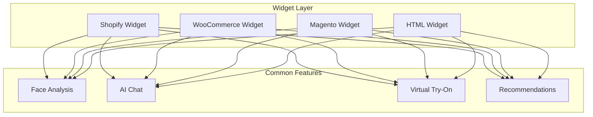
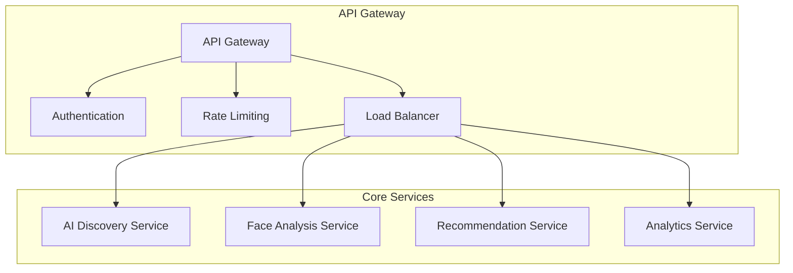
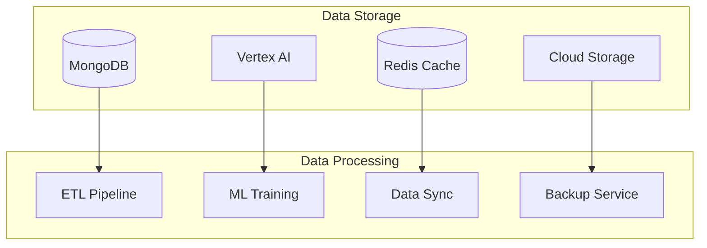
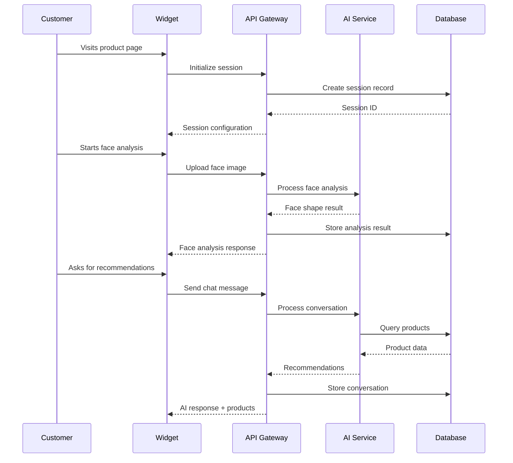

# AI Discovery E-commerce Integration - Knowledge Transfer & Training Guide

## Document Information
- **Document Type**: Training & Knowledge Transfer Guide
- **Target Audience**: New Team Members, Support Staff, Stakeholders
- **Version**: 1.0
- **Date**: January 2025
- **Training Duration**: 2-3 weeks (depending on role)

## Table of Contents

1. [Training Overview](#training-overview)
2. [Role-Based Training Paths](#role-based-training-paths)
3. [System Architecture Training](#system-architecture-training)
4. [Platform Integration Training](#platform-integration-training)
5. [Admin Panel Training](#admin-panel-training)
6. [Technical Deep Dive](#technical-deep-dive)
7. [Operational Procedures](#operational-procedures)
8. [Hands-On Exercises](#hands-on-exercises)
9. [Assessment & Certification](#assessment--certification)
10. [Ongoing Learning Resources](#ongoing-learning-resources)

## Training Overview

### Learning Objectives
By the end of this training program, participants will be able to:
- Understand the complete AI Discovery system architecture
- Navigate and use the admin panel effectively
- Troubleshoot common issues across all platforms
- Perform routine maintenance and monitoring tasks
- Support customers with technical and operational questions
- Contribute to system improvements and optimizations

### Training Methodology
- **Theoretical Learning**: Documentation review and presentations
- **Hands-On Practice**: Live system interaction and exercises
- **Mentorship**: Pairing with experienced team members
- **Assessment**: Practical tests and knowledge verification
- **Continuous Learning**: Ongoing updates and skill development

### Prerequisites
- Basic understanding of web technologies (HTML, CSS, JavaScript)
- Familiarity with e-commerce platforms (preferred)
- Understanding of APIs and web services
- Basic knowledge of databases and cloud services

## Role-Based Training Paths

### 1. Support Team Training (1 week)

#### Day 1: System Overview
**Morning Session (3 hours)**
- AI Discovery system introduction
- Business value and customer benefits
- High-level architecture overview
- Platform integration overview

**Afternoon Session (3 hours)**
- Admin panel navigation
- User roles and permissions
- Basic troubleshooting procedures
- Customer communication guidelines

**Hands-On Exercise:**
```
Exercise 1.1: Admin Panel Exploration
1. Log into the admin panel with demo credentials
2. Navigate through all dashboard sections
3. Generate a sample report
4. Create a test alert
5. Export sample data

Time: 1 hour
```

#### Day 2: Platform Integrations
**Morning Session (3 hours)**
- Shopify integration deep dive
- WooCommerce integration overview
- Magento integration basics
- HTML widget implementation

**Afternoon Session (3 hours)**
- Common integration issues
- Platform-specific troubleshooting
- Customer onboarding process
- Configuration best practices

**Hands-On Exercise:**
```
Exercise 2.1: Platform Configuration
1. Set up a test Shopify store integration
2. Configure widget settings
3. Test face analysis functionality
4. Verify recommendation system
5. Document any issues encountered

Time: 2 hours
```

#### Day 3: Customer Support
**Morning Session (3 hours)**
- Customer support workflows
- Ticket management system
- Escalation procedures
- Communication templates

**Afternoon Session (3 hours)**
- Quality management system
- Performance monitoring
- Analytics interpretation
- Report generation

**Hands-On Exercise:**
```
Exercise 3.1: Support Scenario
1. Review sample customer tickets
2. Diagnose reported issues
3. Provide solutions using documentation
4. Escalate complex issues appropriately
5. Document resolution steps

Time: 2 hours
```

#### Day 4: Advanced Troubleshooting
**Morning Session (3 hours)**
- Advanced troubleshooting techniques
- Log analysis and debugging
- Performance optimization
- Security considerations

**Afternoon Session (3 hours)**
- API testing and validation
- Database query basics
- Monitoring and alerting
- Incident response procedures

**Hands-On Exercise:**
```
Exercise 4.1: Troubleshooting Challenge
1. Investigate simulated system issues
2. Use monitoring tools to diagnose problems
3. Apply appropriate solutions
4. Document findings and resolutions
5. Present solutions to the team

Time: 3 hours
```

#### Day 5: Assessment & Certification
**Morning Session (2 hours)**
- Knowledge assessment test
- Practical troubleshooting scenarios
- Customer interaction simulation

**Afternoon Session (2 hours)**
- Feedback and improvement areas
- Certification ceremony
- Ongoing learning plan
- Resource access setup

### 2. Developer Training (2 weeks)

#### Week 1: Foundation & Architecture

**Day 1-2: System Architecture**
- Complete system architecture deep dive
- Microservices communication patterns
- Database design and optimization
- API design principles and implementation

**Day 3-4: Platform Development**
- Shopify app development
- WooCommerce plugin development
- Magento extension development
- HTML widget development

**Day 5: AI Integration**
- Varai AI engine integration
- Face analysis implementation
- Recommendation system architecture
- Machine learning pipeline

#### Week 2: Advanced Development

**Day 6-7: Backend Development**
- API development and testing
- Database operations and optimization
- Authentication and authorization
- Performance optimization techniques

**Day 8-9: Frontend Development**
- Widget development best practices
- React component architecture
- State management and data flow
- User experience optimization

**Day 10: DevOps & Deployment**
- CI/CD pipeline configuration
- Container orchestration
- Monitoring and logging
- Security implementation

### 3. Operations Team Training (1.5 weeks)

#### Week 1: Infrastructure & Monitoring

**Day 1-2: Infrastructure Management**
- Google Cloud Platform overview
- Kubernetes cluster management
- Database administration
- Security and compliance

**Day 3-4: Monitoring & Alerting**
- Prometheus and Grafana setup
- Alert configuration and management
- Performance monitoring
- Incident response procedures

**Day 5: Maintenance & Optimization**
- Routine maintenance procedures
- Performance optimization
- Capacity planning
- Disaster recovery

#### Week 2: Advanced Operations

**Day 6-7: Automation & Scripting**
- Infrastructure as Code (Terraform)
- Automated deployment pipelines
- Monitoring automation
- Backup and recovery automation

**Day 8: Security & Compliance**
- Security best practices
- Compliance requirements (GDPR/CCPA)
- Vulnerability management
- Audit procedures

## System Architecture Training

### Core Components Overview

#### 1. Widget Layer


**Training Focus:**
- Widget initialization and configuration
- Feature integration patterns
- Cross-platform compatibility
- Performance optimization

#### 2. API Gateway & Services


**Training Focus:**
- API design principles
- Service communication patterns
- Authentication and authorization
- Scalability and performance

#### 3. Data Layer


**Training Focus:**
- Database design and optimization
- Caching strategies
- Data synchronization
- Backup and recovery

### Data Flow Training

#### Customer Journey Data Flow


**Training Exercise:**
```
Exercise: Trace a Customer Journey
1. Follow a complete customer interaction
2. Identify each system component involved
3. Document data transformations
4. Note performance considerations
5. Identify potential failure points

Duration: 2 hours
```

## Platform Integration Training

### Shopify Integration Deep Dive

#### App Architecture
```typescript
// Shopify App Structure Training
interface ShopifyAppArchitecture {
  // App configuration
  app: {
    installation: ShopifyAppInstallation;
    authentication: OAuth2Flow;
    permissions: ShopifyScopes[];
  };
  
  // Theme integration
  theme: {
    liquidTemplates: LiquidTemplate[];
    scriptTags: ScriptTag[];
    stylesheets: Stylesheet[];
  };
  
  // API integration
  api: {
    webhooks: WebhookEndpoint[];
    graphql: GraphQLQueries[];
    rest: RESTEndpoints[];
  };
}
```

**Training Components:**
1. **App Development Basics**
   - Shopify Partner account setup
   - App creation and configuration
   - OAuth flow implementation
   - Webhook management

2. **Theme Integration**
   - Liquid template system
   - Script tag injection
   - CSS integration
   - Mobile optimization

3. **API Integration**
   - GraphQL vs REST APIs
   - Rate limiting handling
   - Error handling patterns
   - Data synchronization

**Hands-On Exercise:**
```
Exercise: Build a Basic Shopify App
1. Create a new Shopify Partner account
2. Set up a development store
3. Create a basic app with OAuth
4. Implement a simple widget
5. Test the integration

Duration: 4 hours
```

### WooCommerce Integration Deep Dive

#### Plugin Architecture
```php
<?php
// WooCommerce Plugin Structure Training
class VARAi_Training_Plugin {
    
    // Plugin lifecycle
    public function __construct() {
        register_activation_hook(__FILE__, [$this, 'activate']);
        register_deactivation_hook(__FILE__, [$this, 'deactivate']);
        add_action('init', [$this, 'init']);
    }
    
    // WordPress hooks integration
    public function init() {
        add_action('wp_enqueue_scripts', [$this, 'enqueue_scripts']);
        add_action('woocommerce_single_product_summary', [$this, 'add_widget']);
        add_shortcode('varai_widget', [$this, 'widget_shortcode']);
    }
    
    // AJAX handlers
    public function setup_ajax() {
        add_action('wp_ajax_varai_chat', [$this, 'handle_chat']);
        add_action('wp_ajax_nopriv_varai_chat', [$this, 'handle_chat']);
    }
}
?>
```

**Training Components:**
1. **WordPress Development**
   - Plugin development basics
   - Hook system understanding
   - Database operations
   - Security best practices

2. **WooCommerce Integration**
   - Product data access
   - Cart integration
   - Order processing
   - Customer data handling

3. **Frontend Integration**
   - JavaScript enqueuing
   - AJAX implementation
   - Shortcode development
   - Template customization

**Hands-On Exercise:**
```
Exercise: Develop a WooCommerce Plugin
1. Set up local WordPress/WooCommerce environment
2. Create plugin structure
3. Implement basic widget functionality
4. Add AJAX chat interface
5. Test with sample products

Duration: 6 hours
```

### Magento Integration Deep Dive

#### Extension Architecture
```php
<?php
// Magento Extension Structure Training
namespace VARAi\AIDiscovery\Block;

use Magento\Framework\View\Element\Template;

class Training extends Template
{
    // Dependency injection
    public function __construct(
        Template\Context $context,
        \VARAi\AIDiscovery\Helper\Data $helper,
        array $data = []
    ) {
        $this->helper = $helper;
        parent::__construct($context, $data);
    }
    
    // Business logic
    public function getWidgetConfig()
    {
        return [
            'apiEndpoint' => $this->helper->getApiEndpoint(),
            'features' => $this->helper->getEnabledFeatures(),
            'branding' => $this->helper->getBrandingConfig()
        ];
    }
}
?>
```

**Training Components:**
1. **Magento Architecture**
   - Module development
   - Dependency injection
   - Layout XML system
   - Admin configuration

2. **Frontend Development**
   - Block and template system
   - JavaScript integration
   - CSS management
   - RequireJS usage

3. **Backend Integration**
   - Controller development
   - Model and resource models
   - API development
   - Cron job setup

**Hands-On Exercise:**
```
Exercise: Create a Magento Extension
1. Set up Magento development environment
2. Create module structure
3. Implement admin configuration
4. Add frontend widget
5. Test extension functionality

Duration: 8 hours
```

## Admin Panel Training

### Navigation & Interface

#### Dashboard Overview Training
```javascript
// Admin Panel Training Module
const adminPanelTraining = {
  // Navigation structure
  navigation: {
    overview: "System-wide metrics and KPIs",
    analytics: "Detailed performance analytics",
    quality: "AI conversation quality management",
    performance: "System performance monitoring",
    alerts: "Alert management and configuration",
    clients: "Client management (super admin only)",
    export: "Data export and reporting",
    settings: "System configuration"
  },
  
  // Role-based access
  roles: {
    super_admin: {
      access: "all_sections",
      permissions: ["view_all_clients", "manage_system", "configure_alerts"]
    },
    client: {
      access: "filtered_sections",
      permissions: ["view_own_data", "export_own_data", "manage_own_alerts"]
    }
  }
};
```

**Training Modules:**

#### 1. Super Admin Training
**Session 1: System Overview (2 hours)**
- Cross-platform analytics interpretation
- Client management procedures
- System health monitoring
- Quality oversight responsibilities

**Session 2: Client Management (2 hours)**
- Adding new clients
- Configuration management
- Access control setup
- Billing and usage tracking

**Session 3: System Administration (2 hours)**
- Alert configuration
- Performance monitoring
- Security management
- Backup verification

#### 2. Client User Training
**Session 1: Dashboard Navigation (1 hour)**
- Personal dashboard overview
- Metric interpretation
- Time range selection
- Widget customization

**Session 2: Analytics & Reporting (2 hours)**
- Performance metrics analysis
- Conversion tracking
- Customer journey analysis
- Report generation

**Session 3: Quality Management (1 hour)**
- Quality score interpretation
- Issue identification
- Improvement recommendations
- Alert management

### Hands-On Admin Panel Exercises

#### Exercise 1: Dashboard Mastery
```
Objective: Master admin panel navigation and basic operations

Tasks:
1. Log in with both super admin and client credentials
2. Navigate through all available sections
3. Generate reports for different time periods
4. Set up custom alerts
5. Export data in different formats

Success Criteria:
- Complete all tasks without assistance
- Explain the purpose of each dashboard section
- Demonstrate role-based access differences

Duration: 2 hours
```

#### Exercise 2: Client Management
```
Objective: Learn client onboarding and management (Super Admin only)

Tasks:
1. Add a new client with complete configuration
2. Set up user access for the client
3. Configure platform-specific settings
4. Test the client's dashboard access
5. Generate client-specific reports

Success Criteria:
- Successfully onboard a new client
- Verify all configurations work correctly
- Client can access their dashboard

Duration: 3 hours
```

#### Exercise 3: Quality Management
```
Objective: Master quality monitoring and improvement

Tasks:
1. Review conversation quality scores
2. Identify quality issues and trends
3. Set up quality alerts
4. Generate quality improvement recommendations
5. Track quality improvements over time

Success Criteria:
- Understand quality scoring system
- Can identify and address quality issues
- Successfully configure quality alerts

Duration: 2 hours
```

## Technical Deep Dive

### API Integration Training

#### Authentication & Authorization
```javascript
// API Authentication Training
class APIAuthenticationTraining {
  
  // API Key authentication
  async authenticateWithAPIKey(apiKey) {
    const response = await fetch('https://api.varai.ai/v1/auth/verify', {
      headers: {
        'X-API-Key': apiKey,
        'Content-Type': 'application/json'
      }
    });
    
    if (!response.ok) {
      throw new Error(`Authentication failed: ${response.status}`);
    }
    
    return await response.json();
  }
  
  // JWT token authentication
  async authenticateWithJWT(token) {
    const response = await fetch('https://api.varai.ai/v1/admin/profile', {
      headers: {
        'Authorization': `Bearer ${token}`,
        'Content-Type': 'application/json'
      }
    });
    
    return await response.json();
  }
  
  // Error handling patterns
  handleAuthError(error) {
    switch (error.code) {
      case 'UNAUTHORIZED':
        // Redirect to login
        break;
      case 'FORBIDDEN':
        // Show permission error
        break;
      case 'TOKEN_EXPIRED':
        // Refresh token
        break;
      default:
        // Generic error handling
    }
  }
}
```

#### API Testing Training
```bash
# API Testing Training Script
#!/bin/bash

echo "API Testing Training Session"
echo "============================"

# Test 1: Health Check
echo "Test 1: Health Check"
curl -X GET https://api.varai.ai/v1/health
echo -e "\n"

# Test 2: Authentication
echo "Test 2: Authentication"
curl -X GET https://api.varai.ai/v1/auth/verify \
  -H "X-API-Key: $API_KEY"
echo -e "\n"

# Test 3: Start Session
echo "Test 3: Start Session"
SESSION_RESPONSE=$(curl -X POST https://api.varai.ai/v1/ai/session/start \
  -H "Content-Type: application/json" \
  -H "X-API-Key: $API_KEY" \
  -d '{
    "clientId": "training-client",
    "userId": "training-user",
    "platform": "html"
  }')

SESSION_ID=$(echo $SESSION_RESPONSE | jq -r '.data.sessionId')
echo "Session ID: $SESSION_ID"
echo -e "\n"

# Test 4: Send Chat Message
echo "Test 4: Send Chat Message"
curl -X POST https://api.varai.ai/v1/ai/chat \
  -H "Content-Type: application/json" \
  -H "X-API-Key: $API_KEY" \
  -d "{
    \"sessionId\": \"$SESSION_ID\",
    \"message\": \"I need sunglasses for outdoor activities\"
  }"
echo -e "\n"

# Test 5: Get Recommendations
echo "Test 5: Get Recommendations"
curl -X GET "https://api.varai.ai/v1/recommendations?sessionId=$SESSION_ID&limit=5" \
  -H "X-API-Key: $API_KEY"
echo -e "\n"
```

### Database Operations Training

#### MongoDB Query Training
```javascript
// MongoDB Operations Training
class MongoDBTraining {
  
  // Basic queries
  async basicQueries() {
    // Find sessions for a client
    const sessions = await db.sessions.find({
      clientId: "training-client",
      createdAt: { $gte: new Date("2025-01-01") }
    }).limit(10);
    
    // Aggregate conversation quality
    const qualityStats = await db.sessions.aggregate([
      { $match: { clientId: "training-client" } },
      { $group: {
        _id: null,
        avgQuality: { $avg: "$qualityScore.overall" },
        totalSessions: { $sum: 1 }
      }}
    ]);
    
    // Find top recommended products
    const topProducts = await db.sessions.aggregate([
      { $unwind: "$recommendations" },
      { $group: {
        _id: "$recommendations.productId",
        count: { $sum: 1 },
        avgScore: { $avg: "$recommendations.score" }
      }},
      { $sort: { count: -1 } },
      { $limit: 10 }
    ]);
    
    return { sessions, qualityStats, topProducts };
  }
  
  // Performance optimization
  async optimizationTechniques() {
    // Create indexes
    await db.sessions.createIndex({ "clientId": 1, "createdAt": -1 });
    await db.products.createIndex({ "clientId": 1, "category": 1 });
    
    // Use projection to limit returned fields
    const lightweightSessions = await db.sessions.find(
      { clientId: "training-client" },
      { sessionId: 1, createdAt: 1, qualityScore: 1 }
    );
    
    // Explain query performance
    const explanation = await db.sessions.find({
      clientId: "training-client"
    }).explain("executionStats");
    
    return { lightweightSessions, explanation };
  }
}
```

### Performance Monitoring Training

#### Metrics Collection
```javascript
// Performance Monitoring Training
const performanceTraining = {
  
  // Collect custom metrics
  collectMetrics() {
    const metrics = {
      // API response times
      apiResponseTime: this.measureAPIResponseTime(),
      
      // Database query performance
      dbQueryTime: this.measureDBQueryTime(),
      
      // Widget load times
      widgetLoadTime: this.measureWidgetLoadTime(),
      
      // Face analysis performance
      faceAnalysisTime: this.measureFaceAnalysisTime()
    };
    
    return metrics;
  },
  
  // Measure API response time
  async measureAPIResponseTime() {
    const start = Date.now();
    await fetch('https://api.varai.ai/v1/health');
    return Date.now() - start;
  },
  
  // Set up monitoring alerts
  setupAlerts() {
    const alertConfig = {
      responseTime: {
        threshold: 2000, // 2 seconds
        action: 'notify_team'
      },
      errorRate: {
        threshold: 0.05, // 5%
        action: 'escalate'
      },
      availability: {
        threshold: 0.999, // 99.9%
        action: 'page_oncall'
      }
    };
    
    return alertConfig;
  }
};
```

## Operational Procedures

### Incident Response Training

#### Incident Classification
```yaml
# Incident Response Training Scenarios
incidents:
  p1_critical:
    scenario: "Complete system outage"
    response_time: "15 minutes"
    escalation: "immediate"
    actions:
      - "Assess impact and scope"
      - "Notify stakeholders"
      - "Begin investigation"
      - "Implement emergency fixes"
      - "Communicate status updates"
    
  p2_high:
    scenario: "Major feature unavailable"
    response_time: "1 hour"
    escalation: "30 minutes"
    actions:
      - "Investigate root cause"
      - "Implement workaround"
      - "Monitor system stability"
      - "Plan permanent fix"
    
  p3_medium:
    scenario: "Performance degradation"
    response_time: "4 hours"
    escalation: "2 hours"
    actions:
      - "Analyze performance metrics"
      - "Identify bottlenecks"
      - "Optimize system performance"
      - "Monitor improvements"
```

#### Incident Response Exercise
```
Exercise: Incident Response Simulation

Scenario: API response times have increased to 10+ seconds
Customer reports: Multiple complaints about slow widget loading

Your Tasks:
1. Assess the situation using monitoring tools
2. Identify the root cause
3. Implement immediate mitigation
4. Communicate with stakeholders
5. Plan long-term resolution
6. Document the incident

Success Criteria:
- Correctly identify the issue within 15 minutes
- Implement effective mitigation
- Provide clear stakeholder communication
- Complete incident documentation

Duration: 2 hours
```

### Maintenance Procedures Training

#### Routine Maintenance Checklist
```bash
#!/bin/bash
# Maintenance Training Script

echo "Daily Maintenance Training"
echo "========================="

# 1. System Health Check
echo "1. Checking system health..."
curl -f https://api.varai.ai/v1/health || echo "❌ Health check failed"

# 2. Monitor Resource Usage
echo "2. Checking resource usage..."
kubectl top nodes
kubectl top pods -n varai-production

# 3. Review Error Logs
echo "3. Reviewing error logs..."
kubectl logs -l app=ai-discovery-service --since=24h | grep -i error | tail -10

# 4. Database Health
echo "4. Checking database health..."
mongosh --eval "db.runCommand({serverStatus: 1}).ok" || echo "❌ Database check failed"

# 5. Backup Verification
echo "5. Verifying backups..."
ls -la /backups/$(date +%Y-%m-%d)* || echo "❌ No backup found for today"

# 6. Performance Metrics
echo "6. Collecting performance metrics..."
curl -s https://api.varai.ai/v1/metrics | jq '.performance'

echo "Daily maintenance check completed"
```

## Hands-On Exercises

### Exercise 1: Complete System Setup
```
Objective: Set up a complete AI Discovery system from scratch

Prerequisites:
- Access to development environment
- API keys and credentials
- Sample e-commerce store

Tasks:
1. Set up development environment
2. Configure database and services
3. Deploy widgets to test stores
4. Configure admin panel access
5. Test complete customer journey
6. Set up monitoring and alerts

Deliverables:
- Working system with all components
- Documentation of setup process
- Test results and validation
- Monitoring dashboard configuration

Duration: 2 days
Difficulty: Advanced
```

### Exercise 2: Customer Support Simulation
```
Objective: Handle realistic customer support scenarios

Scenarios:
1. Widget not loading on Shopify store
2. Face analysis not working on mobile
3. Recommendations not relevant to customer
4. Performance issues during peak traffic
5. Integration problems after platform update

Tasks for each scenario:
1. Diagnose the issue using available tools
2. Provide immediate workaround if possible
3. Implement permanent solution
4. Document resolution steps
5. Update knowledge base

Success Criteria:
- Resolve all scenarios within SLA
- Provide clear customer communication
- Document solutions for future reference

Duration: 1 day
Difficulty: Intermediate
```

### Exercise 3: Performance Optimization
```
Objective: Optimize system performance under load

Setup:
- Load testing environment
- Performance monitoring tools
- Sample traffic patterns

Tasks:
1. Establish performance baselines
2. Generate realistic load patterns
3. Identify performance bottlenecks
4. Implement optimization strategies
5. Measure improvement results
6. Document optimization procedures

Optimization Areas:
- API response times
- Database query performance
- Widget loading speed
- Face analysis processing
- Recommendation generation

Success Criteria:
- Achieve target performance metrics
- Document optimization strategies
- Create performance monitoring alerts

Duration: 3 days
Difficulty: Advanced
```

## Assessment & Certification

### Knowledge Assessment

#### Written Assessment (1 hour)
**Section A: System Architecture (25 points)**
1. Describe the AI Discovery system architecture
2. Explain data flow between components
3. Identify potential failure points
4. Describe scalability considerations

**Section B: Platform Integration (25 points)**
1. Compare integration approaches across platforms
2. Explain authentication mechanisms
3. Describe troubleshooting procedures
4. Identify best practices

**Section C: Operations & Maintenance (25 points)**
1. Describe monitoring strategies
2. Explain incident response procedures
3. Outline maintenance schedules
4. Describe backup and recovery

**Section D: Customer Support (25 points)**
1. Explain support workflows
2. Describe escalation procedures
3. Outline communication strategies
4. Identify training needs

#### Practical Assessment (2 hours)
**Task 1: System Diagnosis (30 minutes)**
- Given a system issue, diagnose and resolve
- Use monitoring tools effectively
- Document findings and solutions

**Task 2: Customer Support (30 minutes)**
- Handle simulated customer inquiries
- Provide clear explanations and solutions
- Escalate appropriately when needed

**Task 3: Configuration Management (30 minutes)**
- Set up new client configuration
- Test integration functionality
- Verify security settings

**Task 4: Performance Analysis (30 minutes)**
- Analyze system performance metrics
- Identify optimization opportunities
- Recommend improvement strategies

### Certification Levels

#### Level 1: Support Specialist
**Requirements:**
- Complete support team training
- Pass written assessment (80%+)
- Complete practical assessment
- Shadow experienced team member (1 week)

**Capabilities:**
- Handle routine customer inquiries
- Perform basic troubleshooting
- Use admin panel effectively
- Escalate complex issues appropriately

#### Level 2: Technical Specialist
**Requirements:**
- Complete developer training
- Pass advanced written assessment (85%+)
- Complete complex practical assessment
- Lead training session for new team members

**Capabilities:**
- Develop platform integrations
- Perform advanced troubleshooting
- Optimize system performance
- Mentor junior team members

#### Level 3: Operations Expert
**Requirements:**
- Complete operations training
- Pass expert-level assessment (90%+)
- Lead incident response exercise
- Contribute to system improvements

**Capabilities:**
- Manage system infrastructure
- Lead incident response
- Design monitoring strategies
- Train and certify others

### Certification Maintenance

#### Continuing Education Requirements
- **Quarterly Updates**: 4 hours of training on new features
- **Annual Recertification**: Updated assessment and practical test
- **Peer Learning**: Participate in knowledge sharing sessions
- **Innovation Projects**: Contribute to system improvements

#### Knowledge Sharing
- **Monthly Tech Talks**: Present on specialized topics
- **Documentation Updates**: Maintain training materials
- **Mentorship Program**: Guide new team members
- **Best Practices**: Share lessons learned and improvements

## Ongoing Learning Resources

### Documentation Library
- **Technical Documentation**: Complete system documentation
- **API References**: Comprehensive API documentation
- **Best Practices**: Curated best practices and guidelines
- **Troubleshooting Guides**: Common issues and solutions