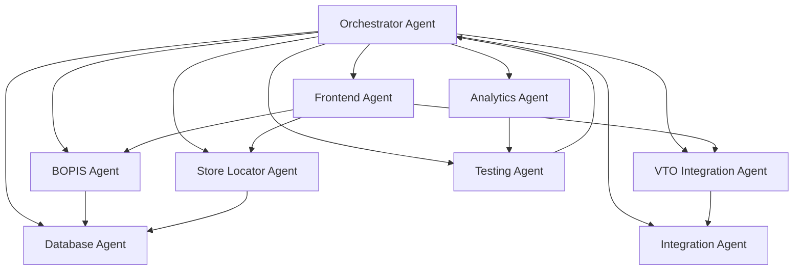

# VARAi Webstore SPARC Implementation Plan
## Best-in-Class Ecommerce Experience with BOPIS, VTO, and Agentic Features

### Document Version: 1.0
### Target Platform: VARAi Webstore
### Implementation Framework: SPARC Agentic
### Timeline: 23 Days

---

## Executive Summary

This document outlines the comprehensive SPARC agentic framework implementation plan to transform the VARAi webstore into a best-in-class ecommerce experience. The plan integrates Buy Online Pick up In Store (BOPIS), advanced store locator, 3D product visualization, virtual try-on capabilities, and agentic AI features while leveraging existing platform APIs.

**Current Status**: Basic cart functionality exists but lacks sophisticated ecommerce features
**Target State**: Best-in-class omnichannel eyewear retail platform
**Key Integration**: Leverage existing [`virtual_try_on.py`](src/api/routers/virtual_try_on.py) APIs rather than rebuilding

---

## SPARC Agentic Framework Architecture

### Agent Coordination Model



---

## Phase 1: Specification & Planning (S)
**Duration**: 3 Days | **Agents**: Orchestrator, Database, Integration

### Day 1: Requirements Analysis & API Mapping

#### Orchestrator Agent Tasks
- [ ] Initialize project coordination
- [ ] Review existing cart implementation in [`apps/html-store/js/cart.js`](apps/html-store/js/cart.js)
- [ ] Analyze current API endpoints
- [ ] Create task assignment matrix

#### Integration Agent Tasks
- [ ] Map existing VTO API endpoints:
  ```javascript
  const existingAPIs = {
    virtualTryOn: '/virtual-try-on',
    sessions: '/virtual-try-on/sessions/{id}',
    feedback: '/virtual-try-on/sessions/{id}/feedback',
    compatibility: '/virtual-try-on/frames/{id}/compatibility'
  };
  ```
- [ ] Document face analysis services integration points
- [ ] Create API abstraction layer specifications

### Day 2-3: Database Schema Design

#### Database Agent Tasks
- [ ] Design multi-tenant retailer architecture:
  ```sql
  -- Retailers (eyewear store chains/brands)
  CREATE TABLE retailers (
      id UUID PRIMARY KEY,
      name VARCHAR(255) NOT NULL,
      brand_name VARCHAR(255),
      logo_url TEXT,
      website_url TEXT,
      contact_email VARCHAR(255),
      phone VARCHAR(50),
      created_at TIMESTAMP DEFAULT NOW(),
      updated_at TIMESTAMP DEFAULT NOW()
  );
  
  -- Physical store locations
  CREATE TABLE stores (
      id UUID PRIMARY KEY,
      retailer_id UUID REFERENCES retailers(id),
      name VARCHAR(255) NOT NULL,
      address_line1 VARCHAR(255) NOT NULL,
      city VARCHAR(100) NOT NULL,
      state VARCHAR(50) NOT NULL,
      postal_code VARCHAR(20) NOT NULL,
      latitude DECIMAL(10, 8),
      longitude DECIMAL(11, 8),
      hours_of_operation JSONB,
      services_offered TEXT[],
      is_active BOOLEAN DEFAULT true
  );
  
  -- Store inventory tracking
  CREATE TABLE store_inventory (
      id UUID PRIMARY KEY,
      store_id UUID REFERENCES stores(id),
      frame_id UUID REFERENCES frames(id),
      quantity_available INTEGER DEFAULT 0,
      quantity_reserved INTEGER DEFAULT 0,
      reorder_level INTEGER DEFAULT 5
  );
  
  -- Customer reservations
  CREATE TABLE reservations (
      id UUID PRIMARY KEY,
      customer_email VARCHAR(255) NOT NULL,
      customer_name VARCHAR(255) NOT NULL,
      store_id UUID REFERENCES stores(id),
      frame_id UUID REFERENCES frames(id),
      quantity INTEGER DEFAULT 1,
      pickup_by_date TIMESTAMP NOT NULL,
      status VARCHAR(50) DEFAULT 'pending'
  );
  ```

**Deliverables**:
- Complete database schema specification
- API integration mapping document
- Project coordination framework

---

## Phase 2: Platform Foundation (P)
**Duration**: 5 Days | **Agents**: Database, Integration, BOPIS

### Day 4-5: Database Implementation

#### Database Agent Tasks
- [ ] Implement schema migration scripts
- [ ] Create database seeding for test stores
- [ ] Set up multi-tenant data isolation
- [ ] Implement data validation rules

### Day 6-7: API Service Layer

#### Integration Agent Tasks
- [ ] Create VTO service abstraction:
  ```javascript
  class VTOService {
    async performTryOn(frameId, userId, adjustments) {
      return await this.apiClient.post('/virtual-try-on', {
        frame_id: frameId,
        user_id: userId,
        adjustment_params: adjustments
      });
    }
    
    async getSession(sessionId) {
      return await this.apiClient.get(`/virtual-try-on/sessions/${sessionId}`);
    }
  }
  ```
- [ ] Implement face analysis service integration
- [ ] Create error handling and fallback mechanisms

### Day 8: BOPIS Core System

#### BOPIS Agent Tasks
- [ ] Design reservation workflow
- [ ] Implement pickup time calculation
- [ ] Create store notification system
- [ ] Build reservation management API

**Deliverables**:
- Database migration scripts
- API service layer implementation
- BOPIS core system

---

## Phase 3: Architecture Implementation (A)
**Duration**: 7 Days | **Agents**: Store Locator, VTO Integration, Frontend

### Day 9-11: Store Locator System

#### Store Locator Agent Tasks
- [ ] Implement GPS-based store finder:
  ```javascript
  class StoreLocator {
    async findNearbyStores(lat, lng, radius = 25) {
      const stores = await this.storeService.getStoresByLocation(lat, lng, radius);
      return stores.map(store => ({
        ...store,
        distance: this.calculateDistance(lat, lng, store.latitude, store.longitude),
        inventory: this.getStoreInventory(store.id)
      }));
    }
  }
  ```
- [ ] Build real-time inventory integration
- [ ] Create store details display
- [ ] Implement distance calculations

### Day 12-13: VTO Integration

#### VTO Integration Agent Tasks
- [ ] Connect existing VTO APIs to cart system
- [ ] Implement 3D product viewer
- [ ] Create camera interface integration
- [ ] Build try-on session management

### Day 14-15: Frontend Enhancement

#### Frontend Agent Tasks
- [ ] Enhance cart UI with BOPIS options:
  ```javascript
  // Enhanced cart checkout with store pickup
  function enhanceCartCheckout() {
    const checkoutOptions = {
      shipping: createShippingOption(),
      pickup: createPickupOption() // New BOPIS option
    };
    
    return checkoutOptions;
  }
  ```
- [ ] Integrate store locator interface
- [ ] Build VTO components
- [ ] Create mobile-responsive design

**Deliverables**:
- Store locator with GPS integration
- VTO cart integration
- Enhanced frontend components

---

## Phase 4: Refinement & Integration (R)
**Duration**: 5 Days | **Agents**: Frontend, Testing, Analytics

### Day 16-17: Component Integration

#### Frontend Agent Tasks
- [ ] Integrate all components into cohesive experience
- [ ] Implement agentic AI chat interface
- [ ] Create seamless user workflows
- [ ] Optimize performance

### Day 18-19: Testing Implementation

#### Testing Agent Tasks
- [ ] Create BOPIS workflow tests:
  ```javascript
  describe('BOPIS Workflow', () => {
    it('should allow customer to reserve for pickup', async () => {
      // Test complete reservation flow
    });
    
    it('should show real-time inventory', async () => {
      // Test inventory accuracy
    });
  });
  ```
- [ ] Implement VTO integration tests
- [ ] Create mobile responsiveness tests
- [ ] Run performance benchmarks

### Day 20: Analytics Implementation

#### Analytics Agent Tasks
- [ ] Implement BOPIS conversion tracking
- [ ] Create store performance analytics
- [ ] Build VTO usage metrics
- [ ] Set up A/B testing framework

**Deliverables**:
- Integrated frontend experience
- Comprehensive test suites
- Analytics tracking system

---

## Phase 5: Completion & Deployment (C)
**Duration**: 3 Days | **Agents**: All agents coordinated by Orchestrator

### Day 21: Final Integration Testing

#### All Agents Tasks
- [ ] End-to-end workflow testing
- [ ] Cross-browser compatibility
- [ ] Mobile device testing
- [ ] Performance optimization

### Day 22: Production Preparation

#### Orchestrator Agent Tasks
- [ ] Coordinate deployment preparation
- [ ] Verify all integrations
- [ ] Prepare rollback procedures
- [ ] Final security review

### Day 23: Deployment & Monitoring

#### All Agents Tasks
- [ ] Production deployment
- [ ] Monitor system performance
- [ ] Verify all features functional
- [ ] Document any issues

**Deliverables**:
- Production-ready webstore
- Monitoring dashboards
- Deployment documentation

---

## Technical Implementation Details

### API Integration Strategy

#### Existing VTO API Utilization
```javascript
// Leverage existing virtual try-on endpoints
const VTOIntegration = {
  // Use existing POST /virtual-try-on
  performTryOn: async (frameId, userId) => {
    return await fetch('/virtual-try-on', {
      method: 'POST',
      body: new URLSearchParams({
        frame_id: frameId,
        user_id: userId
      })
    });
  },
  
  // Use existing session management
  getSession: async (sessionId) => {
    return await fetch(`/virtual-try-on/sessions/${sessionId}`);
  }
};
```

#### Face Analysis Service Integration
```javascript
// Connect to existing face analysis services
const FaceAnalysisIntegration = {
  analyzeImage: async (imageData) => {
    // Use existing face_analysis_advanced.py service
    return await this.faceAnalysisService.processImage(imageData);
  }
};
```

### Database Migration Strategy

#### Schema Evolution
```sql
-- Add new tables while preserving existing structure
ALTER TABLE products ADD COLUMN vto_compatible BOOLEAN DEFAULT false;
ALTER TABLE products ADD COLUMN store_exclusive BOOLEAN DEFAULT false;

-- Create indexes for performance
CREATE INDEX idx_stores_location ON stores USING GIST (
  ll_to_earth(latitude, longitude)
);
CREATE INDEX idx_inventory_store_frame ON store_inventory (store_id, frame_id);
```

### Frontend Enhancement Strategy

#### Cart Integration
```javascript
// Enhance existing cart.js with BOPIS functionality
class EnhancedCartManager extends CartManager {
  constructor() {
    super();
    this.storeLocator = new StoreLocator();
    this.vtoService = new VTOService();
  }
  
  async addPickupOption() {
    const nearbyStores = await this.storeLocator.findNearbyStores(
      this.userLocation.lat, 
      this.userLocation.lng
    );
    
    return this.renderPickupOptions(nearbyStores);
  }
}
```

---

## Success Criteria & KPIs

### Technical Metrics
- [ ] **Cart Completion Rate**: +40% improvement
- [ ] **Page Load Time**: <2 seconds for all pages
- [ ] **Mobile Performance**: 90+ Lighthouse score
- [ ] **API Response Time**: <200ms average
- [ ] **VTO Integration**: 95% success rate

### Business Metrics
- [ ] **Online-to-Offline Conversion**: 25% of online browsers visit stores
- [ ] **Average Order Value**: +30% increase
- [ ] **Customer Engagement**: +50% time on site
- [ ] **BOPIS Adoption**: 15% of orders use pickup option
- [ ] **Store Traffic**: +20% increase in foot traffic

### User Experience Metrics
- [ ] **Task Completion Rate**: 90% for key user journeys
- [ ] **User Satisfaction**: 4.5+ star rating
- [ ] **Feature Adoption**: 60% of users try VTO feature
- [ ] **Mobile Usage**: Seamless experience across devices

---

## Risk Mitigation

### Technical Risks
| Risk | Impact | Mitigation |
|------|--------|------------|
| API Integration Failures | High | Implement fallback mechanisms and comprehensive testing |
| Database Performance | Medium | Optimize queries and implement caching |
| Mobile Compatibility | Medium | Progressive enhancement and responsive design |

### Business Risks
| Risk | Impact | Mitigation |
|------|--------|------------|
| User Adoption | High | Gradual rollout and user education |
| Store Inventory Accuracy | Medium | Real-time sync and validation |
| Performance Impact | Medium | Load testing and optimization |

---

## Resource Requirements

### Development Team
- **Frontend Developer**: 1 FTE for 23 days
- **Backend Developer**: 1 FTE for 15 days
- **Database Engineer**: 0.5 FTE for 10 days
- **QA Engineer**: 0.5 FTE for 8 days
- **DevOps Engineer**: 0.25 FTE for 5 days

### Infrastructure
- **Database Storage**: Additional 50GB for store/inventory data
- **API Capacity**: 20% increase in API calls
- **CDN**: Enhanced for 3D model delivery
- **Monitoring**: Extended for new features

---

## Next Steps

### Immediate Actions (Next 48 Hours)
1. **Orchestrator Agent**: Initialize project coordination
2. **Database Agent**: Begin schema design
3. **Integration Agent**: Start API mapping
4. **Stakeholder Review**: Approve implementation plan

### Week 1 Milestones
- [ ] Complete database schema design
- [ ] Finish API integration mapping
- [ ] Begin database implementation
- [ ] Start BOPIS system design

### Go-Live Preparation
- [ ] Production environment setup
- [ ] Monitoring dashboard configuration
- [ ] User training materials
- [ ] Support documentation

---

## Conclusion

This SPARC agentic framework implementation plan provides a comprehensive roadmap to transform the VARAi webstore into a best-in-class ecommerce experience. By leveraging existing APIs and implementing sophisticated BOPIS, store locator, and VTO features, the platform will deliver exceptional value to both customers and retailers.

The 23-day timeline ensures rapid delivery while maintaining quality through systematic testing and integration. The agentic approach guarantees that each component is developed by specialized expertise, resulting in a cohesive and powerful ecommerce platform.

**Success depends on**: Proper coordination between agents, adherence to the timeline, and seamless integration with existing platform APIs.

---

*This document serves as the master implementation plan for the VARAi webstore enhancement project. All development work should reference this plan for coordination and progress tracking.*