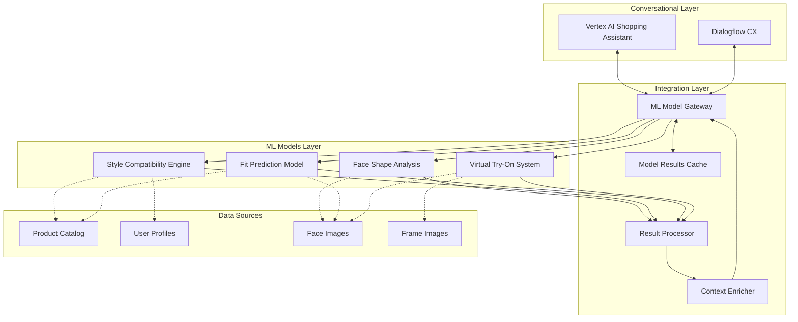
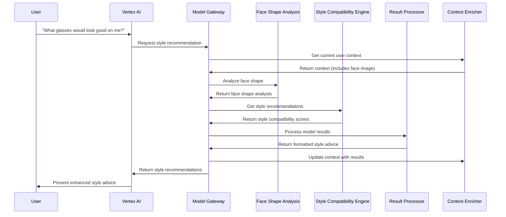
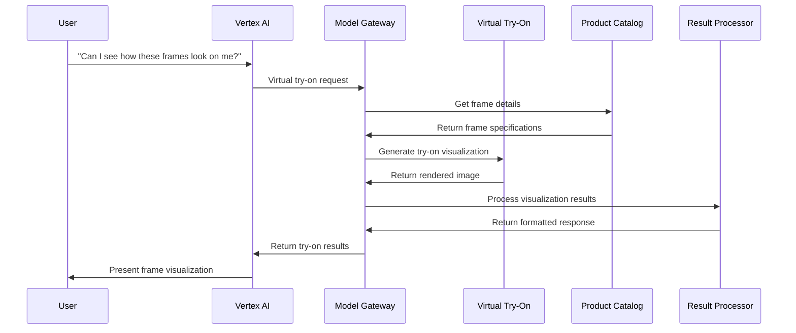
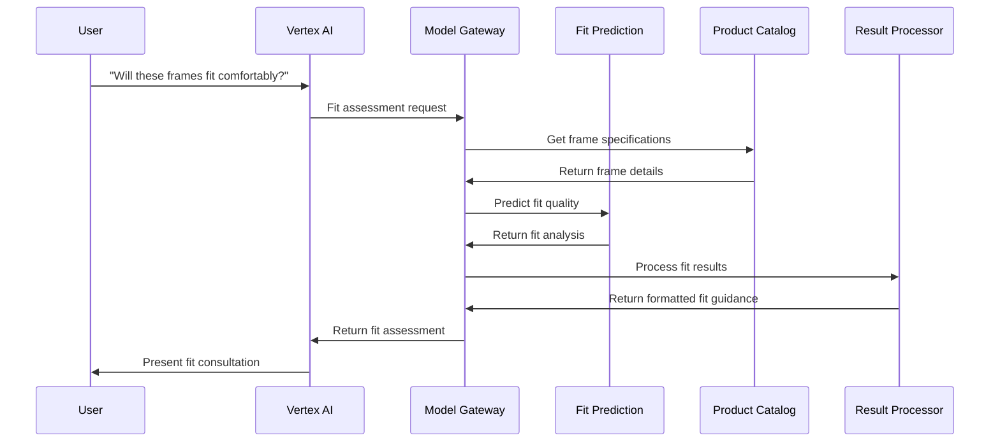

# ML Model Integration Architecture

This document outlines the architecture for integrating EyewearML's machine learning models with the Vertex AI Shopping Assistant. The integration enables the combined system to leverage both Vertex AI's general shopping capabilities and EyewearML's specialized eyewear domain models.

## Overview

The ML model integration architecture focuses on seamlessly connecting specialized eyewear models with Vertex AI's conversational capabilities. This enables domain-specific analysis and recommendations while maintaining a cohesive user experience.



## ML Models and Capabilities

The integration incorporates several specialized eyewear models:

### 1. Face Shape Analysis Model

**Purpose**: Analyzes facial characteristics to determine face shape and key measurements.

**Capabilities**:
- Face shape classification (round, oval, square, heart, diamond, etc.)
- Facial proportion analysis
- Feature detection (cheekbones, jawline, forehead width, etc.)
- Measurement estimation (face width, PD, etc.)

**Integration Points**:
- Triggered from style recommendation flows
- Provides input to style compatibility engine
- Enhances frame recommendations with face shape context

**API Interface**:
```json
// Request
{
  "image": "base64_encoded_image",
  "tenant_id": "tenant_identifier",
  "analysis_type": "FULL | SHAPE_ONLY | MEASUREMENTS",
  "include_confidence": true
}

// Response
{
  "face_shape": {
    "primary": "oval",
    "confidence": 0.89,
    "alternatives": [
      {"shape": "round", "confidence": 0.08},
      {"shape": "heart", "confidence": 0.03}
    ]
  },
  "measurements": {
    "face_width": 138.5,
    "pd": 64.2,
    "bridge_width": 18.1,
    "temple_to_ear": 102.3
  },
  "features": {
    "cheekbones": "defined",
    "jawline": "rounded",
    "forehead": "proportional"
  }
}
```

### 2. Style Compatibility Engine

**Purpose**: Determines optimal frame styles based on face shape, personal preferences, and style factors.

**Capabilities**:
- Face-to-frame compatibility scoring
- Style preference matching
- Occasion-appropriate recommendations
- Personalized style ranking

**Integration Points**:
- Enhances product recommendations from Vertex AI
- Provides input to frame finder searches
- Generates style consultation responses

**API Interface**:
```json
// Request
{
  "face_shape": "oval",
  "style_preferences": ["modern", "minimalist"],
  "occasions": ["work", "everyday"],
  "coloring": {
    "skin_tone": "warm",
    "hair_color": "brown"
  },
  "constraints": {
    "materials": ["titanium", "acetate"],
    "exclude_styles": ["oversized"]
  },
  "tenant_id": "tenant_identifier"
}

// Response
{
  "recommended_styles": [
    {
      "style": "rectangular",
      "compatibility_score": 0.95,
      "rationale": "Rectangular frames add definition to oval face shapes while meeting modern aesthetic preferences."
    },
    {
      "style": "geometric",
      "compatibility_score": 0.92,
      "rationale": "Clean geometric lines align with minimalist preferences while maintaining professional appearance."
    }
  ],
  "color_recommendations": [
    {"color": "tortoise", "score": 0.88},
    {"color": "matte black", "score": 0.85}
  ],
  "material_recommendations": [
    {"material": "titanium", "score": 0.94},
    {"material": "acetate", "score": 0.89}
  ]
}
```

### 3. Fit Prediction Model

**Purpose**: Predicts fit quality and potential fit issues for specific frame-face combinations.

**Capabilities**:
- Frame-face fit scoring
- Pressure point prediction
- Stability assessment
- Comfort duration estimation

**Integration Points**:
- Augments product recommendations with fit data
- Provides input to fit consultation responses
- Helps explain potential comfort issues

**API Interface**:
```json
// Request
{
  "face_measurements": {
    "face_width": 138.5,
    "pd": 64.2,
    "bridge_width": 18.1,
    "temple_to_ear": 102.3
  },
  "frame_specifications": {
    "frame_width": 140,
    "bridge_width": 18,
    "temple_length": 145,
    "lens_height": 38,
    "lens_width": 52,
    "material": "titanium",
    "weight": 15.3,
    "has_nosepads": true,
    "has_spring_hinges": false
  },
  "tenant_id": "tenant_identifier"
}

// Response
{
  "overall_fit_score": 0.87,
  "fit_attributes": {
    "width_compatibility": 0.92,
    "bridge_fit": 0.85,
    "temple_fit": 0.89,
    "balance": 0.82
  },
  "potential_issues": [
    {
      "issue": "slight_bridge_pressure",
      "severity": "low",
      "recommendation": "Consider frames with slightly wider bridge or adjustable nose pads"
    }
  ],
  "comfort_assessment": {
    "estimated_comfort_hours": 8,
    "pressure_points": ["slight bridge pressure after extended wear"],
    "stability": "very good"
  }
}
```

### 4. Virtual Try-On System

**Purpose**: Renders realistic visualizations of frames on the user's face.

**Capabilities**:
- 3D frame rendering on face images
- Accurate sizing and positioning
- Lighting and material simulation
- Multi-angle visualization

**Integration Points**:
- Triggered after product recommendations
- Integrated with shopping flow
- Provides visual feedback for style consultation

**API Interface**:
```json
// Request
{
  "image": "base64_encoded_face_image",
  "frame_id": "product_identifier",
  "frame_color": "tortoise", 
  "angle": "front", // front, side, angle
  "tenant_id": "tenant_identifier"
}

// Response
{
  "rendered_image": "base64_encoded_result_image",
  "positioning_data": {
    "scale_factor": 1.02,
    "position_x": 320,
    "position_y": 240,
    "rotation_x": 2.1,
    "rotation_y": 0.3,
    "rotation_z": 0.1
  },
  "alternate_angles": [
    {"angle": "angle_right", "thumbnail": "base64_thumbnail"}
  ]
}
```

## Integration Architecture Components

### ML Model Gateway

The Model Gateway acts as a unified interface between the conversational systems (Vertex AI and Dialogflow CX) and EyewearML's specialized models:

**Responsibilities**:
- Route model requests to appropriate ML services
- Handle authentication and tenant context
- Manage request throttling and prioritization
- Track model usage and performance

**Implementation Considerations**:
- REST API with standardized endpoints
- API key authentication with tenant identification
- Request validation and preprocessing
- Error handling and fallback strategies

### Result Processor

The Result Processor transforms raw model outputs into formats suitable for integration with conversational responses:

**Responsibilities**:
- Convert technical model results into conversational elements
- Extract key insights from model outputs
- Format results for various conversation contexts
- Combine results from multiple models when needed

**Implementation Considerations**:
- Modular processors for each model type
- Template-based response formatting
- Context-aware result transformation
- Response personalization based on user history

### Context Enricher

The Context Enricher maintains and updates conversation context with model results:

**Responsibilities**:
- Store model results in session context
- Update user profiles with derived insights
- Track usage of ML insights in conversation
- Maintain model result validity state

**Implementation Considerations**:
- Integration with existing context management
- TTL (time-to-live) for model results
- Confidence scoring for stored results
- Contextual relevance tracking

### ML Results Cache

The ML Results Cache improves performance by storing frequently used model results:

**Responsibilities**:
- Cache model results for repeat access
- Maintain cache consistency with product updates
- Apply tenant-specific caching policies
- Optimize cache for common request patterns

**Implementation Considerations**:
- Redis or similar in-memory cache
- Multi-level caching strategy
- Tenant isolation in cache implementation
- Periodic cache invalidation

## Integration Workflows

### Style Recommendation Workflow



### Virtual Try-On Workflow



### Fit Consultation Workflow



## Model Invocation Strategies

### Proactive Model Invocation

In certain contexts, models are invoked proactively to enhance responses:

1. **Pre-emptive Face Analysis**:
   - Trigger face analysis when style topics are first mentioned
   - Store results for later use in conversation
   - Update progressively with more image data

2. **Background Style Analysis**:
   - Analyze style compatibility for browsed products
   - Prepare personalized recommendations before explicitly asked
   - Build style profile incrementally

3. **Predictive Fit Assessment**:
   - Pre-compute fit metrics for likely product recommendations
   - Prepare fit insights for top recommended products
   - Prioritize computation for products with high selection probability

### On-Demand Model Invocation

Models are invoked on-demand in response to specific user queries:

1. **Explicit Try-On Requests**:
   - Trigger virtual try-on for specific product
   - Process in real-time with high priority
   - Return results directly in conversation

2. **Direct Fit Questions**:
   - Invoke fit prediction for specific frame-face combination
   - Generate comprehensive fit assessment
   - Present detailed fit guidance

3. **Comparative Analysis**:
   - Analyze multiple products simultaneously
   - Generate comparative metrics
   - Present ranked results based on compatibility

## Performance Optimization

### Model Serving Optimization

1. **Model Quantization and Optimization**:
   - Use optimized TensorFlow/PyTorch models
   - Implement quantized models where appropriate
   - Balance accuracy vs. performance for each use case

2. **Batched Processing**:
   - Combine similar requests for batch processing
   - Optimize for GPU utilization
   - Schedule based on priority and dependencies

3. **Model Variants**:
   - Implement lightweight models for initial screening
   - Use detailed models only when necessary
   - Select model complexity based on context

### Caching Strategies

1. **Face Analysis Caching**:
   - Cache face shape analysis for repeat sessions
   - Update when new images are provided
   - Set appropriate TTL based on feature stability

2. **Style Preference Caching**:
   - Cache style compatibility scores for user-category combinations
   - Invalidate on significant catalog updates
   - Use tiered caching for common queries

3. **Try-On Result Caching**:
   - Cache rendered images for common frame-face combinations
   - Store intermediate rendering data
   - Prioritize cache for popular products

## Error Handling and Fallbacks

### Graceful Degradation

1. **Face Analysis Fallbacks**:
   - Use estimates from measurements if image quality is poor
   - Fall back to general recommendations if analysis fails
   - Request additional images when quality is insufficient

2. **Style Recommendation Fallbacks**:
   - Use generic style guidelines if personalization fails
   - Leverage most popular styles when confidence is low
   - Provide educational content instead of specific recommendations

3. **Try-On Fallbacks**:
   - Show product images if try-on fails
   - Offer alternative visualization methods
   - Explain limitations transparently

### Error Classification and Recovery

1. **Temporary Processing Errors**:
   - Retry with exponential backoff
   - Switch to alternate processing queue
   - Alert monitoring systems

2. **Input Quality Issues**:
   - Provide specific guidance for better inputs
   - Suggest alternative approaches
   - Explain quality requirements

3. **Confidence Threshold Failures**:
   - Communicate uncertainty appropriately
   - Suggest additional information needed
   - Offer broader recommendations with explanation

## Monitoring and Analytics

### Model Performance Monitoring

1. **Accuracy Metrics**:
   - Track prediction accuracy against feedback
   - Monitor confidence distributions
   - Identify systematic errors

2. **Performance Metrics**:
   - Measure response times by model and operation
   - Track resource utilization
   - Monitor batch efficiency

3. **Usage Patterns**:
   - Analyze most frequent model invocations
   - Track user engagement with model outputs
   - Identify opportunities for optimization

### Continuous Improvement

1. **Feedback Collection**:
   - Capture explicit feedback on recommendations
   - Track user actions following recommendations
   - Analyze conversation patterns

2. **Model Retraining Triggers**:
   - Schedule periodic retraining
   - Trigger on significant performance drift
   - Update based on new product catalog patterns

3. **A/B Testing Framework**:
   - Test model variants with controlled user groups
   - Compare engagement metrics
   - Validate improvements before full deployment

## Integration Implementation

### API Implementation Guidelines

1. **Standardized Request/Response Format**:
   - Consistent JSON structures
   - Standard error response format
   - Versioned API endpoints

2. **Authentication and Security**:
   - API key validation
   - Request signing
   - Rate limiting per tenant

3. **Documentation and Testing**:
   - OpenAPI/Swagger specifications
   - Integration test suites
   - Example requests and responses

### Development and Deployment Process

1. **Local Development Environment**:
   - Model simulators for development
   - Docker containers for consistent environments
   - Integration test harnesses

2. **CI/CD Pipeline**:
   - Automated testing of integration points
   - Versioned deployments
   - Canary releases for model updates

3. **Monitoring and Alerting**:
   - Real-time performance dashboards
   - Error rate alerting
   - Usage tracking
