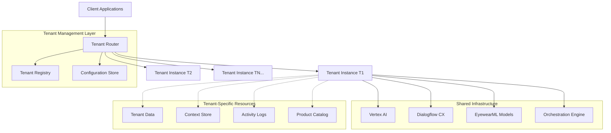

# Multi-Tenant Architecture for Vertex AI Integration

This document outlines the multi-tenant design for the EyewearML Vertex AI integration, enabling the system to serve multiple tenants (eyewear retailers) while maintaining isolation, security, and performance.

## Overview

The integration is designed as a cloud-based, multi-tenant system that allows multiple eyewear retailers to leverage the same infrastructure while maintaining complete isolation between tenants. The architecture ensures that each tenant's data, context, and configuration are secured and separated.

## Tenant Isolation

### Logical Isolation

The system implements complete logical isolation between tenants through several mechanisms:

1. **Tenant ID Based Partitioning**:
   - Every API request includes a tenant identifier
   - All data is partitioned using the tenant ID as a key
   - All storage is logically separated by tenant

2. **Separate Conversation Sessions**:
   - Each tenant has isolated conversation sessions
   - Context and history are never shared across tenants
   - Session management is tenant-specific

3. **Independent Agent Configuration**:
   - Each tenant can customize agent behavior
   - Prompt templates can be tenant-specific
   - Conversation flows can be tailored to each tenant's needs

### Data Isolation

The system ensures complete data isolation:

1. **Product Catalog Separation**:
   - Each tenant's product catalog is stored separately
   - No cross-tenant product visibility
   - Catalog synchronization is tenant-specific

2. **Context Store Isolation**:
   - User profiles and preferences are tenant-isolated
   - Conversation history is never shared across tenants
   - Context management systems maintain strict boundaries

3. **Analytics and Reporting Isolation**:
   - Usage metrics are separated by tenant
   - Reports only include data from a single tenant
   - No aggregation across tenant boundaries without explicit permission

## Tenant Configuration

Each tenant's integration can be individually configured:

### Global Settings

- Tenant identification and authentication keys
- Service level tiers and rate limits
- Default language and locale settings
- Brand voice guidelines

### Integration Settings

- E-commerce platform connection details (Shopify/WooCommerce)
- Product catalog synchronization settings
- Intent routing configuration
- Vertex AI service connection parameters

### UI Customization

- Branding elements (colors, logo, fonts)
- Custom conversation opening messages
- Custom agent personality traits
- Custom welcome and error messages

### Model Settings

- Face shape analysis sensitivity settings
- Style recommendation preferences
- Fit assessment configuration
- Virtual try-on settings

## Tenant Management

### Tenant Onboarding Process

1. **Registration and Setup**:
   - Create tenant record with unique identifier
   - Generate API credentials
   - Configure authentication
   - Set up initial configuration

2. **E-commerce Connection**:
   - Configure Shopify/WooCommerce integration
   - Establish bi-directional sync
   - Verify product data flow
   - Test authentication

3. **Initial Sync and Training**:
   - Import product catalog
   - Perform initial ML model training/adaptation for tenant data
   - Configure domain expertise modules
   - Verify intent routing

4. **Testing and Deployment**:
   - Conduct tenant-specific testing
   - Verify isolation from other tenants
   - Finalize configuration
   - Deploy to production environment

### Tenant Administration

1. **Tenant Dashboard**:
   - Usage monitoring
   - Configuration management
   - Performance analytics
   - System health alerts

2. **Tenant API Management**:
   - Key rotation
   - Permission management
   - Rate limit adjustments
   - Access logging

3. **Tenant Support Tools**:
   - Conversation logs
   - Error tracking
   - Support ticket integration
   - Training and documentation

## Scalability Architecture

The multi-tenant design is built for horizontal scalability:

### Tenant-Based Scaling

1. **Tenant Load Balancing**:
   - Distribution based on tenant activity
   - Predictive scaling based on historical patterns
   - Priority tiers for different service levels

2. **Tenant-Specific Resource Allocation**:
   - High-volume tenants receive dedicated resources
   - Resources dynamically adjusted based on demand
   - Service level guarantees maintained

3. **Tenant Isolation During Scaling**:
   - Scaling operations maintain security boundaries
   - No degradation of isolation during scaling
   - Resource contention resolved without cross-tenant impact

### Component-Based Scaling

1. **Catalog Management Scaling**:
   - Product database sharding by tenant
   - Catalog cache scaling based on size and access patterns
   - Sync operations scheduled to optimize resource usage

2. **Conversation Management Scaling**:
   - Session store horizontal scaling
   - Context cache distribution
   - Intent routing load distribution

3. **Machine Learning Model Serving**:
   - Model replication across serving instances
   - Inference optimization for multi-tenant access
   - Tenant-specific model optimization

## Performance Optimization

### Tenant-Level Caching

1. **Product Catalog Caching**:
   - Per-tenant catalog caching
   - Frequency-based cache prioritization
   - Cache invalidation on catalog updates

2. **Intent Classification Caching**:
   - Common intent patterns cached per tenant
   - Tenant-specific intent recognition optimization
   - Intent confidence threshold customization

3. **Machine Learning Results Caching**:
   - Face analysis results caching
   - Style recommendation caching
   - Fit prediction result caching

### Tenant-Specific Performance Monitoring

1. **Response Time Tracking**:
   - Per-tenant response time metrics
   - Anomaly detection for performance degradation
   - SLA compliance monitoring

2. **Resource Utilization Monitoring**:
   - Tenant-specific resource consumption tracking
   - Usage pattern analysis
   - Resource allocation optimization

3. **Bottleneck Identification**:
   - Tenant-specific performance bottleneck detection
   - Automatic scaling trigger recommendations
   - Performance improvement suggestions

## Security Considerations

### Tenant Authentication and Authorization

1. **API Security**:
   - Tenant-specific API keys
   - JWT-based authentication
   - Scoped access tokens
   - Rate limiting per tenant

2. **Data Access Controls**:
   - Role-based access within tenant boundaries
   - Fine-grained permission management
   - Audit logging for all access attempts

3. **Integration Security**:
   - Secure credential storage
   - Encrypted communication channels
   - Credential rotation policies

### Tenant Data Protection

1. **Data Encryption**:
   - Encryption of all tenant data at rest
   - Transport layer encryption
   - End-to-end encryption for sensitive operations

2. **Data Retention and Deletion**:
   - Tenant-specific data retention policies
   - Complete data deletion processes
   - Data export capabilities

3. **Privacy Controls**:
   - GDPR/CCPA compliance tools per tenant
   - Data anonymization capabilities
   - Consent management tools

## Implementation Guidelines

### Tenant Identifier Management

1. **Tenant ID Structure**:
   - UUID-based tenant identifiers
   - Hierarchical tenant structure support (for multi-brand retailers)
   - Consistent tenant ID propagation across all systems

2. **Tenant Context Propagation**:
   - Tenant context maintained throughout request lifecycle
   - Middleware for automatic tenant context injection
   - Verification at service boundaries

3. **Cross-Tenant Operation Prevention**:
   - Strict validation of tenant context in all operations
   - Preventing accidental cross-tenant data access
   - Logging and alerting for tenant isolation violations

### Database Design for Multi-Tenancy

1. **Schema Approaches**:
   - Separate schema per tenant
   - Tenant ID column in all tables
   - Query filters automatically applied

2. **Data Partitioning Strategies**:
   - Partition by tenant ID
   - Separate physical storage for high-security tenants
   - Optimized indexing for tenant-specific queries

3. **Connection Management**:
   - Connection pooling per tenant
   - Tenant-specific database credentials
   - Query monitoring per tenant

## Testing and Validation

1. **Isolation Testing**:
   - Automated tests for tenant boundary enforcement
   - Cross-tenant access attempt detection
   - Data leakage prevention verification

2. **Performance Testing**:
   - Multi-tenant load testing
   - Resource contention scenarios
   - Scaling behavior validation

3. **Security Testing**:
   - Penetration testing of tenant boundaries
   - Authentication and authorization testing
   - Data protection verification
