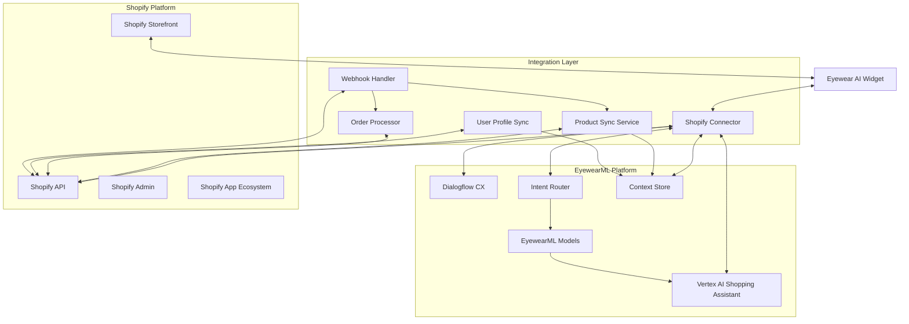
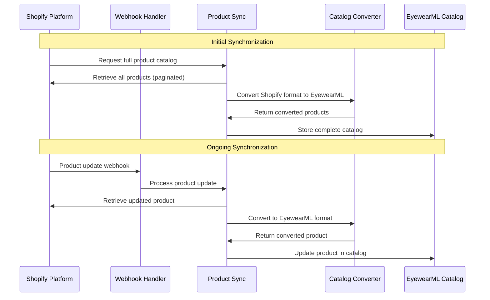
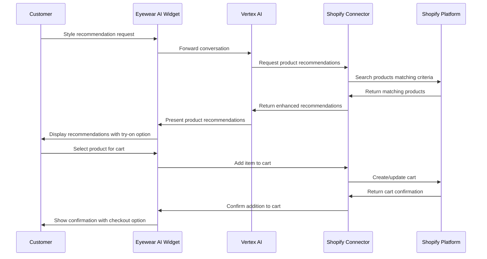
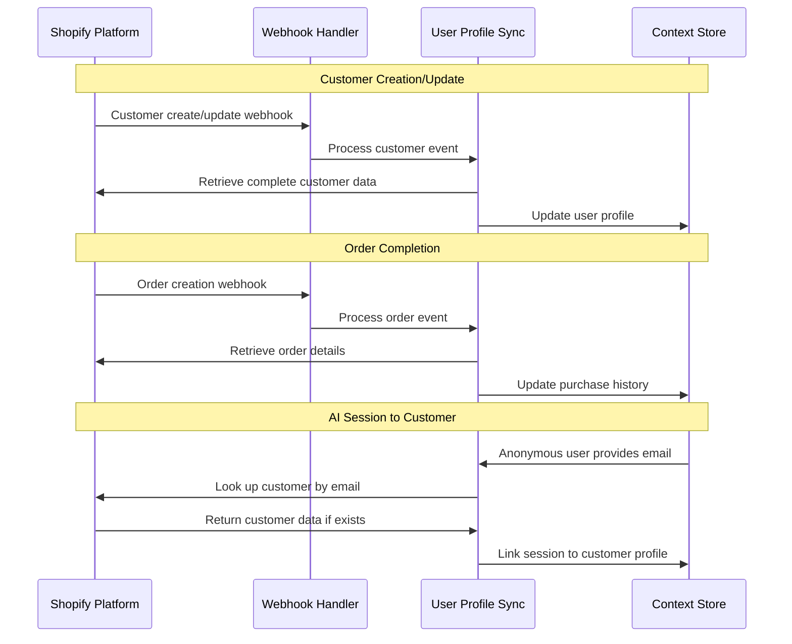

# Shopify Integration Architecture

This document outlines the architecture for integrating EyewearML's Vertex AI-powered conversational assistant with Shopify's e-commerce platform. The integration enables a seamless shopping experience with specialized eyewear consultation capabilities.

## Overview

The Shopify integration connects the EyewearML platform with Shopify stores, enabling bi-directional data flow between the conversational AI system and the e-commerce platform. This creates a cohesive shopping experience where customers can receive specialized eyewear guidance while browsing and purchasing products.

## Integration Components

### Shopify Connector

The Shopify Connector is the central component that facilitates communication between the EyewearML platform and Shopify:

**Responsibilities**:
- Authenticate and manage API connections to Shopify
- Route data between appropriate systems
- Transform data between Shopify and EyewearML formats
- Handle error recovery and synchronization issues

**Implementation Considerations**:
- Shopify API version compatibility
- OAuth flow for secure authentication
- Rate limiting adherence
- Tenant-specific connection management

### Product Sync Service

The Product Sync Service manages the product catalog synchronization between Shopify and the EyewearML platform:

**Responsibilities**:
- Initial product catalog import
- Real-time product updates
- Mapping Shopify product structure to EyewearML catalog
- Enhancing product data with eyewear-specific attributes

**Implementation Considerations**:
- Efficient delta synchronization 
- Product metadata enrichment
- Image optimization for try-on services
- Custom attributes for eyewear specifications

### Order Processor

The Order Processor manages order-related operations between the conversational AI and Shopify:

**Responsibilities**:
- Process orders created through the conversational interface
- Track order status for customer inquiries
- Handle cart management operations
- Process fulfillment and shipping information

**Implementation Considerations**:
- Secure payment handling
- Inventory verification
- Tax and shipping calculations
- Order status webhooks

### User Profile Sync

The User Profile Sync service synchronizes customer information between systems:

**Responsibilities**:
- Maintain consistent customer profiles
- Sync purchase history and preferences
- Manage prescription information securely
- Handle customer consent and privacy settings

**Implementation Considerations**:
- GDPR/CCPA compliance
- Secure storage of sensitive information
- Profile merging for returning customers
- Anonymous to authenticated user transition

### Webhook Handler

The Webhook Handler processes real-time events from Shopify:

**Responsibilities**:
- Register necessary webhooks with Shopify
- Process incoming webhook events
- Route events to appropriate services
- Verify webhook authenticity

**Implementation Considerations**:
- Webhook signature verification
- Idempotent event processing
- Event queuing for high volumes
- Event retry mechanisms

### Eyewear AI Widget

The customer-facing interface that integrates into the Shopify storefront:

**Responsibilities**:
- Provide chat interface embedded in Shopify store
- Handle image uploads for face analysis
- Display virtual try-on results
- Integrate with shopping cart

**Implementation Considerations**:
- Responsive design for all devices
- Theme compatibility
- Performance optimization
- Accessibility compliance

## Shopify Data Model Mapping

### Product Mapping

Mapping between Shopify products and EyewearML catalog:

| Shopify Attribute | EyewearML Attribute | Notes |
|-------------------|---------------------|-------|
| Product ID | external_id | Shopify product identifier |
| Title | name | Product name |
| Description | description | Product description |
| Product Type | category | Mapped to eyewear category |
| Tags | tags, attributes | Split into taxonomy and attributes |
| Options | variants | Mapped to frame color/size options |
| Variants | variants | Includes SKU, price, inventory |
| Metafields | technical_specifications | Eyewear-specific attributes |
| Images | images | Used for display and try-on |

**Extended Eyewear Attributes** (stored in Shopify metafields):

- Frame dimensions (lens width, bridge width, temple length)
- Frame material
- Frame weight
- Face shape compatibility
- Lens compatibility (progressive, bifocal, etc.)
- Fit characteristics
- Style attributes (modern, classic, etc.)

### Customer Mapping

Mapping between Shopify customers and EyewearML user profiles:

| Shopify Attribute | EyewearML Attribute | Notes |
|-------------------|---------------------|-------|
| Customer ID | external_id | Shopify customer identifier |
| First/Last Name | name | Customer name |
| Email | email | Primary identifier |
| Phone | phone | Secondary contact |
| Default Address | shipping_address | For order fulfillment |
| Metafields | eyewear_profile | Extended eyewear information |
| Order History | purchase_history | Previous purchases |

**Extended Eyewear Profile** (stored in Shopify metafields):

- Face shape analysis results
- Style preferences
- Fit preferences and issues
- Prescription information (if provided)
- Previous try-on history
- Frame recommendations

### Order Mapping

Mapping between Shopify orders and EyewearML transactions:

| Shopify Attribute | EyewearML Attribute | Notes |
|-------------------|---------------------|-------|
| Order ID | external_id | Shopify order identifier |
| Line Items | items | Products in order |
| Customer | user_id | Customer reference |
| Shipping Address | shipping_address | Delivery location |
| Financial Status | payment_status | Payment information |
| Fulfillment Status | fulfillment_status | Order status |
| Discount Codes | promotions | Applied promotions |
| Cart Attributes | consultation_reference | Link to conversation |

## Integration Workflows

### Product Catalog Synchronization

### Conversation with Product Recommendations

### User Profile Synchronization

## Shopify App Integration

The EyewearML integration is deployed as a custom Shopify app:

### App Architecture

1. **Embedded Admin App**:
   - Custom Shopify admin interface
   - Configuration dashboard
   - Analytics and reporting
   - Catalog management tools

2. **Storefront UI Components**:
   - Embedded chat widget
   - Virtual try-on interface
   - Product recommendation displays
   - Face shape analysis tools

3. **API Extensions**:
   - GraphQL extensions for eyewear attributes
   - REST API endpoints for conversational AI
   - Webhook subscriptions
   - App bridge integration

### App Installation Flow

1. **Merchant Installation**:
   - Shopify app store listing
   - OAuth authorization flow
   - Permission scopes requested
   - Initial configuration wizard

2. **Store Configuration**:
   - Theme integration setup
   - Product catalog synchronization
   - Custom attribute mapping
   - Widget placement options

3. **Testing and Activation**:
   - Test mode for merchant validation
   - Sample conversation flows
   - Widget preview in theme
   - Go-live checklist

## Multi-Store Management

For merchants with multiple Shopify stores:

### Centralized Management

1. **Cross-Store Dashboard**:
   - Unified administration interface
   - Consolidated analytics
   - Shared knowledge base
   - Centralized configuration

2. **Store-Specific Settings**:
   - Per-store theme integration
   - Store-specific product catalog
   - Language and locale settings
   - Branding customization

3. **Shared AI Training**:
   - Aggregated conversation data (with appropriate privacy controls)
   - Cross-store style recommendations
   - Shared fit analysis models
   - Combined customer insights

## Security and Compliance

### Data Security

1. **API Security**:
   - OAuth 2.0 authentication
   - Scoped API tokens
   - HTTPS encryption
   - Token rotation policies

2. **Customer Data Protection**:
   - PII encryption
   - Prescription data security
   - Secure image storage
   - Data minimization practices

### Compliance

1. **GDPR Compliance**:
   - Customer data export
   - Right to be forgotten
   - Consent management
   - Privacy policy integration

2. **ADA Compliance**:
   - Accessible chat interface
   - Screen reader compatibility
   - Keyboard navigation
   - Alternative text for images

## Performance Optimization

### Shopify API Usage

1. **Rate Limit Management**:
   - Request throttling
   - Batch operations
   - Prioritized queue for critical operations
   - Cache-first approach for product data

2. **Bulk Operations**:
   - GraphQL bulk operations for catalog sync
   - Bulk mutations for data updates
   - Efficient pagination
   - Incremental sync strategies

### Storefront Performance

1. **Widget Optimization**:
   - Lazy loading of chat components
   - Progressive image loading
   - Efficient asset caching
   - Code splitting and minification

2. **Response Time Optimization**:
   - Pre-fetching of likely recommendations
   - Local storage for conversation state
   - Optimistic UI updates
   - Background processing for intensive operations

## Implementation Guidelines

### Shopify API Best Practices

1. **API Version Management**:
   - Pin to specific API version
   - Scheduled version upgrades
   - Compatibility testing
   - Feature support verification

2. **Error Handling**:
   - Robust retry mechanisms
   - Exponential backoff
   - Graceful degradation
   - Error notification system

3. **Webhook Management**:
   - Verification of webhook signatures
   - Acknowledgment of receipt
   - Processing idempotency
   - Failed webhook recovery

### App Store Requirements

1. **Submission Requirements**:
   - App listing details
   - Privacy policy
   - Support information
   - Demo store setup

2. **Review Process Preparation**:
   - Testing account for reviewers
   - Documentation of features
   - Sample data preparation
   - Testing instructions

3. **Ongoing Compliance**:
   - API usage monitoring
   - Regular security reviews
   - Performance benchmarking
   - User experience testing

## Deployment and Operations

### Deployment Process

1. **Development Environment**:
   - Local development store
   - Test data generation
   - Theme integration development
   - API mocking

2. **Staging Environment**:
   - Partner test store
   - Production-like data
   - Full integration testing
   - Performance validation

3. **Production Deployment**:
   - Phased rollout
   - Monitoring setup
   - Backup procedures
   - Rollback planning

### Operational Support

1. **Monitoring**:
   - API call monitoring
   - Error rate tracking
   - Performance metrics
   - User engagement analytics

2. **Support Processes**:
   - Merchant support portal
   - End-user support through chat
   - Issue escalation procedures
   - Documentation and knowledge base

3. **Update Management**:
   - Regular update schedule
   - Feature flagging
   - A/B testing capability
   - Deprecation policies
