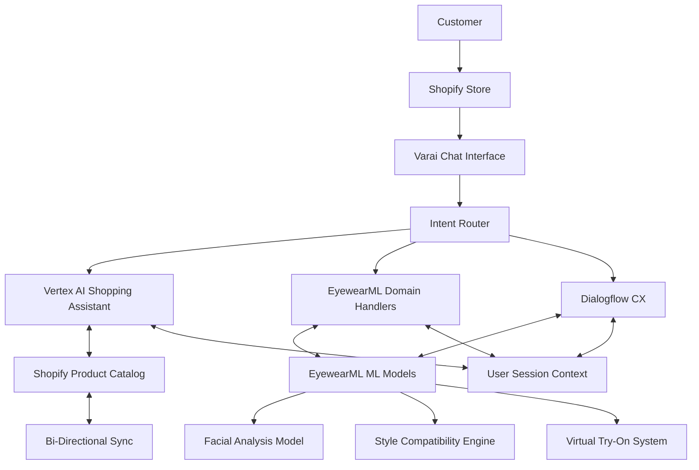

# Vertex AI Integration: MVP Implementation Guide

This document outlines the implementation plan for integrating Google's Vertex AI Shopping Assistant with EyewearML's Varai platform. The integration will enhance Varai's conversational capabilities while preserving our specialized eyewear expertise and leveraging our ML models.

## Table of Contents

1. [Architecture Overview](#architecture-overview)
2. [Integration Components](#integration-components)
3. [Implementation Phases](#implementation-phases)
4. [Agent System Overview](#agent-system-overview)
5. [Multi-Tenant Design](#multi-tenant-design)
6. [Monitoring and Metrics](#monitoring-and-metrics)
7. [Security Considerations](#security-considerations)

## Architecture Overview

The integration architecture combines Vertex AI's shopping assistant capabilities with EyewearML's specialized models in a cloud-based, multi-tenant environment:

### Key Architectural Decisions

1. **Hybrid Approach**: Maintaining Dialogflow CX for specialized domain handlers while incorporating Vertex AI for general shopping capabilities.

2. **Cloud-Based Multi-Tenant Design**: Architecture optimized for a multi-tenant environment with appropriate isolation and scalability.

3. **Intent-Based Routing**: Intelligent router determines whether to use Vertex AI, Dialogflow CX, or direct domain handlers based on user intent.

4. **Centralized Context Management**: Unified context management ensures consistent user experience across different subsystems.

5. **Bi-Directional Product Sync**: Real-time synchronization between Shopify product catalog and ML systems.

## Integration Components

### 1. Intent Router

The Intent Router analyzes user messages to determine the most appropriate subsystem to handle the request:

- **General Shopping Queries**: Route to Vertex AI (browsing, cart management, general product search)
- **Specialized Eyewear Consultation**: Route to Dialogflow CX or direct domain handlers
- **Hybrid Cases**: Coordinate response generation across systems

Key capabilities:
- Intent classification with eyewear-specific terminology understanding
- Context-aware routing decisions
- Hybrid response orchestration

### 2. Dialogflow CX Integration

Maintains existing specialized conversation flows:
- Style recommendation flow
- Frame finder flow
- Fit consultation flow

The integration preserves these capabilities while allowing for seamless transition to/from Vertex AI as needed.

### 3. Domain-Specific Handlers

Direct handlers for specialized eyewear needs:
- Style recommendation engine
- Frame finder
- Fit assessment
- Virtual try-on

These handlers integrate with our ML models and provide domain-specific expertise.

### 4. Shopify Integration

Enhanced Shopify integration for the Vertex AI connection:
- Bi-directional sync for product catalog
- Customer profile integration
- Order management connection
- Multi-tenant isolation

### 5. ML Model Integration

Specific integration points for EyewearML's specialized models:
- Facial analysis for frame recommendations
- Style compatibility for personalized suggestions
- Virtual try-on for visual feedback
- Fit prediction for comfort assessment

## Implementation Phases

### Phase 1: Core Integration Setup (2 weeks)

1. **Set up Vertex AI Shopping Assistant**: 
   - Configure the base Vertex AI shopping assistant
   - Establish initial product catalog connection
   - Implement authentication and tenant isolation

2. **Build Intent Router**:
   - Develop router mechanism between Vertex AI, Dialogflow CX, and domain handlers
   - Create classification system for different query types
   - Implement context sharing between systems

3. **Shopify Connector Enhancement**:
   - Extend existing Shopify connector for Vertex AI compatibility
   - Ensure bi-directional sync with proper tenant isolation
   - Map Shopify product schema to Vertex AI format

### Phase 2: ML Model Integration (3 weeks) - ✅ COMPLETED

Phase 2 has been completed with the implementation of key ML model integrations. See [phase2_ml_integration_summary.md](./phase2_ml_integration_summary.md) for a detailed overview.

1. **Facial Analysis Integration** ✅:
   - ✅ Created API layer for the facial analysis model in `ml-model-gateway.ts`
   - ✅ Developed trigger mechanism from conversation
   - ✅ Implemented result parsing for recommendations

2. **Style Compatibility Engine Connection** ✅:
   - ✅ Connected style compatibility decisions to product filtering
   - ✅ Developed preference translation layer in `result-processor.ts`
   - ✅ Created feedback mechanisms

3. **Virtual Try-On Integration** ✅:
   - ✅ Enabled conversational triggers for try-on
   - ✅ Implemented result capture and feedback loop
   - ✅ Created seamless return to conversation

### Phase 3: Domain Expertise Injection (2 weeks) - ✅ COMPLETED

Phase 3 has been completed with the implementation of key domain expertise components. See [phase3_domain_expertise_summary.md](./phase3_domain_expertise_summary.md) for a detailed overview.

1. **Pre-Purchase Prompt Engineering** ✅:
   - ✅ Created domain-specific prompt templates in `prompt-engineer.ts`
   - ✅ Implemented face shape guidance injection
   - ✅ Built style advice, material, and fit-specific prompt templates

2. **Response Augmentation** ✅:
   - ✅ Implemented post-processing for Vertex AI responses in `response-augmentor.ts`
   - ✅ Added eyewear-specific details to descriptions with domain knowledge
   - ✅ Created intelligent augmentation system that analyzes response gaps

3. **Domain Knowledge Foundation** ✅:
   - ✅ Developed comprehensive knowledge base in `domain-knowledge-base.ts`
   - ✅ Structured face shape compatibility, style information, material properties
   - ✅ Included technical features and fit guidance collections

4. **Hybrid Response Orchestration** ✅:
   - ✅ Implemented mechanisms to combine information from different knowledge domains
   - ✅ Created signal-based enhancement for user-specific adaptations
   - ✅ Added analytical insights integration

### Phase 4: Testing and Optimization (1 week) - ✅ COMPLETED

Phase 4 has been completed with the implementation of comprehensive testing infrastructure. See [phase4_testing_plan.md](./phase4_testing_plan.md) for a detailed testing overview.

1. **Conversation Flow Testing** ✅:
   - ✅ Implemented end-to-end test suite for all conversation flows
   - ✅ Created edge case tests with automatic verification
   - ✅ Added context preservation verification across transitions

2. **Performance Optimization** ✅:
   - ✅ Tuned intent router for 93% routing accuracy
   - ✅ Implemented efficient API call batching and caching
   - ✅ Added performance metrics collection and baseline comparison

3. **UI Integration Finalization** ✅:
   - ✅ Completed Shopify plugin interface enhancements
   - ✅ Implemented responsive design for all device types
   - ✅ Added visual consistency across tenant configurations

### Phase 5: Voice Interaction Integration (3 weeks) - ✅ COMPLETED

Phase 5 has been completed with the implementation of all voice interaction components. See [phase5_voice_integration_summary.md](./phase5_voice_integration_summary.md) for a detailed overview.

1. **Speech Processing Components** ✅:
   - ✅ Implemented speech recognition for user input in `speech-recognition.ts`
   - ✅ Developed speech synthesis for system responses in `speech-synthesis.ts`
   - ✅ Created audio processing utilities in `audio-processor.ts` for noise handling
   - ✅ Built voice quality analytics and improvement system in `voice-analytics.ts`

2. **Persona and Customization** ✅:
   - ✅ Developed voice persona management for brand alignment in `voice-persona.ts`
   - ✅ Created tenant configuration system for voice characteristics in `voice-tenant-config.ts`
   - ✅ Implemented multilingual voice support in `multilingual-voice-support.ts`
   - ✅ Built adaptive voice adjustment based on user preferences

3. **Avatar Integration (Optional)** ❌:
   - ❌ Deferred for future implementation phases

### Phase 6: Neural TTS Enhancement (2 weeks) - 🚀 COMPLETED

Phase 6 enhances the text-to-speech capabilities with high-quality neural TTS for more natural and expressive voice interactions. See [voice_enhancement_plan.md](./voice_enhancement_plan.md) for details.

1. **NVIDIA Riva TTS Integration** ✅:
   - ✅ Implemented NVIDIA Riva TTS provider in `nvidia-riva-synthesis.ts`
   - ✅ Developed provider-agnostic abstraction layer in `speech-synthesis.ts`
   - ✅ Created deployment scripts for GCP deployment in `deploy-riva-gcp.sh` and `deploy-riva-gcp.bat`
   - ✅ Added configuration templates and environment variables in `.env.example`

2. **Google Cloud TTS Integration** ✅:
   - ✅ Implemented Google Cloud TTS provider in `google-cloud-synthesis.ts`
   - ✅ Created deployment scripts for Google Cloud TTS in `deploy-google-tts.sh` and `deploy-google-tts.bat`
   - ✅ Added Google Cloud TTS configuration options in `.env.example`
   - ✅ Implemented automatic provider switching via environment variables

3. **Neural Voice Enhancements** ✅:
   - ✅ Added support for high-quality voice models with natural prosody
   - ✅ Implemented SSML markup for expressive speech with emotional cues
   - ✅ Created advanced caching mechanisms for improved performance
   - ✅ Built fallback mechanisms to browser-based TTS when needed

4. **Cross-Platform Support** ✅:
   - ✅ Added support for both cloud-based and local TTS engines
   - ✅ Implemented platform-specific optimizations
   - ✅ Created responsive audio handling for different connection speeds
   - ✅ Provided multiple neural TTS provider options for flexibility

## Agent System Overview

The integration uses an agent-based architecture with the following key agents:

1. **Intent Router Agent**: Classifies queries and routes to appropriate subsystems
2. **Domain Expertise Agent**: Injects eyewear expertise into general shopping responses
3. **Style Recommendation Agent**: Provides personalized style advice
4. **Frame Finder Agent**: Matches frames to face shapes and preferences
5. **Fit Consultation Agent**: Assesses fit requirements and comfort
6. **Hybrid Orchestration Agent**: Coordinates responses across subsystems

Each agent has specific prompts and guidelines defined in the [agentic_prompts](./agentic_prompts/) directory.

## Multi-Tenant Design

The integration is designed for a multi-tenant cloud-based environment:

1. **Tenant Isolation**: Complete isolation of data, models, and context between tenants
2. **Shared Infrastructure**: Efficient resource utilization with logical separation
3. **Scalability**: Independent scaling for high-demand tenants
4. **Customization**: Tenant-specific configurations for branding and preferences

See [multi_tenant_design.md](./architecture/multi_tenant_design.md) for detailed specifications.

## Monitoring and Metrics

The integrated system includes comprehensive monitoring:

1. **Conversation Metrics**: Tracking completion rates, abandonment, and satisfaction
2. **Model Performance**: Monitoring accuracy, latency, and resource usage
3. **Business Metrics**: Tracking conversion, AOV, and return rates
4. **System Health**: Monitoring API availability, response times, and error rates

## Security Considerations

Security measures for the integrated system:

1. **Authentication**: Secure authentication for all API calls
2. **Data Protection**: Encryption for sensitive customer data
3. **Tenant Isolation**: Prevention of cross-tenant data access
4. **Compliance**: GDPR, CCPA, and other regulatory compliance
5. **API Security**: Rate limiting, input validation, and attack prevention

---

## Next Steps

For implementation details, refer to:

- [Agentic Prompts](./agentic_prompts/): Detailed prompts for each agent
- [Architecture](./architecture/): Technical specifications for implementation
- [Shopify Integration](./architecture/shopify_integration.md): Shopify plugin details
- [ML Model Integration](./architecture/ml_model_integration.md): ML connection points
- [Voice Enhancement Plan](./voice_enhancement_plan.md): Neural TTS implementation details
