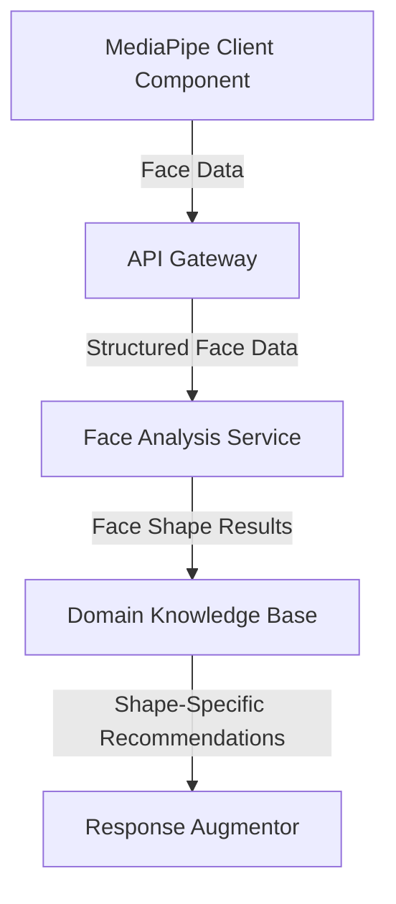
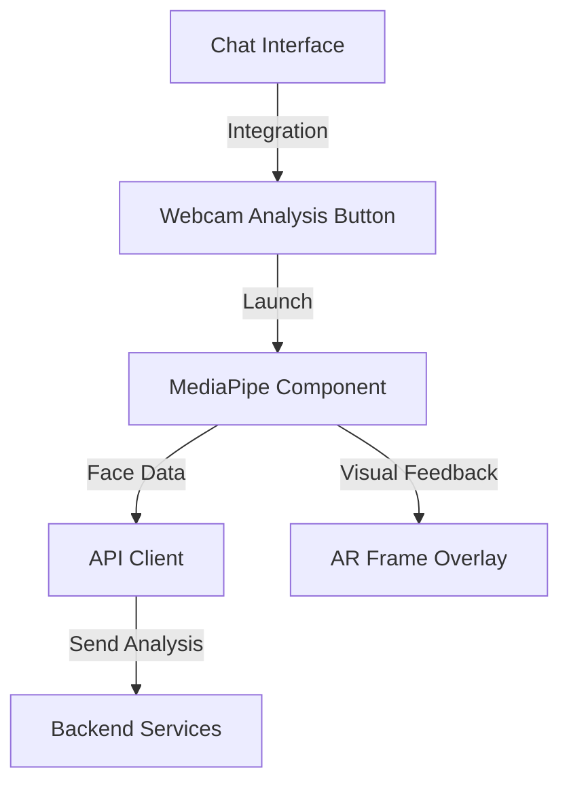

# Phase 4: Enhancement and MediaPipe Integration Plan

This document outlines implementation strategies for the proposed enhancements to the Vertex AI integration system and details how to integrate the existing MediaPipe face shape analysis application.

## System Enhancement Implementation Strategies

### 1. Knowledge Base Expansion

**Current State:**
- Static knowledge base with predefined eyewear expertise categories
- Manual updates required for new information

**Implementation Strategy:**
1. **Content Management System Integration:**
   - Create an admin interface for non-technical staff to add/update eyewear expertise
   - Implement a versioned knowledge base with review workflows
   - Add ability to flag outdated information for review

2. **Automated Knowledge Extraction:**
   - Develop scrapers for eyewear industry publications and research
   - Implement NLP processing to extract relevant structured information
   - Create verification workflows to validate extracted knowledge

3. **API-Based Extension Points:**
   - Create external API endpoints for third-party knowledge providers
   - Implement a standardized knowledge ingestion format
   - Develop validation and integration testing for external knowledge

### 2. Dynamic Learning

**Current State:**
- Static domain knowledge without feedback incorporation
- No mechanism for learning from successful interactions

**Implementation Strategy:**
1. **Conversation Success Tracking:**
   - Implement success metrics for conversation outcomes (purchase, appointment booking, etc.)
   - Track which knowledge recommendations led to successful outcomes
   - Build a recommendation ranking system based on historical success

2. **Feedback Collection System:**
   - Add explicit feedback collection after knowledge-enhanced responses
   - Implement implicit feedback tracking (did user continue conversation, make a purchase, etc.)
   - Create a reinforcement learning module to adjust knowledge importance weighting

3. **A/B Testing Framework:**
   - Develop an A/B testing system for different knowledge augmentation strategies
   - Implement variant tracking and performance analysis
   - Create automated knowledge enhancement optimization based on test results

### 3. Personalization Refinement

**Current State:**
- Basic personalization based on current conversation context
- Limited use of historical user data

**Implementation Strategy:**
1. **User Profile Expansion:**
   - Extend user profiles to store eyewear preferences, purchase history, and interactions
   - Implement privacy-compliant storage with appropriate retention policies
   - Create a preference inference engine to derive implied preferences

2. **Contextual Memory Enhancement:**
   - Develop a historical context processor that incorporates past conversations
   - Implement cross-session memory with appropriate prioritization
   - Create decay functions for older context to maintain relevance

3. **Personalized Knowledge Prioritization:**
   - Build a ranking system for knowledge based on user preferences
   - Implement relevance scoring for different knowledge segments
   - Create personalized response templates based on user communication style

### 4. Multi-modal Support

**Current State:**
- Text-based knowledge injection
- No integration with image or video analysis

**Implementation Strategy:**
1. **Image-Based Knowledge Integration:**
   - Extend knowledge base to include image references and visual examples
   - Implement image-based lookup for products and styles
   - Create image-enhanced response templates

2. **MediaPipe Face Analysis Integration:**
   - Integrate D:\try-me-nextJS MediaPipe application (detailed in separate section)
   - Develop knowledge connectors for face shape detection results
   - Implement real-time knowledge augmentation based on visual analysis

3. **Interactive Visual Feedback:**
   - Create visual overlays for eyewear recommendations
   - Implement visual comparison tools for different styles
   - Develop interactive feedback mechanisms based on visual content

### 5. Analytics Integration

**Current State:**
- Basic tracking of augmentation impact
- Limited integration with business metrics

**Implementation Strategy:**
1. **Comprehensive Analytics Dashboard:**
   - Develop dashboards for knowledge utilization and effectiveness
   - Implement funnel analysis from knowledge delivery to conversion
   - Create ROI metrics for different knowledge categories

2. **Predictive Conversion Modeling:**
   - Build predictive models for conversion likelihood based on knowledge delivery
   - Implement real-time optimization of knowledge selection
   - Create automated reports on knowledge effectiveness

3. **Multi-touch Attribution:**
   - Develop attribution models for knowledge contribution to sales
   - Implement tracking across conversation sessions and channels
   - Create performance metrics for knowledge engineering investments

## MediaPipe Face Shape Analysis Integration

### Overview of Existing MediaPipe Application

The application at D:\try-me-nextJS is a Next.js application that leverages MediaPipe for face mesh detection and analysis through the user's webcam. This technology:

1. Activates the user's webcam
2. Uses MediaPipe to detect facial landmarks (face mesh)
3. Analyzes these landmarks to determine face shape classification
4. Can potentially provide real-time feedback

### Integration Strategy

#### 1. Architecture Integration

**Server-Side Components:**

**Client-Side Components:**

#### 2. Implementation Steps

1. **Extract Core MediaPipe Functionality:**
   - Isolate the face mesh detection and analysis from the Next.js application
   - Convert to a standalone component that can be embedded in multiple interfaces
   - Ensure compatibility with different front-end frameworks

2. **API Development:**
   - Create REST/GraphQL endpoints for face analysis results
   - Implement WebSocket connections for real-time analysis
   - Develop secure data storage for face shape profiles with appropriate privacy controls

3. **Knowledge Base Connector:**
   - Extend domain knowledge base to accept face shape analysis input
   - Create mapping between detected face measurements and frame recommendations
   - Implement confidence scoring for shape detection to weight recommendations

4. **UI Integration:**
   - Add webcam activation option within chat interface
   - Develop visual indicators for face shape analysis progress
   - Create seamless transition from visual analysis to text recommendations

5. **Virtual Try-On Extension:**
   - Leverage face mesh data for accurate frame positioning
   - Implement AR overlay for virtual frame try-on
   - Create side-by-side comparison view for different recommended frames

#### 3. Technical Requirements

1. **Browser Compatibility:**
   - Ensure MediaPipe functions across major browsers
   - Implement fallbacks for browsers with limited WebRTC support
   - Optimize performance for mobile devices

2. **Privacy Considerations:**
   - Process face data client-side where possible
   - Implement clear consent mechanisms for webcam access
   - Create appropriate data retention policies for any stored face data

3. **Accessibility Requirements:**
   - Provide alternative paths for users unable to use webcam
   - Ensure feedback is available through multiple channels (visual and text)
   - Implement keyboard navigation for the entire analysis process

## Implementation Phases

### Phase 1: MediaPipe Integration (3 weeks)

1. **Week 1: Core Extraction and API Development**
   - Extract MediaPipe functionality from Next.js app
   - Develop core API endpoints
   - Implement initial knowledge base connectors

2. **Week 2: UI Integration and Testing**
   - Integrate webcam activation within main interface
   - Develop visual feedback components
   - Implement end-to-end testing

3. **Week 3: Enhanced Features and Optimization**
   - Add virtual try-on capabilities
   - Optimize performance across devices
   - Implement privacy controls and consent flows

### Phase 2: Enhancement Implementation (6 weeks)

1. **Weeks 1-2: Knowledge Base Expansion & Analytics**
   - Develop admin interface for knowledge management
   - Implement analytics dashboard
   - Create API endpoints for external knowledge sources

2. **Weeks 3-4: Dynamic Learning & Personalization**
   - Implement conversation success tracking
   - Develop feedback collection system
   - Create personalized knowledge prioritization

3. **Weeks 5-6: Multi-modal Support & Integration**
   - Extend knowledge base for image references
   - Implement interactive visual feedback
   - Create comprehensive integration testing

## Conclusion

Integrating the MediaPipe face shape analysis with the Vertex AI system represents a significant enhancement to the platform's capabilities, enabling true multi-modal interaction. This integration, combined with the five enhancement areas, will create a comprehensive next-generation eyewear consultation system that combines AI conversation capabilities with specialized domain knowledge and visual analysis.

The phased implementation approach ensures that each component can be thoroughly tested and optimized before proceeding to the next phase, minimizing risk and ensuring quality throughout the development process.
