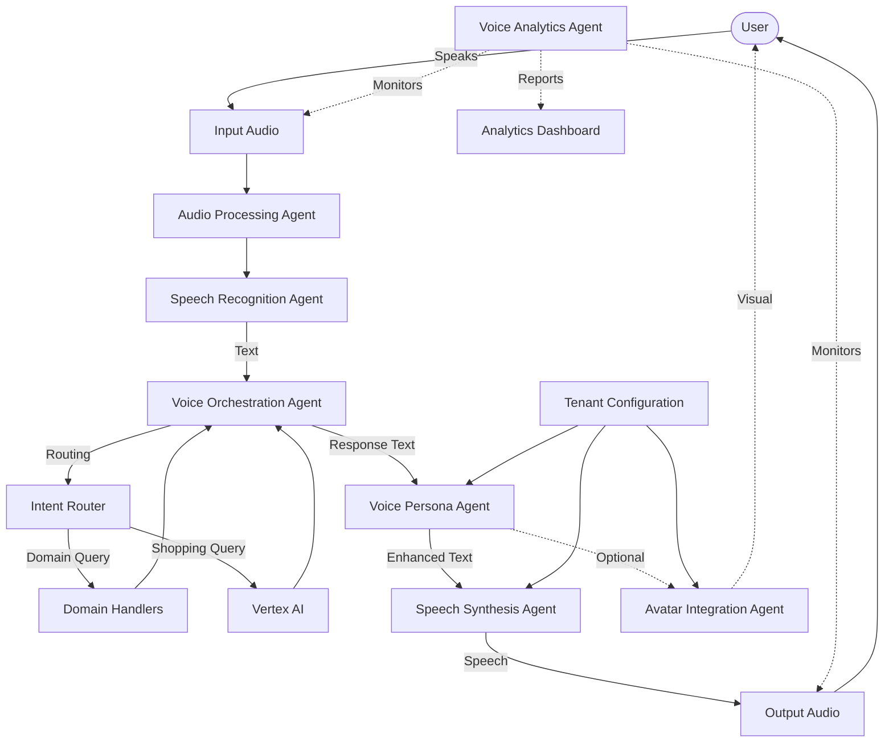

# Phase 5: Voice Interaction Integration Plan

This document outlines the detailed implementation plan for Phase 5 of the Vertex AI Integration project: Voice Interaction Integration. This phase adds bidirectional voice capabilities to enhance user engagement and accessibility across all supported platforms.

## Table of Contents

1. [Overview](#overview)
2. [Architecture](#architecture)
3. [Implementation Schedule](#implementation-schedule)
4. [Technical Components](#technical-components)
5. [Integration Points](#integration-points)
6. [Testing Strategy](#testing-strategy)
7. [Rollout Plan](#rollout-plan)
8. [Success Metrics](#success-metrics)

## Overview

Phase 5 adds voice interaction capabilities to the EyewearML platform, enabling users to engage with the system using natural speech instead of or in addition to text. The implementation includes both speech recognition (converting user speech to text) and speech synthesis (converting system responses to spoken output), along with sophisticated voice persona customization and optional avatar integration.

### Key Objectives

1. Create an intuitive voice-based interaction experience
2. Maintain consistent brand identity through voice persona customization
3. Ensure seamless integration with existing features, particularly face analysis
4. Support multi-tenant voice configuration
5. Implement robust voice analytics and quality monitoring
6. Ensure accessibility compliance across all interfaces

## Architecture

The voice interaction system follows the same agent-based architecture as the core system, with specialized agents handling different aspects of voice processing:

## Implementation Schedule

Phase 5 implementation is planned over a 3-week period:

### Week 1: Core Voice Processing

1. **Days 1-2: Basic Infrastructure**
   - Set up voice component directory structure
   - Implement audio processing utilities
   - Create basic speech recognition wrapper

2. **Days 3-4: Speech Recognition**
   - Implement browser-based speech recognition (Web Speech API)
   - Create cloud provider adapters (Google, NVIDIA, Amazon)
   - Build voice activity detection system

3. **Days 5-7: Speech Synthesis**
   - Implement text-to-speech conversion
   - Create SSML enhancement for natural speech
   - Build speech parameter controls for customization

### Week 2: Orchestration and Persona

1. **Days 8-9: Voice Orchestration**
   - Implement turn-taking management
   - Build interruption handling
   - Create modality transition system

2. **Days 10-11: Voice Persona**
   - Implement persona configuration system
   - Create brand voice alignment tools
   - Build emotional tone management

3. **Days 12-14: Tenant Configuration**
   - Create multi-tenant voice settings
   - Implement voice profile management
   - Build tenant-specific voice customization UI

### Week 3: Integration and Polish

1. **Days 15-16: Avatar Integration**
   - Implement optional avatar visualization
   - Create speech-visual synchronization
   - Build expression and gesture management

2. **Days 17-18: Analytics**
   - Create voice interaction analytics
   - Implement quality monitoring
   - Build usage reporting

3. **Days 19-21: Testing and Refinement**
   - Conduct comprehensive voice testing
   - Fine-tune voice parameters
   - Optimize performance

## Technical Components

### 1. Speech Recognition Agent

The Speech Recognition Agent handles all aspects of converting user speech to text:

- **Input management**: Activation, capture, and streaming
- **Recognition processing**: API selection, audio processing, confidence scoring
- **Error handling**: Recovery from recognition failures, ambiguity resolution
- **Context integration**: Domain-specific vocabulary enhancement

Implementation details and agent prompts are described in [speech_recognition_agent.md](./agentic_prompts/voice/speech_recognition_agent.md).

### 2. Speech Synthesis Agent

The Speech Synthesis Agent converts system text responses into natural-sounding speech:

- **Text preprocessing**: Format optimization, pronunciation correction, emphasis markup
- **Voice selection**: Tenant-specific voice characteristics
- **Speech generation**: API integration, parameter management, streaming
- **Output control**: Playback management, interruption handling

Implementation details and agent prompts are described in [speech_synthesis_agent.md](./agentic_prompts/voice/speech_synthesis_agent.md).

### 3. Voice Orchestration Agent

The Voice Orchestration Agent coordinates the entire voice interaction flow:

- **Turn management**: Controlling conversation flow between user and system
- **Mode transitions**: Seamlessly switching between voice and text when appropriate
- **Session control**: Initializing and managing voice session state
- **Performance optimization**: Resource allocation and response time management

Implementation details and agent prompts are described in [voice_orchestration_agent.md](./agentic_prompts/voice/voice_orchestration_agent.md).

### 4. Voice Persona Agent

The Voice Persona Agent maintains consistent personality characteristics:

- **Persona definition**: Brand-aligned voice personality
- **Response enhancement**: Conversational markers and style consistency
- **Adaptation**: Adjusting to user interaction patterns
- **Multi-channel consistency**: Maintaining consistent persona across modalities

Implementation details and agent prompts are described in [voice_persona_agent.md](./agentic_prompts/voice/voice_persona_agent.md).

### 5. Audio Processing Agent

The Audio Processing Agent handles technical aspects of audio signal processing:

- **Noise management**: Reduction, filtering, and environmental adaptation
- **Signal enhancement**: Normalization, compression, and clarity improvement
- **Interruption detection**: Identifying user speech during system output
- **Quality optimization**: Device-specific audio adjustments

Implementation details and agent prompts are described in [audio_processing_agent.md](./agentic_prompts/voice/audio_processing_agent.md).

### 6. Voice Analytics Agent

The Voice Analytics Agent monitors and analyzes voice interaction metrics:

- **Usage tracking**: Voice feature adoption and usage patterns
- **Quality assessment**: Speech recognition accuracy and synthesis quality
- **Performance monitoring**: Response times and resource utilization
- **Reporting**: Tenant-specific analytics dashboards

Implementation details and agent prompts are described in [voice_analytics_agent.md](./agentic_prompts/voice/voice_analytics_agent.md).

### 7. Avatar Integration Agent (Optional)

The Avatar Integration Agent coordinates visual representation with voice:

- **Visual rendering**: Avatar display and animation
- **Speech synchronization**: Lip movement and facial expressions
- **Gesture management**: Appropriate body language coordination
- **UI integration**: Embedding avatar in conversation interface

Implementation details and agent prompts are described in [avatar_integration_agent.md](./agentic_prompts/voice/avatar_integration_agent.md).

## Integration Points

### 1. Core System Integration

Voice components integrate with existing system architecture through these key points:

1. **Intent Router**: Voice input is processed through the same intent routing system
2. **Domain Handlers**: Domain expertise is applied consistently across modalities
3. **Session Context**: Voice interaction history maintained in unified context
4. **Tenant Configuration**: Voice settings integrated into existing tenant config

### 2. Face Analysis Integration

Special attention is given to integrating voice with the face analysis feature:

1. **Voice guidance**: Verbal instructions for face positioning and analysis
2. **Multimodal feedback**: Combined visual and audio confirmation
3. **Analysis narration**: Verbal explanation of analysis process and results
4. **Seamless transitions**: Smooth flow between conversation and analysis

### 3. Shopify Integration

Voice capabilities extend to the Shopify integration:

1. **Product browsing**: Voice-based catalog navigation
2. **Cart management**: Add/remove items by voice
3. **Checkout process**: Voice guidance through purchase steps
4. **Order status**: Voice queries for order information

## Testing Strategy

The testing strategy for voice integration includes:

1. **Unit Testing**: Individual component functionality verification
2. **Integration Testing**: Voice component interaction validation
3. **End-to-End Testing**: Complete voice conversation flows
4. **Performance Testing**: Response time and resource utilization benchmarking
5. **Cross-Browser/Device Testing**: Compatibility validation across platforms
6. **Accessibility Testing**: Compliance with accessibility standards

Test cases and procedures are detailed in the test plan document.

## Rollout Plan

The voice integration rollout follows a phased approach:

1. **Internal Alpha**: Developer testing of core functionality
2. **Closed Beta**: Selected customers with controlled features
3. **Open Beta**: Opt-in access for all customers
4. **General Availability**: Full feature release with ongoing monitoring

## Success Metrics

The success of voice integration will be measured by:

1. **Adoption Rate**: Percentage of users choosing voice interaction
2. **Completion Rate**: Successfully completed voice conversations
3. **Error Rate**: Recognition and synthesis errors
4. **Satisfaction**: User feedback and satisfaction scores
5. **Performance**: Response time and system resource impact
6. **Business Impact**: Conversion rates and average order value

## Next Steps

1. Initiate infrastructure setup for voice components
2. Develop speech recognition and synthesis implementations
3. Create voice orchestration system
4. Implement voice persona customization
5. Build analytics and monitoring
6. Integrate with existing systems
7. Conduct comprehensive testing
8. Roll out to production
