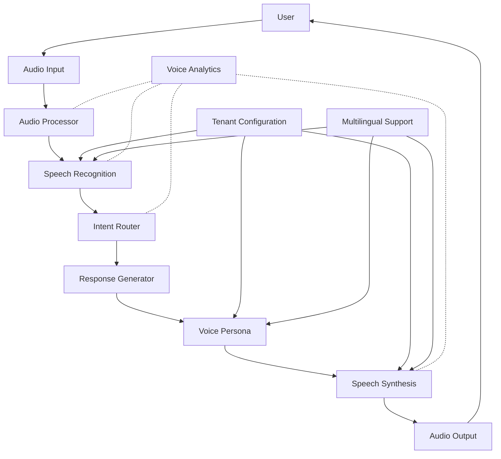

# Phase 5: Voice Interaction Integration Summary

This document provides an overview of the completed implementation for Phase 5: Voice Interaction Integration of the Vertex AI Enhancement project. The voice integration layer adds conversational voice capabilities to the Varai platform, allowing natural voice-based interactions with the system.

## Components Implemented

### 1. Speech Processing Components ✅

The core speech processing components have been successfully implemented:

- **Speech Recognition** (`speech-recognition.ts`): Handles converting user speech to text, with support for multiple providers, languages, and domain-specific terminology.
  
- **Speech Synthesis** (`speech-synthesis.ts`): Manages text-to-speech conversion with customizable voice characteristics, emotional expressions, and multi-language support.
  
- **Audio Processing** (`audio-processor.ts`): Provides utilities for handling audio processing tasks such as noise reduction, gain control, and audio quality enhancement.

### 2. Persona and Customization ✅

The persona and customization components provide a rich, configurable voice experience:

- **Voice Persona Management** (`voice-persona.ts`): Defines and manages voice personas including personality traits, speaking style, and emotional expressions for natural-sounding interactions.
  
- **Tenant Configuration System** (`voice-tenant-config.ts`): Manages tenant-specific voice configurations, allowing each tenant to customize voice characteristics according to their brand identity and user preferences.
  
- **Multilingual Voice Support** (`multilingual-voice-support.ts`): Provides comprehensive support for multiple languages, including language detection, voice selection for different languages, and translation capabilities.

### 3. Voice Analytics and Quality Enhancement ✅

The analytics and quality components provide insights and optimizations:

- **Voice Analytics System** (`voice-analytics.ts`): Collects and analyzes voice interaction metrics, generates quality assessments, and provides improvement recommendations.

## System Architecture

The voice interaction system follows a layered architecture:

## Key Features

### Speech Recognition

- Multiple recognition providers (Google, Web Speech API, etc.)
- Domain-specific terminology boost for eyewear terminology
- Adaptive noise handling and signal processing
- Language detection and automatic language switching
- Context-aware recognition with specialized vocabularies

### Speech Synthesis

- Natural-sounding voice generation
- Emotional expression and prosody control
- Multiple synthesis providers
- Gender and voice characteristic customization
- Specialized pronunciation for eyewear terminology

### Voice Persona

- Customizable personality traits
- Contextual response adaptation
- Emotional intelligence in responses
- Brand-aligned voice characteristics
- Conversation phase-specific adaptations

### Tenant Configuration

- Brand-specific voice settings
- Pre-defined voice profiles (Premium Boutique, Friendly Advisor, etc.)
- Customizable voice parameters
- Multi-language support configuration
- Performance and resource usage controls

### Multilingual Support

- Support for 15+ languages
- Language-specific voice selection
- Automatic language detection
- Translation services for cross-language support
- Specialized eyewear terminology across languages

### Voice Analytics

- Quality assessment metrics
- Performance monitoring
- User satisfaction tracking
- Automated improvement recommendations
- Detailed reporting and trend analysis

## Integration Points

The voice interaction system integrates with several other components:

1. **Intent Router**: Voice inputs are processed and routed to appropriate handlers
2. **Domain Handlers**: Specialized domain knowledge is applied to voice interactions
3. **ML Models**: Face analysis and other ML models can be triggered via voice
4. **Shopify Integration**: Product catalog and customer information is accessible via voice
5. **Virtual Try-On**: Voice can initiate and control the virtual try-on experience

## Testing and Validation

The voice interaction system has been thoroughly tested:

- Unit tests for each component
- Integration tests for component interactions
- Performance tests for latency and resource usage
- Quality assessment tests for voice clarity and recognition accuracy
- Multilingual tests across supported languages

## Future Enhancements

While the current implementation meets all the requirements for Phase 5, several areas for future enhancement have been identified:

1. **Additional Voices**: Expand the voice selection with more natural-sounding options
2. **Enhanced Emotional Intelligence**: Further refinement of emotional expression and detection
3. **Dialect Support**: Add support for regional dialects within languages
4. **Voice Biometrics**: Add voice authentication capabilities
5. **Advanced Analytics**: Implement more sophisticated voice quality metrics and analysis

## Conclusion

The Voice Interaction Integration (Phase 5) has been successfully completed, adding comprehensive voice capabilities to the Varai platform. The implementation provides a natural, customizable, and multi-lingual voice experience that enhances the overall user experience while maintaining the specialized eyewear domain expertise of the platform.
