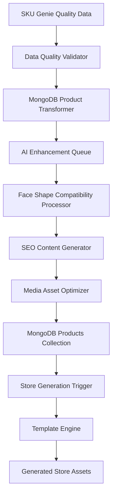

# MongoDB Foundation Architecture Specification
## End-to-End Eyewear Product Data Layer Implementation

### Executive Summary

This specification defines the comprehensive MongoDB integration architecture for the eyewear ML platform, addressing the critical path foundation identified in the MVP Gap Analysis. The current system has PostgreSQL/Prisma infrastructure but lacks the specialized eyewear schema and data flow integration required for AI-powered store generation.

**Key Insight**: The existing template engine and store generation services are already built and tested, but they expect MongoDB collections that don't exist yet. This specification bridges that gap by designing the complete data architecture that enables the full AI-to-store pipeline.

---

## 1. Current State Analysis

### 1.1 Existing Infrastructure ✅
- **PostgreSQL/Prisma**: Complete RBAC, analytics, and tenant management
- **Template Engine**: Fully implemented with theme support (`src/store_generation/template_engine/`)
- **Store Generation Models**: Complete data models expecting MongoDB (`src/store_generation/models.py`)
- **Product Data Service**: Full service layer with MongoDB aggregation pipelines (`src/store_generation/services/product_data_service.py`)
- **API Layer**: Store generation endpoints ready (`src/store_generation/api.py`)

### 1.2 Critical Gaps ❌
- **MongoDB Eyewear Collections**: Core product data structures missing
- **Data Migration Pipeline**: No path from PostgreSQL to MongoDB
- **SKU Genie Integration**: No data flow from quality management to product catalog
- **AI Enhancement Pipeline**: Missing ML-powered product enrichment
- **Cross-Database Synchronization**: No strategy for dual-database operations

---

## 2. MongoDB Schema Architecture

### 2.1 Database Structure
```javascript
// Primary Database: eyewear_ml
// Collections Design for Specialized Eyewear Domain
```

### 2.2 Core Collections

#### 2.2.1 Products Collection
```javascript
// Collection: products
{
  _id: ObjectId,
  
  // Core Product Identity
  sku: string,                    // Unique SKU from SKU Genie
  product_id: string,             // Cross-platform identifier
  name: string,                   // Product display name
  description: string,            // Product description
  ai_description: string,         // AI-enhanced description
  
  // Brand and Classification
  brand_id: ObjectId,             // Reference to brands collection
  brand_name: string,             // Denormalized for performance
  category_id: ObjectId,          // Reference to categories collection
  category_name: string,          // Denormalized for performance
  
  // Eyewear-Specific Data
  frame_type: string,             // "prescription", "sunglasses", "blue_light"
  frame_shape: string,            // "round", "square", "aviator", "cat_eye", "rectangular"
  frame_material: string,         // "acetate", "metal", "titanium", "plastic"
  lens_type: string,              // "single_vision", "progressive", "bifocal"
  
  // Physical Specifications
  measurements: {
    lens_width: number,           // mm
    bridge_width: number,         // mm
    temple_length: number,        // mm
    frame_width: number,          // mm (calculated)
    frame_height: number,         // mm
    weight: number                // grams
  },
  
  // Face Shape Compatibility (AI-Powered)
  face_shape_compatibility: {
    oval: number,                 // 0.0 - 1.0 compatibility score
    round: number,
    square: number,
    heart: number,
    diamond: number,
    oblong: number
  },
  
  // Styling and Aesthetics
  color: string,                  // Primary color
  color_variants: [string],       // Available color options
  style: string,                  // "modern", "classic", "vintage", "sporty"
  gender_target: string,          // "unisex", "men", "women", "kids"
  
  // Pricing and Inventory
  price: number,
  compare_at_price: number,       // Original price for sales
  currency: string,
  cost: number,                   // Wholesale cost
  inventory_quantity: number,
  in_stock: boolean,
  low_stock_threshold: number,
  
  // Media Assets
  media: {
    primary_image: string,        // Main product image
    gallery_images: [string],     // Additional angles
    try_on_image: string,         // Virtual try-on compatible image
    video_url: string,            // Product video
    ar_model_url: string,         // 3D model for AR
    // Optimized versions generated by asset pipeline
    optimized_images: {
      webp: [string],             // WebP format images
      avif: [string],             // AVIF format images
      placeholder: string         // Base64 blur placeholder
    },
    responsive_breakpoints: {
      mobile: [string],           // Mobile-optimized images
      tablet: [string],           // Tablet-optimized images
      desktop: [string]           // Desktop-optimized images
    }
  },
  
  // SEO and Marketing
  seo: {
    title: string,
    description: string,
    keywords: [string],
    canonical_url: string,
    structured_data: object,      // JSON-LD schema
    open_graph: {
      title: string,
      description: string,
      image: string,
      type: string
    }
  },
  
  // Quality and AI Enhancement
  quality_score: number,          // SKU Genie quality score (0.0 - 1.0)
  ai_enhanced: boolean,           // Whether AI processing is complete
  ai_tags: [string],              // AI-generated tags
  ai_metadata: {
    style_confidence: number,     // AI confidence in style classification
    face_shape_model_version: string,
    enhancement_timestamp: Date,
    processing_notes: [string]
  },
  
  // User Engagement
  rating: number,                 // Average user rating
  review_count: number,           // Number of reviews
  view_count: number,             // Product page views
  conversion_rate: number,        // Purchase conversion rate
  
  // Store Generation Optimization
  featured: boolean,              // Featured product flag
  sort_order: number,            // Custom sort order
  template_variant: string,       // Specific template for rendering
  store_visibility: {
    visible: boolean,
    hide_out_of_stock: boolean,
    minimum_inventory: number
  },
  
  // Cross-Platform Integration
  platform_data: {
    shopify_id: string,           // Shopify product ID
    bigcommerce_id: string,       // BigCommerce product ID
    woocommerce_id: string,       // WooCommerce product ID
    sync_status: object           // Sync status per platform
  },
  
  // Metadata
  source: string,                 // Data source (SKU Genie, import, manual)
  source_metadata: object,        // Source-specific data
  active: boolean,                // Active status
  created_at: Date,
  updated_at: Date,
  last_validated: Date,           // Last quality validation
  
  // Indexes for Performance
  @@index([sku]),                // Unique SKU lookup
  @@index([brand_id, active]),   // Brand filtering
  @@index([category_id, active]), // Category filtering
  @@index([frame_type, active]), // Frame type filtering
  @@index([in_stock, active]),   // Stock filtering
  @@index([quality_score]),      // Quality-based sorting
  @@index([featured, sort_order]), // Featured product display
  @@index([created_at]),         // Chronological queries
  @@text_index([name, description, ai_description, ai_tags]) // Full-text search
}
#### 2.2.2 Brands Collection
```javascript
// Collection: brands
{
  _id: ObjectId,
  name: string,                   // Brand name
  slug: string,                   // URL-friendly brand name
  description: string,            // Brand description
  logo_url: string,               // Brand logo
  website: string,                // Brand website
  country_of_origin: string,      // Manufacturing country
  founded_year: number,           // Founding year
  
  // Brand Characteristics
  positioning: string,            // "luxury", "affordable", "premium", "mass_market"
  style_focus: [string],          // ["modern", "classic", "sporty"]
  target_demographic: {
    age_range: string,            // "18-25", "25-40", "40+"
    gender: string,               // "unisex", "men", "women"
    lifestyle: [string]           // ["professional", "casual", "athletic"]
  },
  
  // Quality and Sourcing
  quality_tier: string,           // "entry", "mid", "premium", "luxury"
  manufacturing: {
    primary_location: string,
    certifications: [string],     // Quality certifications
    sustainability_rating: number
  },
  
  // Product Portfolio
  product_count: number,          // Cached product count
  average_price_range: {
    min: number,
    max: number,
    currency: string
  },
  frame_specialties: [string],    // Specialized frame types
  
  // Marketing and SEO
  seo: {
    title: string,
    description: string,
    keywords: [string]
  },
  
  // Analytics
  popularity_score: number,       // Brand popularity metric
  conversion_rate: number,        // Average conversion rate
  
  // Status
  active: boolean,
  featured: boolean,              // Featured brand status
  sort_order: number,
  created_at: Date,
  updated_at: Date,
  
  @@index([slug]),                // URL lookups
  @@index([active, featured]),    // Active brand filtering
  @@index([positioning])          // Price tier filtering
}
```

#### 2.2.3 Categories Collection
```javascript
// Collection: categories
{
  _id: ObjectId,
  name: string,                   // Category name
  slug: string,                   // URL-friendly name
  description: string,            // Category description
  
  // Hierarchy
  parent_id: ObjectId,            // Parent category (null for root)
  level: number,                  // Hierarchy level (0 = root)
  path: [ObjectId],               // Full path from root
  children_count: number,         // Number of direct children
  
  // Category Characteristics
  category_type: string,          // "frame_type", "style", "gender", "use_case"
  applicable_to: [string],        // Which frame types this applies to
  
  // Filtering and Display
  filter_attributes: [string],    // Filterable product attributes
  display_attributes: [string],   // Attributes to show in listings
  sort_options: [object],         // Available sort options
  
  // SEO
  seo: {
    title: string,
    description: string,
    keywords: [string],
    canonical_url: string
  },
  
  // Product Statistics
  product_count: number,          // Cached product count
  price_range: {
    min: number,
    max: number,
    average: number
  },
  
  // Display
  icon_url: string,               // Category icon
  banner_image: string,           // Category banner
  featured_products: [ObjectId], // Featured products for category
  
  // Status
  active: boolean,
  visible_in_nav: boolean,        // Show in navigation
  sort_order: number,
  created_at: Date,
  updated_at: Date,
  
  @@index([parent_id]),           // Hierarchy queries
  @@index([level, sort_order]),   // Navigation building
  @@index([active, visible_in_nav]) // Menu filtering
}
```

#### 2.2.4 Face Shape Analysis Collection
```javascript
// Collection: face_shape_analysis
{
  _id: ObjectId,
  
  // Analysis Request
  session_id: string,             // User session identifier
  user_id: string,                // User identifier (if logged in)
  image_url: string,              // Uploaded image URL
  
  // AI Analysis Results
  detected_face_shape: {
    primary: string,              // Primary face shape
    confidence: number,           // Confidence score (0.0 - 1.0)
    secondary: string,            // Secondary face shape (if close)
    secondary_confidence: number,
    measurements: {
      face_width: number,         // Relative measurements
      face_length: number,
      forehead_width: number,
      cheekbone_width: number,
      jawline_width: number
    }
  },
  
  // Recommendations Generated
  recommended_products: [ObjectId], // Product recommendations
  recommendation_reason: [string],  // Why each product was recommended
  compatibility_scores: [object],   // Detailed compatibility scores
  
  // Processing Metadata
  ai_model_version: string,       // Model version used
  processing_time_ms: number,     // Processing duration
  image_quality_score: number,    // Input image quality
  
  // User Interaction
  user_feedback: {
    accuracy_rating: number,      // User rating of accuracy
    selected_products: [ObjectId], // Products user selected
    feedback_text: string         // Free-form feedback
  },
  
  // Privacy and Retention
  image_retention_days: number,   // How long to keep image
  anonymized: boolean,            // Whether data is anonymized
  
  created_at: Date,
  expires_at: Date,               // Data expiration
  
  @@index([session_id]),          // Session lookups
  @@index([user_id]),             // User history
  @@index([created_at])           // Time-based queries
}
```

---

## 3. Data Migration Architecture

### 3.1 PostgreSQL to MongoDB Bridge Strategy

#### 3.1.1 Dual-Database Operation Phase
```typescript
interface MigrationStrategy {
  phase1: "dual_write_postgres_primary"     // Write to both, read from PostgreSQL
  phase2: "dual_write_mongodb_primary"      // Write to both, read from MongoDB
  phase3: "mongodb_only"                    // MongoDB only operation
  
  rollback_capability: boolean              // Can rollback to previous phase
  data_consistency_checks: string[]        // Validation procedures
}
```

#### 3.1.2 Migration Pipeline Components
```javascript
// Migration Service Architecture
{
  data_extractors: {
    postgresql_extractor: "Extract tenant, user, analytics data",
    sku_genie_extractor: "Extract quality-validated product data",
    media_extractor: "Extract and optimize media assets"
  },
  
  data_transformers: {
    schema_mapper: "Map PostgreSQL schema to MongoDB schema",
    data_enricher: "Add MongoDB-specific fields",
    ai_processor: "Generate AI-enhanced content"
  },
  
  data_loaders: {
    mongodb_loader: "Load data into MongoDB collections",
    index_builder: "Create optimized indexes",
    validation_runner: "Validate migrated data"
  }
}
```

### 3.2 SKU Genie Integration Pipeline

#### 3.2.1 Data Flow Architecture


#### 3.2.2 Real-time Synchronization
```javascript
// SKU Genie Webhook Handler
{
  webhook_events: [
    "product.created",
    "product.updated", 
    "product.quality_validated",
    "product.media_updated"
  ],
  
  processing_pipeline: {
    event_validator: "Validate webhook payload",
    data_transformer: "Transform to MongoDB schema",
    ai_enhancer: "Trigger AI processing if needed",
    mongodb_writer: "Update MongoDB collections",
    cache_invalidator: "Clear relevant caches",
    store_regenerator: "Trigger store updates if needed"
  }
}
```

---

## 4. Implementation Roadmap

### 4.1 Phase 1: MongoDB Foundation (Week 1)

#### 4.1.1 MongoDB Setup and Schema Implementation
- **Day 1-2**: MongoDB cluster setup and collection creation
- **Day 3-4**: Index optimization and performance tuning
- **Day 5-7**: Data migration pipeline implementation

#### 4.1.2 Core Integration Points
- **Template Engine Integration**: Connect existing service to MongoDB
- **API Layer Updates**: Update endpoints to use MongoDB data provider
- **Cache Strategy Implementation**: Redis integration for performance

### 4.2 Phase 2: AI Enhancement Pipeline (Week 2)

#### 4.2.1 Face Shape Analysis Integration
- **AI Model Integration**: Vertex AI face shape classification
- **Product Compatibility Engine**: AI-powered compatibility scoring
- **Real-time Processing Pipeline**: Async processing for user uploads

#### 4.2.2 Content Enhancement
- **AI Description Generation**: ML-powered product descriptions
- **SEO Optimization**: Automated SEO content generation
- **Tag Generation**: AI-powered product tagging

### 4.3 Phase 3: Store Generation Integration (Week 3)

#### 4.3.1 End-to-End Data Flow
- **SKU Genie → MongoDB**: Real-time data synchronization
- **MongoDB → Template Engine**: Product data provider integration
- **Template Engine → Stores**: Multi-platform store generation

#### 4.3.2 Performance Optimization
- **Aggregation Pipeline Optimization**: High-performance queries
- **Caching Strategy**: Multi-layer cache implementation
- **CDN Integration**: Asset optimization and delivery

### 4.4 Phase 4: Production Readiness (Week 4)

#### 4.4.1 Security and Compliance
- **Data Protection**: Privacy controls and data retention
- **Access Controls**: RBAC implementation
- **Audit Logging**: Comprehensive activity tracking

#### 4.4.2 Monitoring and Operations
- **Performance Monitoring**: Query performance and resource usage
- **Business Metrics**: Data quality and AI accuracy tracking
- **Alerting**: Proactive issue detection and notification

---

## 5. Success Metrics and Validation

### 5.1 Technical Performance Metrics
- **Query Performance**: 95th percentile < 2 seconds for product listings
- **AI Processing**: Face shape analysis < 10 seconds, >85% accuracy
- **Data Migration**: Zero data loss, <1% inconsistency rate
- **Store Generation**: <30 seconds for 1000+ product catalogs

### 5.2 Business Impact Metrics
- **Data Quality**: >90% products with complete MongoDB schema
- **AI Enhancement**: >80% products with AI-generated content
- **User Experience**: <2 second page load times across all stores
- **Integration Success**: 100% SKU Genie → Store pipeline functionality

### 5.3 Operational Metrics
- **System Uptime**: 99.9% availability SLA
- **Data Consistency**: <0.1% cross-database synchronization errors
- **Security Compliance**: 100% GDPR/CCPA compliance validation
- **Monitoring Coverage**: 100% critical path monitoring implementation

---

## 6. Risk Mitigation and Rollback Strategy

### 6.1 Technical Risks
- **Data Migration Complexity**: Comprehensive testing with rollback procedures
- **Performance Degradation**: Gradual rollout with performance monitoring
- **Integration Failures**: Isolated testing of each integration point
- **AI Model Accuracy**: A/B testing with human validation fallbacks

### 6.2 Business Continuity
- **Dual-Database Operation**: Maintain PostgreSQL as fallback during transition
- **Gradual Migration**: Phase-based rollout with validation at each step
- **Rollback Procedures**: Automated rollback triggers for critical failures
- **Data Backup Strategy**: Continuous backups with point-in-time recovery

---

## 7. Cross-Mode Orchestration Plan

### 7.1 Mode Sequence and Dependencies

#### 7.1.1 Architect → Auto-Coder Handoff
```typescript
interface ArchitectDeliverables {
  schema_specifications: "Complete MongoDB schema definitions"
  api_interfaces: "Data provider interface specifications"
  integration_points: "Template engine and AI service integration"
  performance_requirements: "SLA and performance benchmarks"
}
```

#### 7.1.2 Auto-Coder → TDD Handoff
```typescript
interface AutoCoderDeliverables {
  mongodb_implementation: "Collections, indexes, and connections"
  data_migration_scripts: "PostgreSQL to MongoDB migration tools"
  ai_integration_services: "Face shape analysis and content enhancement"
  api_endpoint_updates: "MongoDB-integrated API layer"
}
```

#### 7.1.3 TDD → Critic/Scorer Handoff
```typescript
interface TDDDeliverables {
  test_coverage: "Comprehensive test suite with >90% coverage"
  integration_tests: "End-to-end pipeline validation"
  performance_tests: "Load testing and benchmarking"
  security_tests: "Data protection and access control validation"
}
```

### 7.2 Final Assembly Requirements

#### 7.2.1 Complete Implementation Package
- **MongoDB Foundation**: Production-ready cluster with optimized schema
- **Migration Pipeline**: Tested data migration from PostgreSQL
- **AI Enhancement**: Face shape analysis and content generation
- **Store Integration**: Complete SKU Genie → Template Engine pipeline
- **Monitoring**: Full operational monitoring and alerting
- **Documentation**: Complete technical and operational documentation

---

## Conclusion

This MongoDB Foundation Architecture provides the critical data layer foundation required to unlock the full potential of the eyewear ML platform. By implementing this specification, we establish the scalable, AI-ready product catalog that enables both automated store generation and intelligent product recommendations.

The architecture is designed to integrate seamlessly with existing components while providing the specialized eyewear domain features that differentiate this platform from generic e-commerce solutions. The phased implementation approach ensures minimal risk while delivering immediate business value through improved data quality and AI-powered enhancements.

**Next Steps**: Switch to Auto-Coder mode for implementation of the MongoDB collections, migration pipeline, and core integration services outlined in this specification.